# Orchestration Architecture (Agents, Teams, Tasks, Skills)

_Last updated: 2026-02-11_

This is the architecture of TINA as an **agentic orchestration system**.

The core is not crate boundaries. The core is:
- skill-defined control protocols,
- team and task topology,
- message contracts between teammates,
- state transitions delegated to `tina-session orchestrate`.

Infrastructure (`tina-daemon`, Convex, tmux, git worktrees) exists to support and project that protocol.

## 1. Core Runtime Model

### 1.1 Control-plane entities

| Entity | Primary responsibility | Durable output |
|---|---|---|
| `tina:orchestrate` team-lead | Build orchestration DAG, dispatch phase actors, translate messages to state events | Orchestration + phase/task/event updates |
| `tina:design-validator` | Validate design readiness (`Pass/Warning/Stop`) | Validation report + status message |
| `tina:phase-planner` | Produce phase plan file and task metadata | `PLAN_PATH`, committed plan |
| `tina:phase-executor` | Start tmux phase run + wait for terminal phase status | `execute-N started` / `execute-N complete` |
| `tina:phase-reviewer` | Architectural + integration + metrics review | `review-N complete (pass|gaps)` |
| `tina:team-lead-init` | Per-phase task DAG scheduler (workers/reviewers) | phase `status.json` transitions |
| `tina:codex-cli` adapter | Execute routed tasks via `tina-session exec-codex` while preserving message grammar | Native-compatible completion/error messages |
| `tina:checkpoint` / `tina:rehydrate` | Context lifecycle for long-running execution | `handoff.md` and resumed task state |

### 1.2 Architecture as behavior layers

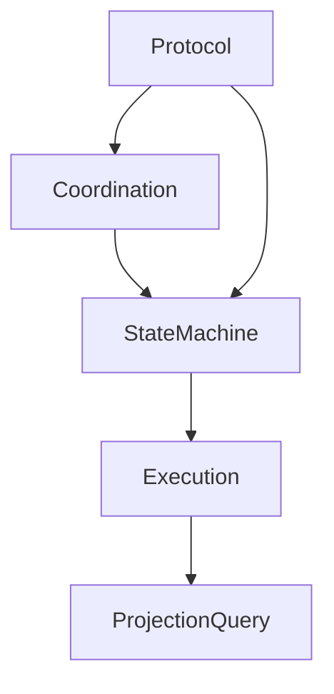

## 2. Team Topology

TINA uses hierarchical teams:
- One orchestration team: `<feature>-orchestration`.
- One phase execution team per phase/remediation: `<feature>-phase-<N>`.
- Ephemeral task-level members inside phase team: `worker-N`, `spec-reviewer-N`, `code-quality-reviewer-N`.

Phase teams can be linked to the orchestration team using `parent_team_id`.

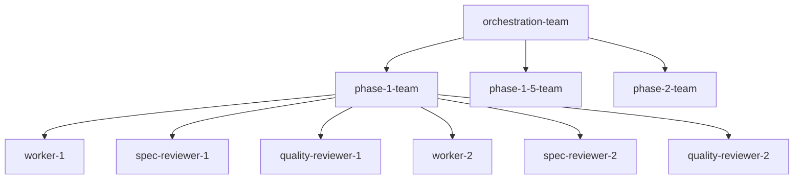

## 3. Orchestration DAG (Feature-Level)

The orchestration team creates a global DAG:
- `validate-design`
- For each phase `N`: `plan-phase-N -> execute-phase-N -> review-phase-N`
- `finalize` after last review

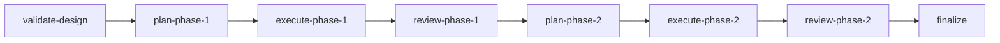

Remediation branches are created dynamically when review finds gaps:
- `review-phase-1 (gaps)` creates remediation phase `1.5`
- possible nested remediation `1.5.5` (depth-limited)

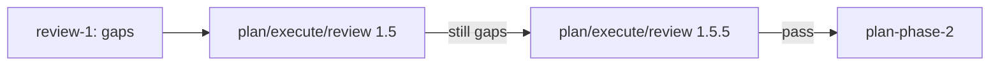

## 4. Phase Execution DAG (Task-Level)

`team-lead-init` parses phase plan tasks and `Depends on` links, then runs a ready-queue scheduler.

Key behavior:
- spawn workers for **all ready tasks** (parallel where possible),
- review each completed task,
- shut down only that task's agents,
- re-check ready queue.

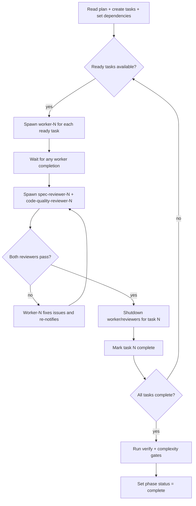

## 5. Message Protocol Is the Contract

The orchestration loop is driven by strict teammate message grammar.

### 5.1 Canonical message patterns

| Producer | Message pattern | Meaning |
|---|---|---|
| design-validator | `VALIDATION_STATUS: Pass|Warning|Stop` | validation verdict |
| phase-planner | `plan-phase-N complete. PLAN_PATH: <path>` | planning done |
| phase-executor | `execute-N started` | execution entered running state |
| phase-executor | `execute-N complete. Git range: A..B` | execution complete |
| phase-reviewer | `review-N complete (pass)` | review pass |
| phase-reviewer | `review-N complete (gaps): issue1, issue2` | remediation needed |
| any phase actor | `<stage>-N error: <reason>` | error path |

### 5.2 Message-to-event translation

The orchestration team translates messages to `tina-session orchestrate advance` events:
- `validation_pass|validation_warning|validation_stop`
- `plan_complete`
- `execute_started|execute_complete`
- `review_pass|review_gaps`
- `error|retry`

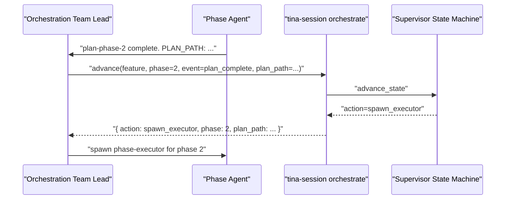

## 6. Action Dispatch and Decision Authority

Decision authority is centralized in `tina-session` state machine.

`orchestrate next/advance` returns typed actions such as:
- `spawn_validator`, `spawn_planner`, `spawn_executor`, `spawn_reviewer`
- `reuse_plan`
- `remediate`
- `consensus_disagreement`
- `wait`, `error`, `stopped`, `finalize`, `complete`

The skill layer dispatches those actions. It does not re-implement transition logic.

## 7. Claude vs Codex Routing

Routing is model-driven (`tina-session config cli-for-model`):
- `claude` route -> native teammate agent (`phase-planner`, `phase-executor`, etc.)
- `codex` route -> `tina:codex-cli` adapter

Adapter preserves the same completion/error message grammar so orchestration logic stays unchanged.

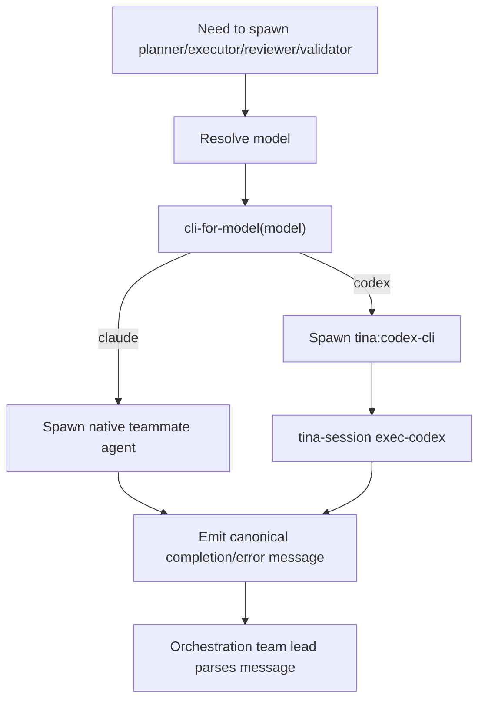

## 8. Consensus Review and Remediation

If `review_consensus` is enabled in model policy:
- orchestration can spawn a secondary reviewer model,
- two verdicts are compared,
- disagreeing verdicts produce `consensus_disagreement` and require manual resolution.

If review reports gaps:
- parent phase becomes complete,
- remediation phase (`N.5`) is created with focused issues,
- scheduler continues on remediation branch.

## 9. Context Lifecycle: Checkpoint and Rehydrate

Checkpoint/rehydrate implements long-run continuity with ephemeral teams.

Important design point:
- Persist **task state and handoff notes**,
- Do **not** persist live team composition,
- Re-spawn fresh workers/reviewers on resume.

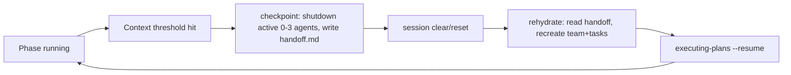

## 10. Where State Lives

### 10.1 Authoritative control state

- `SupervisorState` (feature-level state machine record)
- phase states (`planning/planned/executing/reviewing/complete/blocked`)
- remediation numbering (`N.5`, `N.5.5`)

### 10.2 Runtime coordination state

- `~/.claude/teams/<team>/config.json`
- `~/.claude/tasks/<team>/<id>.json`
- phase status files under `.claude/tina/phase-N/`
- plan files under `docs/plans/`

### 10.3 Projected/query state (Convex)

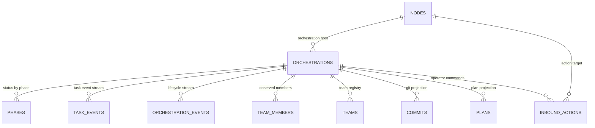

Projection responsibilities:
- `tina-session` writes orchestration/phase/event updates during `advance`.
- `tina-daemon` watches filesystem/git and writes task/team/commit/plan projections.

## 11. Failure and Escalation Semantics

### 11.1 Per-task failure behavior (phase team)

- Worker fails -> retry once with fresh worker for same task.
- Review loops retry until pass or escalation threshold.
- Blocked task blocks only dependents; unrelated DAG branches may continue.

### 11.2 Orchestration-level escalation behavior

- Non-retriable errors return `error { can_retry: false }`.
- Consensus disagreements return dedicated action for manual intervention.
- `validation_stop` or terminal unrecoverable states stop orchestration progression.

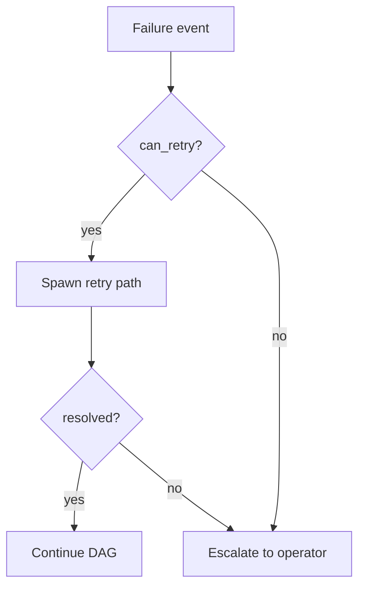

## 12. End-to-End Behavioral Trace

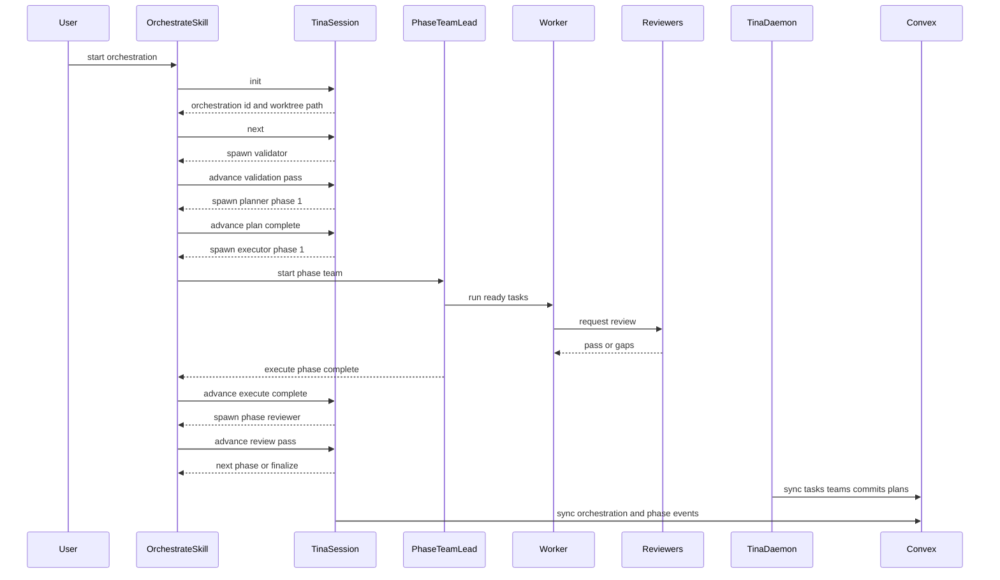

## 13. Source Map (Protocol-First)

Primary protocol definitions:
- `skills/orchestrate/SKILL.md`
- `skills/team-lead-init/SKILL.md`
- `skills/executing-plans/SKILL.md`
- `skills/codex-cli/SKILL.md`
- `skills/checkpoint/SKILL.md`
- `skills/rehydrate/SKILL.md`

Primary phase actor contracts:
- `agents/design-validator.md`
- `agents/phase-planner.md`
- `agents/phase-executor.md`
- `agents/phase-reviewer.md`
- `agents/implementer.md`
- `agents/spec-reviewer.md`
- `agents/code-quality-reviewer.md`

State + dispatch implementation:
- `tina-session/src/state/orchestrate.rs`
- `tina-session/src/state/schema.rs`
- `tina-session/src/commands/orchestrate.rs`
- `tina-session/src/commands/init.rs`
- `tina-session/src/commands/start.rs`

Projection/query support:
- `tina-daemon/src/main.rs`
- `tina-daemon/src/sync.rs`
- `convex/schema.ts`
- `convex/orchestrations.ts`
- `convex/tasks.ts`
- `convex/events.ts`
- `tina-web/src/services/data/queryDefs.ts`
