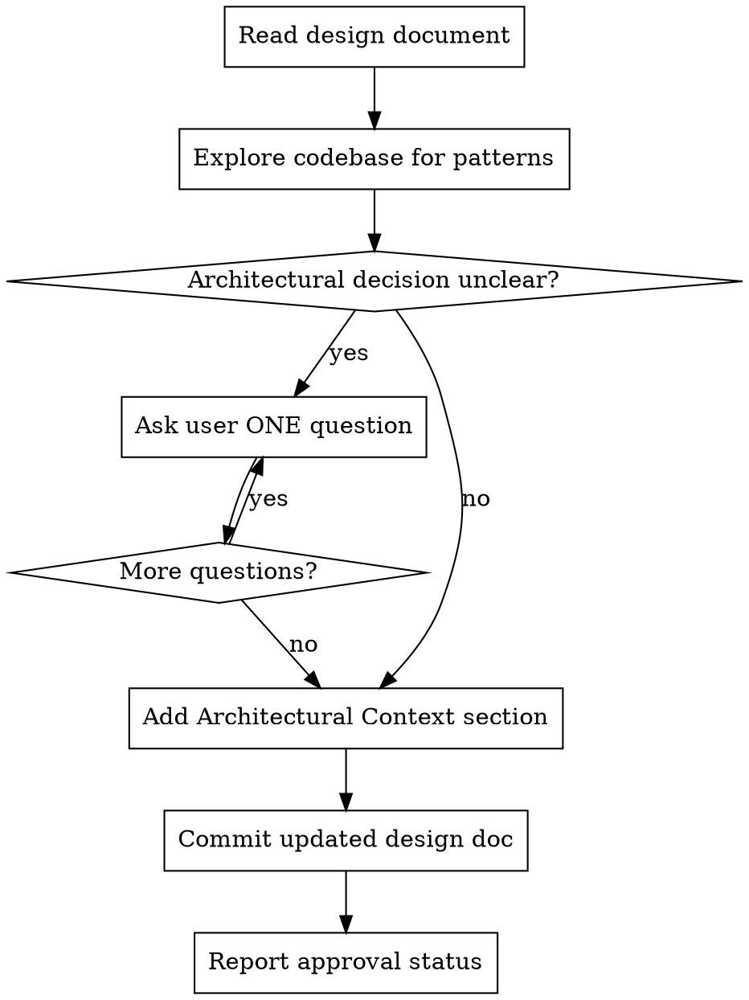

# Architect Skill & Phase Reviewer - Phase 1 Implementation Plan

> **For Claude:** REQUIRED SUB-SKILL: Use superpowers:executing-plans to implement this plan task-by-task.

**Goal:** Create the architect skill that reviews designs before implementation and adds architectural context.

**Architecture:** The architect skill runs in the main conversation (like brainstorming) so it can ask questions interactively. It reads the design doc, explores the codebase for existing patterns, asks clarifying questions one at a time, then adds an "Architectural Context" section to the design doc.

**Tech Stack:** Markdown skills with YAML frontmatter

**Phase context:** This is Phase 1. Phase 2 will create the phase reviewer subagent.

---

### Task 1: Create Architect Skill with Baseline Testing

**REQUIRED SUB-SKILL:** Use superpowers:writing-skills for the TDD approach to skill creation.

**Files:**
- Create: `skills/architect/SKILL.md`

**Step 1: Design pressure scenario for baseline testing**

Create a test scenario that would trigger the architect skill. The scenario should involve a design doc that needs architectural review - specifically one where patterns could be violated if the implementer doesn't know existing conventions.

Example pressure scenario:
```
Design doc: "Add a new CLI command for searching"
Existing codebase: Has established command patterns in commands/
Without architect: Implementer might invent new command structure
With architect: Would note existing patterns to follow
```

**Step 2: Run baseline test WITHOUT skill**

Dispatch a subagent to review a design doc without the architect skill present. Document:
- Did it explore existing patterns before proceeding?
- Did it add architectural context?
- What assumptions did it make?

**Step 3: Write minimal architect skill**

Create `skills/architect/SKILL.md`:

```markdown
---
name: architect
description: Use when a design document is ready and needs architectural review before implementation planning begins
---

# Architectural Review

## Overview

Review design documents before implementation to ensure they fit existing architecture. Add context about patterns to follow, code to reuse, and anti-patterns to avoid.

**Announce at start:** "I'm using the architect skill to review this design for architectural fit."

## When to Use

- After brainstorming produces a design doc
- Before planner creates implementation plan
- Design doc exists at `docs/plans/*-design.md`

## The Process



## Codebase Exploration

Before adding context, explore:

1. **Directory structure** - Where do similar features live?
2. **Existing patterns** - How are similar things implemented?
3. **Shared utilities** - What helpers/utilities exist to reuse?
4. **Test patterns** - How are similar features tested?
5. **Recent commits** - Any relevant recent changes?

Use Glob and Grep to find patterns. Read key files to understand conventions.

## Asking Questions

Like brainstorming, ask questions **one at a time** when architectural decisions are unclear:

- Prefer multiple choice when possible
- Focus on decisions that affect architecture
- Don't ask about implementation details (that's planner's job)

**Example questions:**
- "Should this feature use the existing command pattern in `commands/` or create a new pattern?"
- "The codebase has two auth approaches. Which should this feature follow?"

## Architectural Context Section

Add this section to the design doc (before the Phases section):

```markdown
## Architectural Context

**Patterns to follow:**
- [Pattern name]: See `path/to/example.ts:123-145` for reference
- [Another pattern]: Existing implementation at `path/to/file.ts`

**Code to reuse:**
- `path/to/utility.ts` - [What it provides]
- `path/to/helper.ts` - [What it provides]

**Anti-patterns to avoid:**
- Don't [specific thing] - see `path/to/bad-example.ts` for what NOT to do
- Avoid [pattern] because [reason]

**Integration points:**
- This feature connects to [existing system] via [mechanism]
- Entry point should be [where]
- Output flows to [where]
```

## Commit Message

After adding context:
```bash
git commit -m "docs: add architectural context to <feature> design"
```

## Report Format

After review, report:
- **Design doc:** `docs/plans/2026-01-26-feature-design.md`
- **Status:** Approved / Needs changes
- **Patterns identified:** N patterns to follow
- **Reuse opportunities:** N utilities/helpers to use
- **Concerns:** Any unresolved architectural concerns

## Red Flags

**Never:**
- Skip codebase exploration
- Add generic advice without file:line references
- Approve design without understanding existing patterns
- Ask multiple questions at once
- Make assumptions about unclear architectural decisions

**Always:**
- Explore before advising
- Give specific file:line references
- Ask when unclear (one question at a time)
- Ensure patterns to follow are actually good patterns
```

**Step 4: Run test WITH skill**

Dispatch subagent with the architect skill present. Verify:
- Does it explore the codebase first?
- Does it ask questions when unclear?
- Does it add the Architectural Context section?
- Are file:line references specific?

**Step 5: Refactor - close loopholes**

Based on test results, add any needed:
- Rationalization counters
- Additional red flags
- Clarified instructions

**Step 6: Commit the skill**

```bash
git add skills/architect/SKILL.md
git commit -m "feat: add architect skill for design review"
```

---

### Task 2: Update Brainstorming Skill to Invoke Architect

**Files:**
- Modify: `skills/brainstorming/SKILL.md`

**Step 1: Read current brainstorming skill**

Read `skills/brainstorming/SKILL.md` to understand current handoff flow.

**Step 2: Add architect invocation after design doc**

Update the "After the Design" section to include architect:

Current flow:
```
Documentation → Commit → Implementation setup
```

New flow:
```
Documentation → Commit → Architect review → Implementation setup
```

Add after the Documentation section:

```markdown
**Architectural Review:**
- After committing design doc, invoke superpowers:architect skill
- Architect reviews design, explores codebase, adds Architectural Context section
- Architect must approve before proceeding to implementation
- If architect has concerns, address them before continuing
```

**Step 3: Update Implementation section**

Update the "Implementation (if continuing)" section:

```markdown
**Implementation (if continuing):**
- Ask: "Ready to set up for implementation?"
- **REQUIRED:** Invoke superpowers:architect to review design and add architectural context
- Architect must approve design before proceeding
- Use superpowers:using-git-worktrees to create isolated workspace
- Use superpowers:writing-plans to create detailed implementation plan
```

**Step 4: Commit the update**

```bash
git add skills/brainstorming/SKILL.md
git commit -m "feat: add architect invocation to brainstorming workflow"
```

---

### Task 3: Test End-to-End Flow

**Step 1: Create test scenario**

Create a simple design doc that needs architectural review:

```bash
# In the worktree, create a test design doc
cat > docs/plans/2026-01-26-test-feature-design.md << 'EOF'
# Test Feature Design

A simple feature for testing the architect skill.

## Problem

Need to add a new command.

## Solution

Add a command that does something.

## Phases

### Phase 1: Add command
- Create the command file
- Add tests
EOF
```

**Step 2: Run architect skill manually**

Invoke the architect skill on the test design doc. Verify:
- Codebase exploration happens
- Architectural Context section is added
- Commit is created

**Step 3: Verify the flow**

Check that:
- Design doc now has Architectural Context section
- Patterns reference real files in codebase
- Git log shows the commit

**Step 4: Clean up test file**

```bash
git reset --hard HEAD~1  # Remove test commit
rm docs/plans/2026-01-26-test-feature-design.md
```

**Step 5: Final commit for phase 1**

If any adjustments were needed during testing, commit them:

```bash
git add -A
git commit -m "fix: architect skill adjustments from testing"
```
