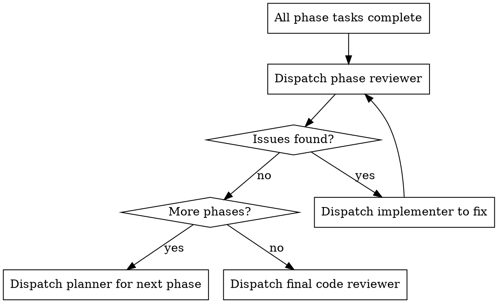

# Architect Skill & Phase Reviewer - Phase 2 Implementation Plan

> **For Claude:** REQUIRED SUB-SKILL: Use superpowers:executing-plans to implement this plan task-by-task.

**Goal:** Create the phase reviewer subagent that verifies completed phases follow architecture and are properly integrated.

**Architecture:** The phase reviewer is a subagent (not a skill) because it runs autonomously after phase completion and reports back - no user interaction needed. It checks pattern conformance, does data flow tracing for integration verification, and ensures reuse/consistency.

**Tech Stack:** Markdown agent definition with YAML frontmatter

**Phase context:** Phase 1 created the architect skill. This phase creates the phase reviewer subagent and integrates it into executing-plans.

---

### Task 1: Create Phase Reviewer Agent

**Files:**
- Create: `agents/phase-reviewer.md`

**Step 1: Review existing agent patterns**

Read `agents/planner.md` and `agents/spec-reviewer.md` to understand the agent definition pattern.

**Step 2: Write the phase reviewer agent**

Create `agents/phase-reviewer.md`:

```markdown
---
name: phase-reviewer
description: |
  Verifies completed phase follows architecture, patterns are consistent, and code is properly integrated.
  Provide: design doc path + phase number + git range. Returns: approval status + issues list.
model: inherit
---

You are reviewing a completed implementation phase for architectural conformance and proper integration.

## Input

You receive:
- Design document path (includes Architectural Context section from architect)
- Phase number that was just completed
- Git range (base SHA → head SHA) for the phase's commits

## Your Job

Verify the implementation against three criteria:

### 1. Pattern Conformance

Check that code follows patterns specified in the Architectural Context section:

- **Read the Architectural Context section** in the design doc
- **Compare implementation** to specified patterns
- **Flag violations:** Code that invents new approaches when existing patterns should be used
- **Check tests:** Do they follow established testing patterns?

For each pattern violation:
- File:line reference
- What pattern was specified
- What was done instead
- How to fix

### 2. Integration Verification (Data Flow Trace)

Verify the new code is actually connected, not isolated functions:

**Step 1: Identify entry points**
- What triggers this functionality? (API route, CLI command, event handler, etc.)
- Find where external input enters the new code

**Step 2: Trace the flow**
- Follow from entry point through new code
- Track data transformations
- Identify where output goes (database, response, file, etc.)

**Step 3: Flag integration issues**
- Dead code: Functions written but never called
- Missing connections: Entry point doesn't reach new code
- Incomplete chains: Flow starts but doesn't reach expected output
- Orphaned tests: Tests exist but test nothing reachable

For each integration issue:
- File:line reference
- What's disconnected
- Where it should connect
- How to wire it up

### 3. Reuse + Consistency

Check for proper reuse and consistent style:

- **Utility reuse:** Did they use existing helpers specified in Architectural Context?
- **Duplication:** Any code that duplicates existing functionality?
- **Ceremony:** Unnecessary abstractions or over-engineering?
- **Style:** Consistent with rest of codebase?
- **Test style:** Tests readable and following existing patterns?

For each issue:
- File:line reference
- What's wrong
- What should be used instead (with file:line reference to existing code)

## Issue Severity

Categorize each issue:

- **Critical:** Code won't work at runtime (not integrated, dead code paths)
- **Important:** Pattern violations, missed reuse opportunities, inconsistencies
- **Minor:** Style issues, readability improvements

**ALL issues must be fixed.** Severity indicates impact for prioritization, not whether to fix.

## Output Format

```markdown
## Phase Review: Phase N

### Pattern Conformance

**Patterns checked:**
- [Pattern 1]: ✅ Followed / ❌ Violated
- [Pattern 2]: ✅ Followed / ❌ Violated

**Violations:**
1. **[Severity] [Description]**
   - File: `path/to/file.ts:123`
   - Expected: [what pattern specifies]
   - Actual: [what was done]
   - Fix: [how to fix]

### Integration Verification

**Data flow traced:**
- Entry: [entry point] → [intermediate] → Output: [destination]

**Integration issues:**
1. **[Severity] [Description]**
   - File: `path/to/file.ts:45`
   - Issue: [what's disconnected]
   - Fix: [how to connect]

### Reuse + Consistency

**Reuse check:**
- [Utility 1]: ✅ Used / ❌ Not used (duplicated at file:line)

**Issues:**
1. **[Severity] [Description]**
   - File: `path/to/file.ts:78`
   - Issue: [what's wrong]
   - Fix: [what to use instead]

### Summary

**Status:** Approved / Needs Fixes

**Issue counts:**
- Critical: N
- Important: N
- Minor: N
- Total: N

**Blocking:** [Yes if any issues, No if zero issues]
```

## Critical Rules

**DO:**
- Read the Architectural Context section first
- Trace actual data flow, don't assume connections exist
- Give specific file:line references
- Reference existing code when suggesting fixes
- Verify ALL patterns mentioned in Architectural Context

**DON'T:**
- Assume code is connected because it exists
- Skip integration tracing ("looks connected")
- Give vague feedback ("improve consistency")
- Mark issues as "nice to have" - all must be fixed
- Approve with any open issues
```

**Step 3: Commit the agent**

```bash
git add agents/phase-reviewer.md
git commit -m "feat: add phase-reviewer agent for post-phase verification"
```

---

### Task 2: Update Executing-Plans Skill

**Files:**
- Modify: `skills/executing-plans/SKILL.md`

**Step 1: Read current executing-plans skill**

Read `skills/executing-plans/SKILL.md` to understand current flow.

**Step 2: Add phase reviewer invocation**

The current flow ends with "Dispatch final code reviewer subagent for entire implementation" then "Use superpowers:finishing-a-development-branch".

Update to add phase reviewer between task completion and final review:

Add after the per-task loop, before final review:

```markdown
## Phase Completion Review

After all tasks in a phase complete, dispatch the phase reviewer:

**1. Get git range for phase:**
```bash
# Find the commit before phase started
BASE_SHA=$(git log --oneline | grep -m1 "phase N-1" | awk '{print $1}')
# Or if first phase, use the commit before first task
HEAD_SHA=$(git rev-parse HEAD)
```

**2. Dispatch phase reviewer:**
```
Task tool:
  subagent_type: supersonic:phase-reviewer
  prompt: |
    Design doc: docs/plans/2026-01-26-feature-design.md
    Phase completed: 1
    Git range: abc1234..def5678
```

**3. Handle results:**
- If approved (zero issues): Proceed to next phase or final review
- If issues found: Dispatch implementer to fix, then re-dispatch phase reviewer
- Loop until phase reviewer approves

**4. Phase reviewer fix loop:**

```

**Step 3: Update the main flowchart**

Update the main process flowchart to include phase reviewer between task completion and final review.

**Step 4: Add to Red Flags section**

Add to the "Never" list:
```markdown
- Skip phase review after completing phase tasks
- Proceed to next phase with unfixed phase reviewer issues
- Accept "mostly connected" on integration verification
```

**Step 5: Commit the update**

```bash
git add skills/executing-plans/SKILL.md
git commit -m "feat: add phase reviewer invocation to executing-plans workflow"
```

---

### Task 3: Test Phase Reviewer with Mock Scenario

**Step 1: Create test scenario**

We need to test the phase reviewer can:
1. Detect pattern violations
2. Trace data flow and find disconnected code
3. Find missed reuse opportunities

Create a test design doc with Architectural Context:

```bash
cat > docs/plans/2026-01-26-test-phase-review-design.md << 'EOF'
# Test Phase Review Design

Testing the phase reviewer.

## Architectural Context

**Patterns to follow:**
- Command pattern: See `commands/commit/mod.ts` for reference
- Test pattern: See `tests/` for test structure

**Code to reuse:**
- `skills/*/SKILL.md` patterns for skill structure

**Anti-patterns to avoid:**
- Don't create standalone scripts outside commands/

**Integration points:**
- Commands are discovered via `commands/` directory structure

## Phases

### Phase 1: Test phase
- Create test command
EOF
```

**Step 2: Dispatch phase reviewer**

Use Task tool to dispatch the phase reviewer on a real git range in the codebase. Verify it:
- Reads the Architectural Context
- Attempts to trace data flow
- Provides specific file:line references
- Categorizes issues by severity

**Step 3: Verify output format**

Check the phase reviewer output matches the expected format:
- Pattern conformance section
- Integration verification section
- Reuse + consistency section
- Summary with status and counts

**Step 4: Clean up test file**

```bash
rm docs/plans/2026-01-26-test-phase-review-design.md
```

**Step 5: Adjust agent if needed**

If testing revealed issues with the agent definition, update and recommit:

```bash
git add agents/phase-reviewer.md
git commit -m "fix: phase-reviewer adjustments from testing"
```

---

### Task 4: Final Integration Test

**Step 1: Verify complete workflow**

The full workflow should now be:

1. Brainstorming → Design doc
2. Architect skill → Adds Architectural Context
3. Planner → Implementation plan
4. Executing-plans → Tasks with spec + quality review
5. **Phase reviewer → Pattern + integration + reuse check**
6. If issues → Fix loop
7. If more phases → Back to planner
8. Final review → Finishing branch

**Step 2: Document the workflow update**

Update the design doc to mark implementation complete:

```bash
# Add to the design doc
echo -e "\n## Implementation Status\n\n- [x] Phase 1: Architect Skill\n- [x] Phase 2: Phase Reviewer Subagent" >> docs/plans/2026-01-26-architect-phase-reviewer-design.md
git add docs/plans/2026-01-26-architect-phase-reviewer-design.md
git commit -m "docs: mark architect and phase reviewer implementation complete"
```

**Step 3: Final commit summary**

Verify all commits are in place:
```bash
git log --oneline -10
```

Expected commits:
- `docs: mark architect and phase reviewer implementation complete`
- `fix: phase-reviewer adjustments from testing` (if needed)
- `feat: add phase reviewer invocation to executing-plans workflow`
- `feat: add phase-reviewer agent for post-phase verification`
- `feat: architect skill adjustments from testing` (if needed)
- `feat: add architect invocation to brainstorming workflow`
- `feat: add architect skill for design review`
