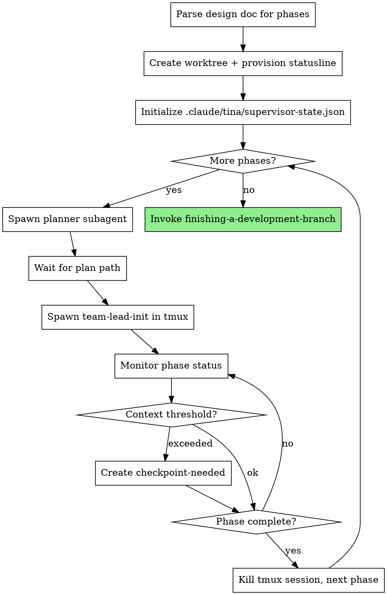

# Context Management Redesign Phase 1 Implementation Plan

> **For Claude:** Use supersonic:executing-plans to implement this plan.

**Goal:** Make orchestrated automation self-contained by provisioning statusline context monitoring in worktrees, eliminating external dependencies on user configuration.

**Architecture:** The orchestrator creates a git worktree for each plan execution, writes a context monitoring script (`tina-write-context.sh`) and local settings (`settings.local.json`) to enable statusline reporting, then the supervisor's monitor loop reads context-metrics.json and creates `checkpoint-needed` when threshold is exceeded. This centralizes context decisions in the supervisor rather than the statusline.

**Phase context:** This is the only phase. The design is self-contained and addresses all gaps in one cohesive change.

---

### Task 1: Integrate Worktree Creation into Orchestrate Skill

**Files:**
- Modify: `/Users/joshua/Projects/supersonic/.worktrees/context-management-redesign/skills/orchestrate/SKILL.md`

**Step 1: Read the current orchestrate skill**

Read `skills/orchestrate/SKILL.md` to understand the current structure, particularly Step 2 (Initialize or Resume State).

**Step 2: Add worktree creation step after Step 1**

Insert a new "Step 1b: Create Worktree" section after "### Step 1: Parse Design Doc" and before "### Step 2: Initialize or Resume State".

Add this content after line 99 (end of Step 1):

```markdown

### Step 1b: Create Worktree

Create an isolated worktree for this orchestration run. One worktree per plan - all phases execute within it.

**Determine worktree directory:**

```bash
# Check in priority order per using-git-worktrees skill
if [ -d ".worktrees" ]; then
  WORKTREE_BASE=".worktrees"
elif [ -d "worktrees" ]; then
  WORKTREE_BASE="worktrees"
else
  # Create .worktrees (preferred, hidden)
  WORKTREE_BASE=".worktrees"
  mkdir -p "$WORKTREE_BASE"
fi
```

**Verify directory is gitignored:**

```bash
if ! git check-ignore -q "$WORKTREE_BASE" 2>/dev/null; then
  echo "$WORKTREE_BASE" >> .gitignore
  git add .gitignore
  git commit -m "chore: add $WORKTREE_BASE to gitignore"
fi
```

**Create branch and worktree:**

```bash
# Extract feature name from design doc path
# e.g., docs/plans/2026-01-26-myfeature-design.md -> myfeature
FEATURE_NAME=$(basename "$DESIGN_DOC" | sed 's/^[0-9-]*//; s/-design\.md$//; s/-/_/g')
BRANCH_NAME="tina/${FEATURE_NAME}"
WORKTREE_PATH="$WORKTREE_BASE/$FEATURE_NAME"

# Create worktree with new branch
git worktree add "$WORKTREE_PATH" -b "$BRANCH_NAME"
cd "$WORKTREE_PATH"

# Store for later use
ORIGINAL_DIR=$(pwd)
```

**Run project setup (auto-detect):**

```bash
# Node.js
if [ -f package.json ]; then npm install; fi

# Rust
if [ -f Cargo.toml ]; then cargo build; fi

# Python
if [ -f requirements.txt ]; then pip install -r requirements.txt; fi
if [ -f pyproject.toml ]; then poetry install 2>/dev/null || pip install -e .; fi

# Go
if [ -f go.mod ]; then go mod download; fi
```

**Verify clean baseline:**

```bash
# Run tests - project-specific command
if [ -f package.json ]; then npm test; fi
if [ -f Cargo.toml ]; then cargo test; fi
if [ -f pytest.ini ] || [ -f pyproject.toml ]; then pytest; fi
if [ -f go.mod ]; then go test ./...; fi

# If tests fail, report and ask whether to proceed
```

**Important:** All subsequent steps execute within this worktree. The tmux command in Step 3d must `cd` to the worktree path.
```

**Step 3: Update Step 3d to use worktree path**

Find the "**3d. Spawn Team-Lead in Tmux**" section (around line 237-247) and update the tmux command to include the worktree path:

Replace:
```markdown
```bash
SESSION_NAME="tina-phase-$PHASE_NUM"
tmux new-session -d -s "$SESSION_NAME" \
  "cd $(pwd) && claude --prompt '/team-lead-init $PLAN_PATH'"
```

With:
```markdown
```bash
SESSION_NAME="tina-phase-$PHASE_NUM"
tmux new-session -d -s "$SESSION_NAME" \
  "cd $WORKTREE_PATH && claude --prompt '/team-lead-init $PLAN_PATH'"
```

**Step 4: Commit the worktree integration**

```bash
git add skills/orchestrate/SKILL.md
git commit -m "feat: integrate worktree creation into orchestrate skill"
```

---

### Task 2: Add Statusline Provisioning to Worktree Setup

**Files:**
- Modify: `/Users/joshua/Projects/supersonic/.worktrees/context-management-redesign/skills/orchestrate/SKILL.md`

**Step 1: Read the updated orchestrate skill**

Read `skills/orchestrate/SKILL.md` to find the Step 1b section added in Task 1.

**Step 2: Add statusline provisioning after worktree creation**

Add this content at the end of Step 1b, after the "Verify clean baseline" section and before the "**Important:**" note:

```markdown

**Provision statusline for context monitoring:**

```bash
# Create .claude directory in worktree
mkdir -p "$WORKTREE_PATH/.claude"

# Write context monitoring script
cat > "$WORKTREE_PATH/.claude/tina-write-context.sh" << 'SCRIPT'
#!/bin/bash
set -e
TINA_DIR="${PWD}/.tina"
mkdir -p "$TINA_DIR"
INPUT=$(cat)
echo "$INPUT" | jq '{
  used_pct: (.context_window.used_percentage // 0),
  tokens: (.context_window.total_input_tokens // 0),
  max: (.context_window.context_window_size // 200000),
  timestamp: now | todate
}' > "$TINA_DIR/context-metrics.json"
echo "ctx:$(echo "$INPUT" | jq -r '.context_window.used_percentage // 0 | floor')%"
SCRIPT
chmod +x "$WORKTREE_PATH/.claude/tina-write-context.sh"

# Write local settings pointing to the script
cat > "$WORKTREE_PATH/.claude/settings.local.json" << EOF
{"statusLine": {"type": "command", "command": "$WORKTREE_PATH/.claude/tina-write-context.sh"}}
EOF
```

This enables automatic context tracking within the worktree. The statusline script writes `.claude/tina/context-metrics.json` on each status update. The supervisor monitor loop reads this file to decide when to trigger checkpoints.
```

**Step 3: Commit the statusline provisioning**

```bash
git add skills/orchestrate/SKILL.md
git commit -m "feat: add statusline provisioning to orchestrate worktree setup"
```

---

### Task 3: Add Context Threshold Check to Monitor Loop

**Files:**
- Modify: `/Users/joshua/Projects/supersonic/.worktrees/context-management-redesign/skills/orchestrate/SKILL.md`

**Step 1: Read the orchestrate skill monitor loop**

Read `skills/orchestrate/SKILL.md` to find the "**3e. Monitor Phase Status**" section (around lines 249-314).

**Step 2: Add context metrics check at the start of the monitor loop**

Insert this content at the beginning of the monitor loop (inside the `while true; do` block, before the tmux session check):

Find this section:
```markdown
```bash
while true; do
  # Check if tmux session is still alive
```

Add before the tmux session check:
```markdown
```bash
while true; do
  # Check context metrics and create checkpoint-needed if threshold exceeded
  if [ -f "$WORKTREE_PATH/.claude/tina/context-metrics.json" ]; then
    USED_PCT=$(jq -r '.used_pct // 0' "$WORKTREE_PATH/.claude/tina/context-metrics.json")
    THRESHOLD=${TINA_THRESHOLD:-70}

    if [ "$(echo "$USED_PCT >= $THRESHOLD" | bc)" -eq 1 ]; then
      if [ ! -f "$WORKTREE_PATH/.claude/tina/checkpoint-needed" ]; then
        echo "{\"triggered_at\": \"$(date -u +%Y-%m-%dT%H:%M:%SZ)\", \"context_pct\": $USED_PCT, \"threshold\": $THRESHOLD}" > "$WORKTREE_PATH/.claude/tina/checkpoint-needed"
        echo "Context at ${USED_PCT}%, triggering checkpoint"
      fi
    fi
  fi

  # Check if tmux session is still alive
```

**Step 3: Update the checkpoint-needed check to use worktree path**

Find the existing checkpoint handling section (around line 337):
```markdown
```bash
# In monitor loop, check for signal file
if [ -f ".claude/tina/checkpoint-needed" ]; then
```

Replace with:
```markdown
```bash
# In monitor loop, check for signal file
if [ -f "$WORKTREE_PATH/.claude/tina/checkpoint-needed" ]; then
```

Also update the rm command at the end of checkpoint handling (around line 392):
```markdown
rm "$WORKTREE_PATH/.claude/tina/checkpoint-needed"
```

**Step 4: Commit the context threshold check**

```bash
git add skills/orchestrate/SKILL.md
git commit -m "feat: add context threshold check to orchestrate monitor loop"
```

---

### Task 4: Add Worktree Cleanup to Completion Step

**Files:**
- Modify: `/Users/joshua/Projects/supersonic/.worktrees/context-management-redesign/skills/orchestrate/SKILL.md`

**Step 1: Read the orchestrate skill completion section**

Read `skills/orchestrate/SKILL.md` to find "### Step 4: Completion" (around lines 489-557).

**Step 2: Add worktree cleanup after tmux session cleanup**

Find this section (around lines 519-525):
```markdown
**4b. Clean up all tmux sessions:**

```bash
for i in $(seq 1 $TOTAL_PHASES); do
  SESSION="tina-phase-$i"
  tmux kill-session -t "$SESSION" 2>/dev/null || true
done
```
```

Add after it:
```markdown

**4c. Worktree handling:**

Present options to user (via finishing-a-development-branch skill):

1. **Merge locally:** Merge worktree branch to base, remove worktree
2. **Create PR:** Push branch, create PR, keep worktree until PR merged
3. **Keep as-is:** Leave worktree for manual handling
4. **Discard:** Remove worktree and branch

```bash
# If merge chosen (option 1 or after PR merged):
git worktree remove "$WORKTREE_PATH"
git branch -d "$BRANCH_NAME"  # Safe delete (only if merged)
```

Note: The finishing-a-development-branch skill handles these options. The orchestrator invokes it in step 4d.
```

**Step 3: Renumber remaining completion steps**

Update the step numbering:
- Old "4c. Update supervisor state" becomes "4d. Update supervisor state"
- Old "4d. Invoke finishing workflow" becomes "4e. Invoke finishing workflow"
- Old "4e. Report completion" becomes "4f. Report completion"

**Step 4: Commit the cleanup step**

```bash
git add skills/orchestrate/SKILL.md
git commit -m "feat: add worktree cleanup to orchestrate completion"
```

---

### Task 5: Update State Files Section

**Files:**
- Modify: `/Users/joshua/Projects/supersonic/.worktrees/context-management-redesign/skills/orchestrate/SKILL.md`

**Step 1: Read the state files section**

Read `skills/orchestrate/SKILL.md` to find "## State Files" (around lines 581-621).

**Step 2: Add worktree path to supervisor state**

Find the supervisor state JSON example:
```json
{
  "design_doc_path": "docs/plans/2026-01-26-feature-design.md",
  "total_phases": 3,
  "current_phase": 2,
```

Add after "design_doc_path":
```json
  "worktree_path": ".worktrees/feature",
  "branch_name": "tina/feature",
```

**Step 3: Update field descriptions**

Add to the field descriptions list:
```markdown
- `worktree_path`: Path to the worktree for this orchestration run
- `branch_name`: Git branch created for this run
```

**Step 4: Add context-metrics.json to state files**

Add a new section after "**Phase status:**":
```markdown

**Context metrics:** `.claude/tina/context-metrics.json` (in worktree)
```json
{
  "used_pct": 45.2,
  "tokens": 90400,
  "max": 200000,
  "timestamp": "2026-01-26T10:15:00Z"
}
```

Written by statusline script on each status update. Supervisor reads this to decide checkpoints.
```

**Step 5: Commit the state files update**

```bash
git add skills/orchestrate/SKILL.md
git commit -m "docs: add worktree and context-metrics to state files section"
```

---

### Task 6: Update Integration Section

**Files:**
- Modify: `/Users/joshua/Projects/supersonic/.worktrees/context-management-redesign/skills/orchestrate/SKILL.md`

**Step 1: Read the integration section**

Read `skills/orchestrate/SKILL.md` to find "## Integration" (around lines 652-698).

**Step 2: Update the invokes/spawns section**

Find:
```markdown
**Invokes after completion:**
- `tina:finishing-a-development-branch` - Handles merge/PR workflow
```

Replace with:
```markdown
**Invokes:**
- `tina:using-git-worktrees` pattern - Worktree creation at start (integrated, not invoked as skill)
- `tina:finishing-a-development-branch` - Handles merge/PR/cleanup workflow after completion
```

**Step 3: Update state files section in Integration**

Find:
```markdown
**State files:**
- `.claude/tina/supervisor-state.json` - Supervisor resumption state
- `.claude/tina/phase-N/status.json` - Per-phase execution status
- `.claude/tina/phase-N/handoff.md` - Context handoff document for checkpoint/rehydrate
```

Replace with:
```markdown
**State files:**
- `.claude/tina/supervisor-state.json` - Supervisor resumption state (includes worktree_path)
- `.claude/tina/phase-N/status.json` - Per-phase execution status
- `.claude/tina/phase-N/handoff.md` - Context handoff document for checkpoint/rehydrate
- `.claude/tina/context-metrics.json` - Context usage metrics (written by statusline)
- `.claude/tina/checkpoint-needed` - Signal file (created by supervisor when threshold exceeded)
```

**Step 4: Update checkpoint cycle description**

Find:
```markdown
**Checkpoint cycle:**
- Statusline script creates `.claude/tina/checkpoint-needed` when context > threshold
```

Replace with:
```markdown
**Checkpoint cycle:**
- Statusline script writes `.claude/tina/context-metrics.json` with usage data
- Supervisor monitor loop reads metrics, creates `.claude/tina/checkpoint-needed` when threshold exceeded
```

**Step 5: Update the depends on section**

Find:
```markdown
**Depends on existing:**
- `tina:executing-plans` - Team-lead delegates to this for task execution
```

Add:
```markdown
- `tina:using-git-worktrees` - Pattern for worktree creation (integrated into Step 1b)
```

**Step 6: Commit the integration update**

```bash
git add skills/orchestrate/SKILL.md
git commit -m "docs: update integration section for context management redesign"
```

---

### Task 7: Update Process Diagram

**Files:**
- Modify: `/Users/joshua/Projects/supersonic/.worktrees/context-management-redesign/skills/orchestrate/SKILL.md`

**Step 1: Read the process diagram**

Read `skills/orchestrate/SKILL.md` to find "## The Process" and the graphviz diagram (around lines 29-57).

**Step 2: Update the diagram to include worktree creation**

Replace the existing diagram:
```markdown
```dot
digraph orchestrate {
    rankdir=TB;

    "Parse design doc for phases" [shape=box];
    "Initialize .claude/tina/supervisor-state.json" [shape=box];
    "More phases?" [shape=diamond];
```

With:
```markdown


**Step 3: Commit the diagram update**

```bash
git add skills/orchestrate/SKILL.md
git commit -m "docs: update orchestrate process diagram with worktree and context monitoring"
```

---

### Task 8: Update Resume Logic for Worktree

**Files:**
- Modify: `/Users/joshua/Projects/supersonic/.worktrees/context-management-redesign/skills/orchestrate/SKILL.md`

**Step 1: Read the resume section**

Read `skills/orchestrate/SKILL.md` to find "## Resumption" (around lines 623-649).

**Step 2: Update resumption to restore worktree path**

Find:
```markdown
**State reconstruction:**
1. Read `.claude/tina/supervisor-state.json` for current phase and active session
```

Replace with:
```markdown
**State reconstruction:**
1. Read `.claude/tina/supervisor-state.json` for current phase, active session, and worktree path
2. Verify worktree still exists: `git worktree list | grep "$WORKTREE_PATH"`
3. If worktree missing: error and exit (cannot resume without worktree)
```

Update the remaining numbered items (shift numbers by 1):
```markdown
4. Check if `active_tmux_session` still exists via `tmux has-session`
5. If session exists: reconnect to monitoring loop
6. If session doesn't exist but phase incomplete: respawn team-lead with `/rehydrate`
7. If phase complete: proceed to next phase
```

**Step 3: Add worktree verification to Step 2**

Find in Step 2 "### Step 2: Initialize or Resume State" the resume section:
```markdown
if [ -f ".claude/tina/supervisor-state.json" ]; then
  # Resume: read current phase
  CURRENT_PHASE=$(jq -r '.current_phase' .claude/tina/supervisor-state.json)
```

Add after reading current phase:
```markdown
  # Read worktree path
  WORKTREE_PATH=$(jq -r '.worktree_path' .claude/tina/supervisor-state.json)
  BRANCH_NAME=$(jq -r '.branch_name' .claude/tina/supervisor-state.json)

  # Verify worktree exists
  if ! git worktree list | grep -q "$WORKTREE_PATH"; then
    echo "Error: Worktree not found at $WORKTREE_PATH"
    echo "Cannot resume - worktree may have been removed"
    exit 1
  fi
```

**Step 4: Update state initialization to include worktree**

Find the state initialization:
```markdown
  cat > .claude/tina/supervisor-state.json << EOF
{
  "design_doc_path": "$DESIGN_DOC",
  "total_phases": $TOTAL_PHASES,
```

Replace with:
```markdown
  cat > .claude/tina/supervisor-state.json << EOF
{
  "design_doc_path": "$DESIGN_DOC",
  "worktree_path": "$WORKTREE_PATH",
  "branch_name": "$BRANCH_NAME",
  "total_phases": $TOTAL_PHASES,
```

**Step 5: Commit the resume logic update**

```bash
git add skills/orchestrate/SKILL.md
git commit -m "feat: update orchestrate resume logic for worktree support"
```

---

### Task 9: Final Verification and Design Doc Update

**Step 1: Verify all changes are committed**

Run:
```bash
git status
```

Expected: Working tree clean

**Step 2: Verify git log shows all commits**

Run:
```bash
git log --oneline -10
```

Expected commits from this implementation:
- `feat: update orchestrate resume logic for worktree support`
- `docs: update orchestrate process diagram with worktree and context monitoring`
- `docs: update integration section for context management redesign`
- `docs: add worktree and context-metrics to state files section`
- `feat: add worktree cleanup to orchestrate completion`
- `feat: add context threshold check to orchestrate monitor loop`
- `feat: add statusline provisioning to orchestrate worktree setup`
- `feat: integrate worktree creation into orchestrate skill`

**Step 3: Verify orchestrate skill has all new sections**

Run:
```bash
grep -n "Step 1b: Create Worktree" skills/orchestrate/SKILL.md
grep -n "tina-write-context.sh" skills/orchestrate/SKILL.md
grep -n "context-metrics.json" skills/orchestrate/SKILL.md
grep -n "TINA_THRESHOLD" skills/orchestrate/SKILL.md
```

Expected: All patterns found in the skill file.

**Step 4: Report completion**

Report:
- Phase 1 complete (only phase)
- Files modified: 1 (`skills/orchestrate/SKILL.md`)
- Key changes:
  1. Worktree creation integrated (Step 1b)
  2. Statusline provisioning for context monitoring
  3. Context threshold check in monitor loop
  4. Worktree cleanup in completion
  5. State files updated for worktree tracking
  6. Resume logic updated for worktree verification
- Capability: Orchestrated automation is now fully self-contained - no user configuration required
