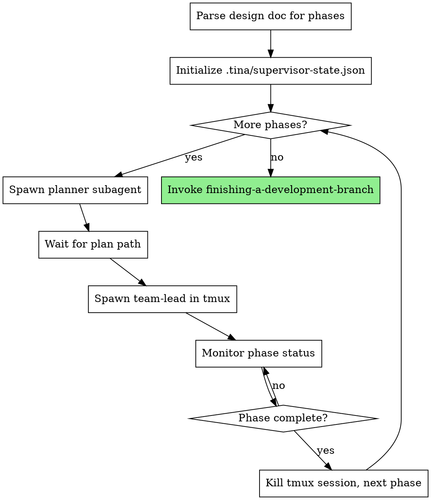
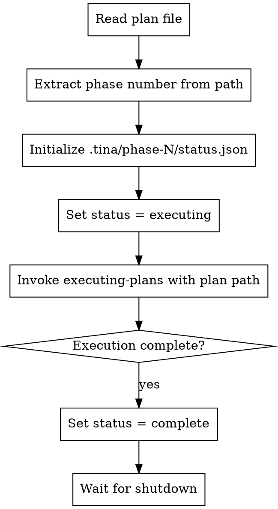

# Orchestrated Automation Phase 1 Implementation Plan

> **For Claude:** Use supersonic:executing-plans to implement this plan.

**Goal:** Create foundation for orchestrated automation: `.tina/` state management, `orchestrate` skill basic loop, and `team-lead-init` skill.

**Architecture:** The orchestrate skill runs in user's foreground session and spawns planners as subagents, then team-leads in tmux sessions. State is persisted to `.tina/supervisor-state.json` for resumption. Team-lead-init reads plan and (in this phase) delegates to existing Task-based execution flow - team-based execution comes in Phase 2.

**Phase context:** This is Phase 1 of 5. No previous phases. This phase establishes the foundation that all other phases build upon.

---

### Task 1: Create `.tina/` State Management Utilities

**Files:**
- Create: `skills/orchestrate/_tina-utils.sh`

**Step 1: Write the shell utilities for `.tina/` state management**

Create helper script with functions for reading/writing supervisor state, phase status, and checking phase completion.

```bash
#!/bin/bash
# TINA state management utilities for orchestrate skill
# Source this file: source "$(dirname "$0")/_tina-utils.sh"

set -e

# Initialize .tina directory structure for orchestration
# Usage: tina_init_supervisor <design_doc_path> <total_phases>
tina_init_supervisor() {
  local design_doc="$1"
  local total_phases="$2"
  local tina_dir="${PWD}/.tina"

  mkdir -p "$tina_dir"

  # Create supervisor state
  cat > "$tina_dir/supervisor-state.json" << EOF
{
  "design_doc_path": "$design_doc",
  "total_phases": $total_phases,
  "current_phase": 0,
  "active_tmux_session": null,
  "plan_paths": {}
}
EOF

  echo "$tina_dir/supervisor-state.json"
}

# Read supervisor state field
# Usage: tina_get_supervisor_field <field>
tina_get_supervisor_field() {
  local field="$1"
  local tina_dir="${PWD}/.tina"

  jq -r ".$field // empty" "$tina_dir/supervisor-state.json"
}

# Update supervisor state field
# Usage: tina_set_supervisor_field <field> <value>
tina_set_supervisor_field() {
  local field="$1"
  local value="$2"
  local tina_dir="${PWD}/.tina"
  local state_file="$tina_dir/supervisor-state.json"

  local tmp_file=$(mktemp)
  jq ".$field = $value" "$state_file" > "$tmp_file"
  mv "$tmp_file" "$state_file"
}

# Add plan path to supervisor state
# Usage: tina_add_plan_path <phase_num> <plan_path>
tina_add_plan_path() {
  local phase_num="$1"
  local plan_path="$2"
  local tina_dir="${PWD}/.tina"
  local state_file="$tina_dir/supervisor-state.json"

  local tmp_file=$(mktemp)
  jq ".plan_paths[\"$phase_num\"] = \"$plan_path\"" "$state_file" > "$tmp_file"
  mv "$tmp_file" "$state_file"
}

# Initialize phase directory
# Usage: tina_init_phase <phase_num>
tina_init_phase() {
  local phase_num="$1"
  local phase_dir="${PWD}/.tina/phase-$phase_num"

  mkdir -p "$phase_dir"

  cat > "$phase_dir/status.json" << EOF
{
  "status": "pending",
  "started_at": null
}
EOF

  echo "$phase_dir"
}

# Update phase status
# Usage: tina_set_phase_status <phase_num> <status> [reason]
tina_set_phase_status() {
  local phase_num="$1"
  local status="$2"
  local reason="${3:-}"
  local phase_dir="${PWD}/.tina/phase-$phase_num"
  local status_file="$phase_dir/status.json"

  local tmp_file=$(mktemp)
  local timestamp=$(date -u +"%Y-%m-%dT%H:%M:%SZ")

  if [ -n "$reason" ]; then
    jq ".status = \"$status\" | .updated_at = \"$timestamp\" | .reason = \"$reason\"" "$status_file" > "$tmp_file"
  else
    jq ".status = \"$status\" | .updated_at = \"$timestamp\"" "$status_file" > "$tmp_file"
  fi
  mv "$tmp_file" "$status_file"
}

# Get phase status
# Usage: tina_get_phase_status <phase_num>
tina_get_phase_status() {
  local phase_num="$1"
  local phase_dir="${PWD}/.tina/phase-$phase_num"

  jq -r '.status // "unknown"' "$phase_dir/status.json"
}

# Check if phase is complete
# Usage: tina_is_phase_complete <phase_num>
tina_is_phase_complete() {
  local phase_num="$1"
  local status=$(tina_get_phase_status "$phase_num")

  [ "$status" = "complete" ]
}

# Check if supervisor state exists (for resumption)
# Usage: tina_supervisor_exists
tina_supervisor_exists() {
  [ -f "${PWD}/.tina/supervisor-state.json" ]
}

# Count phases in design doc by parsing ## Phase N sections
# Usage: tina_count_phases <design_doc_path>
tina_count_phases() {
  local design_doc="$1"
  grep -c "^## Phase [0-9]" "$design_doc" 2>/dev/null || echo "0"
}
```

**Step 2: Verify script is valid bash**

Run: `bash -n /Users/joshua/Projects/supersonic/skills/orchestrate/_tina-utils.sh`
Expected: No output (syntax valid)

**Step 3: Commit the utilities**

```bash
git add skills/orchestrate/_tina-utils.sh
git commit -m "feat: add TINA state management utilities"
```

---

### Task 2: Create `orchestrate` Skill - Basic Structure

**Files:**
- Create: `skills/orchestrate/SKILL.md`

**Step 1: Write the orchestrate skill skeleton**

Create the skill following the existing SKILL.md pattern with YAML frontmatter and overview.

```markdown
---
name: orchestrate
description: Use when you have a design document with multiple phases and want fully automated execution from design to implementation
---

# Orchestrated Automation

## Overview

Automates the full development pipeline from design document to implementation. Spawns planner subagents for each phase, then team-leads in tmux sessions for execution. Monitors progress and handles checkpointing for context management.

**Core principle:** Supervisor maintains zero context about plan content - only tracks file paths, phase numbers, and process state. Fresh context per phase via tmux.

**Announce at start:** "I'm using the orchestrate skill to automate implementation of this design."

## When to Use

- You have a complete design document with `## Phase N` sections
- You want fully automated execution without manual intervention
- The design has been reviewed by `supersonic:architect`

## When NOT to Use

- Design is incomplete or unapproved
- You want manual control over each phase
- Single-phase designs (use `supersonic:writing-plans` + `supersonic:executing-plans` directly)

## The Process



## Invocation

```
/supersonic:orchestrate docs/plans/2026-01-26-myfeature-design.md
```

## Phase 1 Behavior (Current Implementation)

This phase implements basic orchestration without team-based execution:

1. **Parse design doc** - Count `## Phase N` sections
2. **Initialize state** - Create `.tina/supervisor-state.json`
3. **For each phase:**
   - Spawn `supersonic:planner` subagent with design doc + phase number
   - Wait for plan path
   - Spawn team-lead in tmux with plan path
   - Monitor `.tina/phase-N/status.json` until complete
   - Kill tmux session, proceed to next phase
4. **Completion** - Invoke `supersonic:finishing-a-development-branch`

## State Files

**Supervisor state:** `.tina/supervisor-state.json`
```json
{
  "design_doc_path": "docs/plans/2026-01-26-feature-design.md",
  "total_phases": 3,
  "current_phase": 2,
  "active_tmux_session": "supersonic-phase-2",
  "plan_paths": {
    "1": "docs/plans/2026-01-26-feature-phase-1.md",
    "2": "docs/plans/2026-01-26-feature-phase-2.md"
  }
}
```

**Phase status:** `.tina/phase-N/status.json`
```json
{
  "status": "executing",
  "started_at": "2026-01-26T10:00:00Z"
}
```

## Resumption

If interrupted, re-run with same design doc path:
- Reads existing supervisor state
- Detects active tmux sessions
- Resumes from current phase

## Error Handling

**Design doc has no phases:**
- Error immediately: "Design doc must have `## Phase N` sections"

**Planner fails:**
- Retry once, then escalate to user

**Team-lead tmux session dies:**
- Check if phase was complete (proceed if yes)
- Otherwise attempt resume via `/rehydrate`
- If resume fails, escalate to user

## Red Flags

**Never:**
- Read plan content (only track file paths)
- Parse plan structure (that's team-lead's job)
- Skip phase completion verification
- Leave orphaned tmux sessions

**Always:**
- Wait for planner to return path before spawning team-lead
- Verify phase complete via status.json before proceeding
- Clean up tmux session after phase completes
```

**Step 2: Verify YAML frontmatter is valid**

Run: `head -5 /Users/joshua/Projects/supersonic/skills/orchestrate/SKILL.md`
Expected: Shows `---`, `name:`, `description:`, `---`

**Step 3: Commit the skill skeleton**

```bash
git add skills/orchestrate/SKILL.md
git commit -m "feat: add orchestrate skill skeleton"
```

---

### Task 3: Create `team-lead-init` Skill

**Files:**
- Create: `skills/team-lead-init/SKILL.md`

**Step 1: Write the team-lead-init skill**

This skill runs when a team-lead tmux session starts. For Phase 1, it delegates to existing Task-based `executing-plans`.

```markdown
---
name: team-lead-init
description: Use when starting a team-lead session with a plan path to initialize phase execution
---

# Team Lead Initialization

## Overview

Initialize a team-lead session for phase execution. Reads the plan, sets up phase status, and delegates to the execution workflow.

**Core principle:** Team-lead manages one phase. Reads plan once, executes all tasks, reports completion.

**Announce at start:** "I'm initializing team-lead for this phase."

## Invocation

Called by supervisor when spawning team-lead in tmux:

```
/team-lead-init docs/plans/2026-01-26-feature-phase-1.md
```

## The Process



## Phase Number Extraction

Extract phase number from plan path:
- `docs/plans/2026-01-26-feature-phase-1.md` -> Phase 1
- Pattern: `-phase-(\d+)\.md$`

## Status Updates

**On start:**
```json
{
  "status": "executing",
  "started_at": "2026-01-26T10:00:00Z"
}
```

**On completion:**
```json
{
  "status": "complete",
  "started_at": "2026-01-26T10:00:00Z",
  "completed_at": "2026-01-26T10:30:00Z"
}
```

**On blocked:**
```json
{
  "status": "blocked",
  "started_at": "2026-01-26T10:00:00Z",
  "reason": "Phase reviewer rejected 3 times"
}
```

## Phase 1 Behavior

In this phase, team-lead uses the existing Task-based execution flow:
1. Read plan path
2. Initialize phase status
3. Invoke `supersonic:executing-plans` skill directly
4. Mark phase complete when executing-plans finishes

Phase 2 will add team-based execution via Teammate tool.

## Error Handling

**Plan file not found:**
- Set status = blocked with reason
- Exit (supervisor will escalate)

**executing-plans fails:**
- Set status = blocked with reason
- Exit (supervisor will escalate)

## Red Flags

**Never:**
- Start executing without setting status to "executing"
- Finish without setting status to "complete" or "blocked"
- Swallow errors (always update status with reason)

**Always:**
- Update status.json at each state transition
- Include timestamps for debugging
- Include reasons when blocked
```

**Step 2: Verify YAML frontmatter**

Run: `head -5 /Users/joshua/Projects/supersonic/skills/team-lead-init/SKILL.md`
Expected: Shows `---`, `name:`, `description:`, `---`

**Step 3: Commit the skill**

```bash
git add skills/team-lead-init/SKILL.md
git commit -m "feat: add team-lead-init skill for phase execution"
```

---

### Task 4: Implement Orchestrate Skill Phase Loop Logic

**Files:**
- Modify: `skills/orchestrate/SKILL.md`

**Step 1: Read current orchestrate skill**

Read `skills/orchestrate/SKILL.md` to understand current state.

**Step 2: Add detailed phase loop implementation**

Add a new section after "Phase 1 Behavior" with the concrete implementation steps.

Add after the "Phase 1 Behavior" section:

```markdown

## Implementation Details

### Step 1: Parse Design Doc

```bash
# Count phases
TOTAL_PHASES=$(grep -c "^## Phase [0-9]" "$DESIGN_DOC")
if [ "$TOTAL_PHASES" -eq 0 ]; then
  echo "Error: Design doc must have ## Phase N sections"
  exit 1
fi
```

### Step 2: Initialize or Resume State

**If `.tina/supervisor-state.json` exists:** Resume from saved state
**Otherwise:** Initialize new state

```bash
if [ -f ".tina/supervisor-state.json" ]; then
  # Resume: read current phase
  CURRENT_PHASE=$(jq -r '.current_phase' .tina/supervisor-state.json)
  echo "Resuming from phase $CURRENT_PHASE"
else
  # Initialize: create state file
  mkdir -p .tina
  cat > .tina/supervisor-state.json << EOF
{
  "design_doc_path": "$DESIGN_DOC",
  "total_phases": $TOTAL_PHASES,
  "current_phase": 0,
  "active_tmux_session": null,
  "plan_paths": {}
}
EOF
  CURRENT_PHASE=0
fi
```

### Step 3: Phase Loop

For each phase from `CURRENT_PHASE + 1` to `TOTAL_PHASES`:

**3a. Spawn Planner**

```
Task tool:
  subagent_type: supersonic:planner
  prompt: |
    Design doc: $DESIGN_DOC
    Plan phase: $PHASE_NUM
```

Wait for planner to return plan path (e.g., `docs/plans/2026-01-26-feature-phase-1.md`)

**3b. Update Supervisor State**

```bash
# Update current phase and plan path
jq ".current_phase = $PHASE_NUM | .plan_paths[\"$PHASE_NUM\"] = \"$PLAN_PATH\"" \
  .tina/supervisor-state.json > tmp.json && mv tmp.json .tina/supervisor-state.json
```

**3c. Initialize Phase Directory**

```bash
mkdir -p ".tina/phase-$PHASE_NUM"
cat > ".tina/phase-$PHASE_NUM/status.json" << EOF
{
  "status": "pending",
  "started_at": null
}
EOF
```

**3d. Spawn Team-Lead in Tmux**

```bash
SESSION_NAME="supersonic-phase-$PHASE_NUM"
tmux new-session -d -s "$SESSION_NAME" \
  "cd $(pwd) && claude --prompt '/team-lead-init $PLAN_PATH'"

# Update active session in state
jq ".active_tmux_session = \"$SESSION_NAME\"" \
  .tina/supervisor-state.json > tmp.json && mv tmp.json .tina/supervisor-state.json
```

**3e. Monitor Phase Status**

Poll every 10 seconds until phase completes:

```bash
while true; do
  STATUS=$(jq -r '.status' ".tina/phase-$PHASE_NUM/status.json")

  case "$STATUS" in
    "complete")
      echo "Phase $PHASE_NUM complete"
      break
      ;;
    "blocked")
      REASON=$(jq -r '.reason' ".tina/phase-$PHASE_NUM/status.json")
      echo "Phase $PHASE_NUM blocked: $REASON"
      # Escalate to user
      exit 1
      ;;
    *)
      sleep 10
      ;;
  esac
done
```

**3f. Cleanup and Proceed**

```bash
# Kill tmux session
tmux kill-session -t "$SESSION_NAME" 2>/dev/null || true

# Clear active session in state
jq ".active_tmux_session = null" \
  .tina/supervisor-state.json > tmp.json && mv tmp.json .tina/supervisor-state.json
```

### Step 4: Completion

After all phases complete:

```
Invoke supersonic:finishing-a-development-branch skill
```

### Tmux Commands Reference

**Create session:**
```bash
tmux new-session -d -s <name> "<command>"
```

**Check session exists:**
```bash
tmux has-session -t <name> 2>/dev/null && echo "exists"
```

**Kill session:**
```bash
tmux kill-session -t <name>
```

**Send command to session:**
```bash
tmux send-keys -t <name> "<command>" Enter
```
```

**Step 3: Commit the update**

```bash
git add skills/orchestrate/SKILL.md
git commit -m "feat: add phase loop implementation to orchestrate skill"
```

---

### Task 5: Test Single-Phase Execution Flow

**Step 1: Create a minimal test design doc**

Create a simple single-phase design doc for testing:

```bash
mkdir -p /Users/joshua/Projects/supersonic/docs/plans/test-orchestrate
cat > /Users/joshua/Projects/supersonic/docs/plans/test-orchestrate/design.md << 'EOF'
# Test Orchestrate Design

A minimal design for testing the orchestrate skill foundation.

## Problem

Need to verify the orchestrate skill can parse phases and manage state.

## Solution

Create a simple test feature.

## Architectural Context

**Patterns to follow:**
- Skill structure: See `skills/orchestrate/SKILL.md` for reference

**Code to reuse:**
- None for this test

**Anti-patterns to avoid:**
- None for this test

## Phase 1: Test Feature

- Create a simple test file
- Verify it works
- Clean up

EOF
```

**Step 2: Verify phase parsing works**

Run: `grep -c "^## Phase [0-9]" /Users/joshua/Projects/supersonic/docs/plans/test-orchestrate/design.md`
Expected: `1`

**Step 3: Initialize supervisor state manually**

Test the state initialization:

```bash
cd /Users/joshua/Projects/supersonic
mkdir -p .tina
cat > .tina/supervisor-state.json << 'EOF'
{
  "design_doc_path": "docs/plans/test-orchestrate/design.md",
  "total_phases": 1,
  "current_phase": 0,
  "active_tmux_session": null,
  "plan_paths": {}
}
EOF
```

**Step 4: Verify state file created**

Run: `jq '.' /Users/joshua/Projects/supersonic/.tina/supervisor-state.json`
Expected: Valid JSON output with all fields

**Step 5: Initialize phase directory manually**

```bash
mkdir -p /Users/joshua/Projects/supersonic/.tina/phase-1
cat > /Users/joshua/Projects/supersonic/.tina/phase-1/status.json << 'EOF'
{
  "status": "pending",
  "started_at": null
}
EOF
```

**Step 6: Verify phase status file**

Run: `jq '.' /Users/joshua/Projects/supersonic/.tina/phase-1/status.json`
Expected: Valid JSON with status "pending"

**Step 7: Test status update**

```bash
jq '.status = "executing" | .started_at = "2026-01-26T10:00:00Z"' \
  /Users/joshua/Projects/supersonic/.tina/phase-1/status.json > /tmp/status.json && \
  mv /tmp/status.json /Users/joshua/Projects/supersonic/.tina/phase-1/status.json
```

Run: `jq '.status' /Users/joshua/Projects/supersonic/.tina/phase-1/status.json`
Expected: `"executing"`

**Step 8: Clean up test files**

```bash
rm -rf /Users/joshua/Projects/supersonic/docs/plans/test-orchestrate
rm -rf /Users/joshua/Projects/supersonic/.tina/phase-1
# Keep .tina directory but restore original state
rm /Users/joshua/Projects/supersonic/.tina/supervisor-state.json
```

**Step 9: Commit test verification (no files to commit - tests were transient)**

No commit needed - tests were verification only.

---

### Task 6: Update Plugin Registration

**Files:**
- Modify: `/Users/joshua/Projects/supersonic/.claude-plugin/plugin.json`

**Step 1: Read current plugin.json**

Read `/Users/joshua/Projects/supersonic/.claude-plugin/plugin.json` to understand current structure.

**Step 2: Add orchestration keywords**

Add relevant keywords for the new skills:

Current content likely has minimal keywords. Add to the keywords array:

```json
{
  "name": "supersonic",
  "description": "Personal skills library for Claude Code",
  "version": "0.1.0",
  "author": {
    "name": "Joshua"
  },
  "license": "MIT",
  "keywords": ["skills", "tdd", "debugging", "workflows", "orchestrate", "automation", "team-lead", "supervisor"]
}
```

**Step 3: Commit the update**

```bash
git add .claude-plugin/plugin.json
git commit -m "feat: add orchestration keywords to plugin.json"
```

---

### Task 7: Document Integration Points

**Files:**
- Modify: `skills/orchestrate/SKILL.md`

**Step 1: Read current orchestrate skill**

Read to find the best location for integration documentation.

**Step 2: Add Integration section**

Add at the end of the skill, before any Red Flags section:

```markdown

## Integration

**Spawns:**
- `supersonic:planner` - Creates implementation plan for each phase
- Team-lead in tmux - Executes phase via `team-lead-init`

**Invokes after completion:**
- `supersonic:finishing-a-development-branch` - Handles merge/PR workflow

**State files:**
- `.tina/supervisor-state.json` - Supervisor resumption state
- `.tina/phase-N/status.json` - Per-phase execution status

**Depends on existing:**
- `supersonic:executing-plans` - Team-lead delegates to this for task execution
- `supersonic:planner` - Creates phase plans from design doc
- `supersonic:phase-reviewer` - Called by executing-plans after tasks complete

**Future integrations (Phase 2+):**
- Teammate tool for team-based execution
- Checkpoint/rehydrate for context management
- Helper agent for blocked state diagnosis
```

**Step 3: Commit the update**

```bash
git add skills/orchestrate/SKILL.md
git commit -m "docs: add integration points to orchestrate skill"
```

---

### Task 8: Final Verification and Phase Completion

**Step 1: Verify all files exist**

Run:
```bash
ls -la /Users/joshua/Projects/supersonic/skills/orchestrate/
ls -la /Users/joshua/Projects/supersonic/skills/team-lead-init/
```

Expected:
- `skills/orchestrate/SKILL.md` exists
- `skills/orchestrate/_tina-utils.sh` exists
- `skills/team-lead-init/SKILL.md` exists

**Step 2: Verify YAML frontmatter in both skills**

Run:
```bash
head -4 /Users/joshua/Projects/supersonic/skills/orchestrate/SKILL.md
head -4 /Users/joshua/Projects/supersonic/skills/team-lead-init/SKILL.md
```

Expected: Both show valid YAML frontmatter with `name:` and `description:`

**Step 3: Verify bash script syntax**

Run: `bash -n /Users/joshua/Projects/supersonic/skills/orchestrate/_tina-utils.sh`
Expected: No output (syntax valid)

**Step 4: Verify git log shows all commits**

Run: `git log --oneline -10`
Expected: Shows commits for:
- TINA utilities
- orchestrate skill skeleton
- team-lead-init skill
- phase loop implementation
- plugin.json update
- integration docs

**Step 5: Run any existing tests**

Run: `ls /Users/joshua/Projects/supersonic/tests/ 2>/dev/null || echo "No tests directory"`
Expected: Document what tests exist (if any)

**Step 6: Final summary**

Report:
- Phase 1 complete
- Files created: 3 (orchestrate/SKILL.md, orchestrate/_tina-utils.sh, team-lead-init/SKILL.md)
- Files modified: 1 (plugin.json)
- Next phase: Phase 2 - Team-Based Execution
