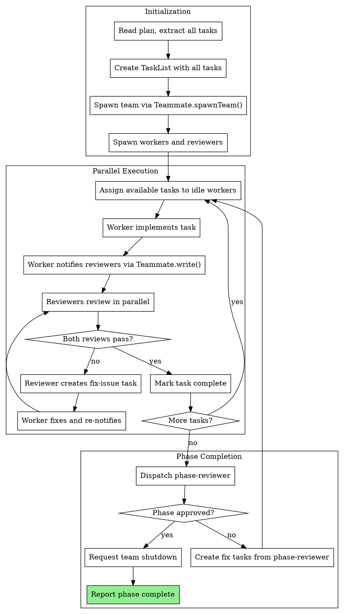
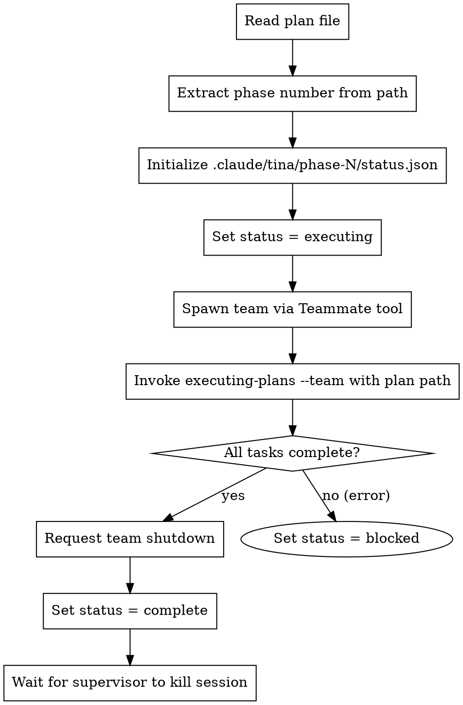

# Orchestrated Automation Phase 2 Implementation Plan

> **For Claude:** REQUIRED SUB-SKILL: Use tina:executing-plans to implement this plan task-by-task.

**Goal:** Enable team-based parallel execution using the Teammate tool, where a team-lead coordinates multiple workers and dedicated reviewers.

**Architecture:** The team-lead spawns a team via `Teammate.spawnTeam()`, then spawns workers (`supersonic:implementer`) and reviewers (`supersonic:spec-reviewer`, `supersonic:code-quality-reviewer`). Workers implement tasks and notify reviewers via `Teammate.write()`. Reviewers respond with approval or fix-issue tasks. Team-lead coordinates via task assignment.

**Tech Stack:** Teammate tool (Claude Code MCP), existing skill/agent infrastructure

**Phase context:** Phase 1 created the foundation (orchestrate, team-lead-init, TINA state). This phase adds team-based execution. Phase 3 will add checkpoint/rehydrate.

---

### Task 1: Add Team Composition Constants to executing-plans

**Files:**
- Modify: `skills/executing-plans/SKILL.md`

**Step 1: Read current executing-plans skill**

Read `skills/executing-plans/SKILL.md` to understand current structure.

**Step 2: Add team composition section**

Add after the "## Agents" section:

```markdown

## Team Composition (Phase 2+)

When running in team mode (invoked via team-lead), executing-plans uses the Teammate tool:

**Default team:**
- 2 workers: `supersonic:implementer`
- 1 spec-reviewer: `supersonic:spec-reviewer`
- 1 code-quality-reviewer: `supersonic:code-quality-reviewer`

**Team name:** `phase-N-execution` where N is the phase number

**Teammate message targets:**
- `spec-reviewer` - For spec compliance reviews
- `code-quality-reviewer` - For code quality reviews
- `worker-1`, `worker-2` - For individual workers

**Message protocol:**
- Worker → Reviewer: `"Task X complete, please review. Git range: abc..def"`
- Reviewer → Worker: `"Review passed"` or `"Fix issues: [list]. Assigned fix-issue task."`
- Worker → Team-lead: `"Idle, no tasks available"`
```

**Step 3: Commit the update**

```bash
git add skills/executing-plans/SKILL.md
git commit -m "docs: add team composition section to executing-plans"
```

---

### Task 2: Create Team-Based Execution Mode in executing-plans

**Files:**
- Modify: `skills/executing-plans/SKILL.md`

**Step 1: Read current executing-plans skill**

Read to find the best location for team mode implementation.

**Step 2: Add team mode process section**

Add after "## The Process" section:

```markdown

## Team Mode Process (Phase 2+)

When invoked with `--team` flag or via team-lead-init, uses parallel execution:



### Team Mode Implementation

**1. Initialize Team:**

```
Teammate.spawnTeam({
  name: "phase-N-execution"
})

Teammate.spawn({
  team: "phase-N-execution",
  name: "worker-1",
  agent: "supersonic:implementer"
})

Teammate.spawn({
  team: "phase-N-execution",
  name: "worker-2",
  agent: "supersonic:implementer"
})

Teammate.spawn({
  team: "phase-N-execution",
  name: "spec-reviewer",
  agent: "supersonic:spec-reviewer"
})

Teammate.spawn({
  team: "phase-N-execution",
  name: "code-quality-reviewer",
  agent: "supersonic:code-quality-reviewer"
})
```

**2. Task Assignment:**

Team-lead assigns tasks explicitly:

```
TaskUpdate({
  taskId: "task-1",
  owner: "worker-1",
  status: "in_progress"
})
```

**3. Review Notification:**

Worker notifies reviewers after implementation:

```
Teammate.write({
  target: "spec-reviewer",
  value: "Task 1 complete. Files: src/foo.ts. Git range: abc123..def456. Please review against spec."
})

Teammate.write({
  target: "code-quality-reviewer",
  value: "Task 1 complete. Files: src/foo.ts. Git range: abc123..def456. Please review code quality."
})
```

**4. Review Response:**

Reviewer creates fix-issue task if problems found:

```
TaskCreate({
  subject: "Fix spec issues in Task 1",
  description: "Issues found:\n- Missing validation\n- Wrong return type",
  activeForm: "Fixing spec issues"
})

TaskUpdate({
  taskId: "fix-task-id",
  owner: "worker-1"
})

Teammate.write({
  target: "worker-1",
  value: "Spec review failed. Fix-issue task created: fix-task-id. Issues: Missing validation, wrong return type."
})
```

**5. Team Shutdown:**

After phase-reviewer approves:

```
Teammate.requestShutdown({
  team: "phase-N-execution"
})
```
```

**Step 3: Commit the update**

```bash
git add skills/executing-plans/SKILL.md
git commit -m "feat: add team mode process to executing-plans"
```

---

### Task 3: Update Worker Agent for Team Communication

**Files:**
- Modify: `agents/implementer.md`

**Step 1: Read current implementer agent**

Read `agents/implementer.md` to understand current behavior.

**Step 2: Add team communication section**

Add section for team mode behavior:

```markdown

## Team Mode Behavior

When spawned as a teammate (via Teammate tool), follow this protocol:

### Receiving Tasks

1. Check TaskList for tasks assigned to you (owner = your name)
2. If no tasks, notify team-lead: `Teammate.write({ target: "team-lead", value: "Idle, no tasks assigned" })`
3. If task assigned, work on it

### Implementation Flow

1. Mark task as `in_progress` via TaskUpdate
2. Implement following standard TDD workflow
3. Self-review, commit changes
4. Note git range for reviewers (commit before implementation → HEAD)

### Review Notification

After implementation complete, notify BOTH reviewers:

```
Teammate.write({
  target: "spec-reviewer",
  value: "Task [ID] '[subject]' complete. Files: [list]. Git range: [base]..[head]. Please review."
})

Teammate.write({
  target: "code-quality-reviewer",
  value: "Task [ID] '[subject]' complete. Files: [list]. Git range: [base]..[head]. Please review."
})
```

### Handling Fix Requests

1. Monitor for Teammate messages from reviewers
2. If fix-issue task assigned, work on it immediately
3. After fixing, re-notify reviewers
4. Keep original task `in_progress` until both reviews pass

### Task Completion

Only mark task `completed` when BOTH reviewers approve:
- Spec-reviewer sends: "Spec review passed"
- Code-quality-reviewer sends: "Code quality review passed"

### Shutdown Protocol

When receiving shutdown request via Teammate:
1. Finish current task if possible (< 2 minutes remaining)
2. Otherwise, leave task in current state
3. Acknowledge shutdown
```

**Step 3: Commit the update**

```bash
git add agents/implementer.md
git commit -m "feat: add team communication protocol to implementer agent"
```

---

### Task 4: Update Spec Reviewer Agent for Team Communication

**Files:**
- Modify: `agents/spec-reviewer.md`

**Step 1: Read current spec-reviewer agent**

Read `agents/spec-reviewer.md` to understand current behavior.

**Step 2: Add team communication section**

Add section for team mode:

```markdown

## Team Mode Behavior

When spawned as a teammate, follow this protocol:

### Monitoring for Reviews

1. Monitor Teammate messages for review requests from workers
2. Message format: `"Task [ID] '[subject]' complete. Files: [list]. Git range: [base]..[head]. Please review."`

### Review Process

1. Read task spec from TaskList (via TaskGet)
2. Review implementation against spec:
   - All requirements met?
   - Nothing extra added?
   - Tests match spec expectations?
3. Determine verdict: PASS or FAIL with specific issues

### Communicating Results

**If PASS:**

```
Teammate.write({
  target: "[worker-name]",
  value: "Spec review passed for Task [ID]."
})
```

**If FAIL:**

1. Create fix-issue task:

```
TaskCreate({
  subject: "Fix spec issues: Task [ID]",
  description: "Spec violations found:\n- [Issue 1]: [details]\n- [Issue 2]: [details]\n\nOriginal task: [ID]",
  activeForm: "Fixing spec issues"
})
```

2. Assign to original worker:

```
TaskUpdate({
  taskId: "[fix-task-id]",
  owner: "[worker-name]"
})
```

3. Notify worker:

```
Teammate.write({
  target: "[worker-name]",
  value: "Spec review FAILED for Task [ID]. Fix-issue task created: [fix-task-id]. Issues:\n- [Issue 1]\n- [Issue 2]"
})
```

### Re-reviews

When worker notifies of fix completion:
1. Review ONLY the fix-issue task changes
2. If all issues resolved: notify pass
3. If issues remain: create new fix-issue task

### Shutdown Protocol

1. Complete any in-progress review (< 2 minutes)
2. Leave pending reviews for resumption
3. Acknowledge shutdown
```

**Step 3: Commit the update**

```bash
git add agents/spec-reviewer.md
git commit -m "feat: add team communication protocol to spec-reviewer agent"
```

---

### Task 5: Update Code Quality Reviewer Agent for Team Communication

**Files:**
- Modify: `agents/code-quality-reviewer.md`

**Step 1: Read current code-quality-reviewer agent**

Read `agents/code-quality-reviewer.md` to understand current behavior.

**Step 2: Add team communication section**

Add section for team mode (similar pattern to spec-reviewer but different focus):

```markdown

## Team Mode Behavior

When spawned as a teammate, follow this protocol:

### Monitoring for Reviews

1. Monitor Teammate messages for review requests from workers
2. Message format: `"Task [ID] '[subject]' complete. Files: [list]. Git range: [base]..[head]. Please review."`

### Review Process

1. Read the changed files in git range
2. Review for code quality (NOT spec compliance - that's spec-reviewer's job):
   - Clean, readable code?
   - Follows existing patterns?
   - No unnecessary complexity?
   - Tests well-structured?
   - No magic numbers/strings?
3. Determine verdict: PASS or FAIL with specific issues

### Communicating Results

**If PASS:**

```
Teammate.write({
  target: "[worker-name]",
  value: "Code quality review passed for Task [ID]."
})
```

**If FAIL:**

1. Create fix-issue task:

```
TaskCreate({
  subject: "Fix quality issues: Task [ID]",
  description: "Quality issues found:\n- [Issue 1]: [file:line] [details]\n- [Issue 2]: [file:line] [details]\n\nOriginal task: [ID]",
  activeForm: "Fixing quality issues"
})
```

2. Assign to original worker:

```
TaskUpdate({
  taskId: "[fix-task-id]",
  owner: "[worker-name]"
})
```

3. Notify worker:

```
Teammate.write({
  target: "[worker-name]",
  value: "Code quality review FAILED for Task [ID]. Fix-issue task created: [fix-task-id]. Issues:\n- [Issue 1]\n- [Issue 2]"
})
```

### Severity Guidance

**Block on:**
- Security issues
- Performance problems (O(n²) where O(n) exists)
- Breaking existing patterns
- Untestable code

**Suggest but don't block:**
- Minor style preferences
- Naming bikeshedding
- Optional refactoring

### Shutdown Protocol

1. Complete any in-progress review (< 2 minutes)
2. Leave pending reviews for resumption
3. Acknowledge shutdown
```

**Step 3: Commit the update**

```bash
git add agents/code-quality-reviewer.md
git commit -m "feat: add team communication protocol to code-quality-reviewer agent"
```

---

### Task 6: Update team-lead-init to Spawn Teams

**Files:**
- Modify: `skills/team-lead-init/SKILL.md`

**Step 1: Read current team-lead-init skill**

Read `skills/team-lead-init/SKILL.md` to understand current structure.

**Step 2: Update the process for team mode**

Replace the "Phase 1 Behavior" section with team-based execution:

```markdown

## The Process (Phase 2)



## Team Spawning

Team-lead spawns the execution team before invoking executing-plans:

**Step 1: Create team**

```
Teammate.spawnTeam({
  name: "phase-N-execution"
})
```

**Step 2: Spawn workers (2 by default)**

```
Teammate.spawn({
  team: "phase-N-execution",
  name: "worker-1",
  agent: "supersonic:implementer",
  context: "You are worker-1 in phase N execution team."
})

Teammate.spawn({
  team: "phase-N-execution",
  name: "worker-2",
  agent: "supersonic:implementer",
  context: "You are worker-2 in phase N execution team."
})
```

**Step 3: Spawn dedicated reviewers**

```
Teammate.spawn({
  team: "phase-N-execution",
  name: "spec-reviewer",
  agent: "supersonic:spec-reviewer",
  context: "You are the spec compliance reviewer for phase N."
})

Teammate.spawn({
  team: "phase-N-execution",
  name: "code-quality-reviewer",
  agent: "supersonic:code-quality-reviewer",
  context: "You are the code quality reviewer for phase N."
})
```

**Step 4: Invoke executing-plans with team flag**

```
/supersonic:executing-plans --team <plan-path>
```

## Team Shutdown

After executing-plans completes (all tasks done, phase-reviewer approved):

```
Teammate.requestShutdown({
  team: "phase-N-execution"
})
```

Wait for all teammates to acknowledge, then update status to complete.
```

**Step 3: Update error handling section**

```markdown

## Error Handling

**Plan file not found:**
- Set status = blocked with reason: "Plan file not found: <path>"
- Do NOT spawn team
- Exit (supervisor will detect blocked status)

**Team spawn fails:**
- Retry team spawn once
- If still fails: Set status = blocked with reason: "Failed to spawn team: <error>"
- Exit

**executing-plans fails:**
- Team-lead already has team spawned
- Request team shutdown before marking blocked
- Set status = blocked with reason from execution error
- Exit

**Worker/reviewer unresponsive:**
- executing-plans handles this (spawns replacement)
- If team-lead cannot recover: request shutdown, mark blocked
```

**Step 4: Commit the update**

```bash
git add skills/team-lead-init/SKILL.md
git commit -m "feat: update team-lead-init for team-based execution"
```

---

### Task 7: Add Team Coordination Logic to executing-plans

**Files:**
- Modify: `skills/executing-plans/SKILL.md`

**Step 1: Read current executing-plans skill**

Read to find best location for coordination logic.

**Step 2: Add team coordination section**

Add after the "Team Mode Implementation" section:

```markdown

## Team Coordination Logic

### Task Assignment Strategy

Team-lead assigns tasks to workers explicitly:

1. **Initial assignment:** Assign first N tasks to N workers
2. **Ongoing assignment:** When worker completes task, assign next available
3. **Priority:** Tasks with no blockedBy first, then by task ID order

```
# Check for idle workers
idle_workers = workers where (no task assigned OR assigned task is complete)

# Get available tasks
available_tasks = tasks where (status = pending AND blockedBy is empty)

# Assign tasks
for worker in idle_workers:
  if available_tasks not empty:
    task = available_tasks.pop()
    TaskUpdate(taskId=task.id, owner=worker.name, status="in_progress")
```

### Review Tracking

Team-lead tracks review status per task:

```json
{
  "task-1": {
    "spec_review": "pending|passed|failed",
    "quality_review": "pending|passed|failed",
    "worker": "worker-1"
  }
}
```

Task only marked complete when BOTH reviews are "passed".

### Message Handling

Team-lead monitors for specific messages:

**From workers:**
- `"Idle, no tasks assigned"` → Assign next available task
- `"Task X blocked on Y"` → Note dependency, assign different task

**From reviewers:**
- Reviewers communicate directly with workers
- Team-lead monitors for escalation: `"Review loop exceeded 3 iterations"`

### Infinite Loop Prevention

If task bounces between worker and reviewer 3+ times:

1. Team-lead intervenes
2. Messages both parties: "Review loop detected. Explain core disagreement."
3. If unresolvable: Mark task blocked, continue with other tasks
4. Include blocked task in phase-reviewer context

### Phase Reviewer Integration

After all regular tasks complete:

1. Get git range: first commit of phase → HEAD
2. Dispatch phase-reviewer (NOT a teammate - use Task tool):

```
Task tool:
  subagent_type: supersonic:phase-reviewer
  prompt: |
    Design doc: [path]
    Phase completed: [N]
    Git range: [base]..[head]
    Blocked tasks (if any): [list with reasons]
```

3. If phase-reviewer finds issues:
   - Create fix tasks from issues
   - Assign to available workers
   - Workers implement, notify reviewers
   - Re-run phase-reviewer after fixes

4. If phase-reviewer rejects 3 times:
   - Mark phase blocked
   - Include phase-reviewer feedback in blocked reason

### Completion Criteria

Phase execution complete when:
- All tasks (including fix tasks) have status = complete
- Phase-reviewer approved
- No unresolved blocked tasks (or blocked tasks documented)
```

**Step 3: Commit the update**

```bash
git add skills/executing-plans/SKILL.md
git commit -m "feat: add team coordination logic to executing-plans"
```

---

### Task 8: Add Red Flags for Team Mode

**Files:**
- Modify: `skills/executing-plans/SKILL.md`

**Step 1: Read current red flags section**

Read to understand existing warnings.

**Step 2: Add team-specific red flags**

Add to the "## Red Flags" section:

```markdown

**Team Mode Specific - Never:**
- Spawn multiple teams for the same phase (one team per phase)
- Let workers assign their own tasks (team-lead assigns explicitly)
- Skip reviewer notification (both reviewers must be notified)
- Mark task complete before both reviews pass
- Let review loops continue indefinitely (cap at 3)
- Use Task tool for workers/reviewers in team mode (use Teammate tool)
- Forget to request team shutdown after phase completes

**Team Mode Specific - Always:**
- Create team BEFORE invoking executing-plans
- Track review status for each task
- Wait for BOTH spec and quality reviews
- Intervene in review loops after 3 iterations
- Shut down team cleanly before marking phase complete
- Include blocked task context in phase-reviewer prompt
```

**Step 3: Commit the update**

```bash
git add skills/executing-plans/SKILL.md
git commit -m "docs: add team mode red flags to executing-plans"
```

---

### Task 9: Test Team Spawning Manually

**Step 1: Verify Teammate tool availability**

Check if Teammate tool is available in Claude Code:

```bash
# In Claude Code session, check available tools
# Teammate tool should be listed
```

If not available, document the gap and proceed with testing mock flow.

**Step 2: Create test scenario**

We'll test the team spawning flow manually:

1. Create a simple test plan
2. Invoke team-lead-init
3. Verify team gets spawned
4. Verify workers receive task assignments
5. Verify review notification flow

**Step 3: Document test results**

Create test notes (not committed - transient):

```bash
# Test: Team spawning
# Date: 2026-01-26
# Result: [PASS/FAIL]
# Notes: [observations]
```

**Step 4: Fix any issues discovered**

If testing reveals issues, update relevant files and commit fixes.

---

### Task 10: Update Integration Section in orchestrate Skill

**Files:**
- Modify: `skills/orchestrate/SKILL.md`

**Step 1: Read current orchestrate skill**

Read to find the Integration section.

**Step 2: Update future integrations to reflect Phase 2 completion**

Update the "Future integrations" section:

```markdown

**Phase 2 integrations (now available):**
- Team-based execution via Teammate tool (workers + reviewers)
- Message-based coordination between teammates
- Review tracking and loop prevention

**Future integrations (Phase 3+):**
- Checkpoint/rehydrate for context management
- Helper agent for blocked state diagnosis
```

**Step 3: Commit the update**

```bash
git add skills/orchestrate/SKILL.md
git commit -m "docs: update orchestrate integrations for phase 2"
```

---

### Task 11: Final Verification

**Step 1: Verify all files modified**

Run:
```bash
git log --oneline -15
```

Expected commits from this phase:
- `docs: update orchestrate integrations for phase 2`
- `docs: add team mode red flags to executing-plans`
- `feat: add team coordination logic to executing-plans`
- `feat: update team-lead-init for team-based execution`
- `feat: add team communication protocol to code-quality-reviewer agent`
- `feat: add team communication protocol to spec-reviewer agent`
- `feat: add team communication protocol to implementer agent`
- `feat: add team mode process to executing-plans`
- `docs: add team composition section to executing-plans`

**Step 2: Verify skill syntax**

Run:
```bash
head -5 skills/executing-plans/SKILL.md
head -5 skills/team-lead-init/SKILL.md
```

Expected: Valid YAML frontmatter in both

**Step 3: Verify agent syntax**

Run:
```bash
head -5 agents/implementer.md
head -5 agents/spec-reviewer.md
head -5 agents/code-quality-reviewer.md
```

Expected: Valid YAML frontmatter in all

**Step 4: Document Phase 2 completion**

Update design doc:

```bash
# Add to the design doc
echo -e "\n## Implementation Status\n\n- [x] Phase 1: Foundation\n- [x] Phase 2: Team-Based Execution\n- [ ] Phase 3: Checkpoint/Rehydrate\n- [ ] Phase 4: Multi-Phase & Error Handling\n- [ ] Phase 5: Resumption & Polish" >> docs/plans/2026-01-26-orchestrated-automation-design.md
git add docs/plans/2026-01-26-orchestrated-automation-design.md
git commit -m "docs: mark phase 2 complete in orchestrated automation design"
```

**Step 5: Summary**

Report:
- Phase 2 complete
- Files modified: 6 (executing-plans, team-lead-init, orchestrate, implementer, spec-reviewer, code-quality-reviewer)
- Key capability: Team-based parallel execution with Teammate tool
- Next phase: Phase 3 - Checkpoint/Rehydrate
