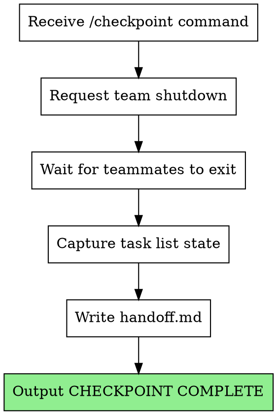
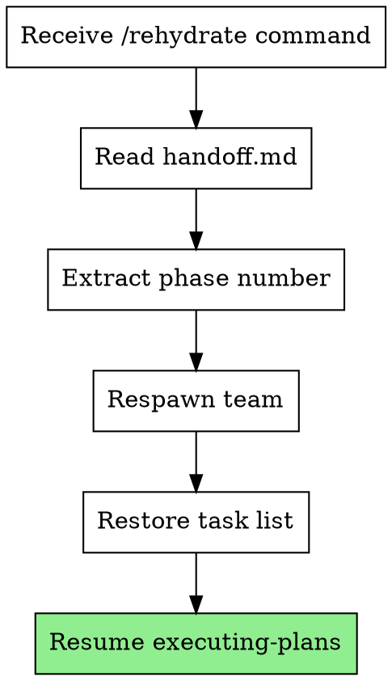

# Orchestrated Automation Phase 3 Implementation Plan

> **For Claude:** REQUIRED SUB-SKILL: Use superpowers:executing-plans to implement this plan task-by-task.

**Goal:** Implement checkpoint and rehydrate skills that allow team-lead sessions to save state and resume after context reset.

**Architecture:** The `checkpoint` skill coordinates team shutdown and writes handoff state to `.claude/tina/phase-N/handoff.md`. The `rehydrate` skill reads the handoff, respawns the team, restores task state, and resumes execution. The supervisor monitors for `checkpoint-needed` signal (already created by tina-statusline.sh) and sends commands via tmux.

**Tech Stack:** Markdown skills with YAML frontmatter, TaskList/TaskCreate/TaskUpdate tools, Teammate tool

**Phase context:** Phase 1 created foundation, Phase 2 added team-based execution. This phase adds context management via checkpoint/rehydrate. Phase 4 will add multi-phase error handling.

---

### Task 1: Create Checkpoint Skill

**Files:**
- Create: `skills/checkpoint/SKILL.md`

**Step 1: Read existing skill patterns**

Read `skills/team-lead-init/SKILL.md` to understand skill structure patterns.

**Step 2: Create the checkpoint skill**

Create `skills/checkpoint/SKILL.md`:

```markdown
---
name: checkpoint
description: Use when supervisor signals checkpoint-needed to save team state before context reset
---

# Checkpoint Protocol

Save team state and prepare for context reset. Called by supervisor when context threshold exceeded.

**Core principle:** Cleanly shut down team, capture all state needed for resumption, signal completion.

**Announce at start:** "Checkpoint requested. Shutting down team and saving state."

## When to Use

- Supervisor sends `/checkpoint` via tmux when context threshold exceeded
- Never invoke manually - supervisor manages the checkpoint lifecycle

## When NOT to Use

- Don't checkpoint mid-task (let current task complete first if < 2 min)
- Don't checkpoint if phase is almost complete (< 1 task remaining)

## The Process



## Team Shutdown

Request graceful shutdown from all teammates:

```
Teammate.requestShutdown({
  team: "phase-N-execution"
})
```

Wait for all teammates to acknowledge (up to 30 seconds). If timeout:
- Force proceed with checkpoint
- Note incomplete shutdown in handoff

## Capturing State

Use TaskList to get all task states:

```
TaskList() -> [
  { id: "1", subject: "...", status: "completed", owner: "" },
  { id: "2", subject: "...", status: "in_progress", owner: "worker-1" },
  { id: "3", subject: "...", status: "pending", owner: "" },
  ...
]
```

For tasks `in_progress`, note:
- Which worker was assigned
- Review status (pending/passed/failed for each reviewer)

## Handoff File Format

Write to `.claude/tina/phase-N/handoff.md`:

```markdown
# Phase N Handoff

**Checkpoint time:** 2026-01-26T10:30:00Z
**Plan path:** docs/plans/2026-01-26-feature-phase-N.md

## Team Composition

- Workers: worker-1, worker-2
- Spec reviewer: spec-reviewer
- Code quality reviewer: code-quality-reviewer

## Task State

### Completed
- Task 1: [subject]
- Task 2: [subject]

### In Progress
- Task 3: [subject]
  - Owner: worker-1
  - Spec review: passed
  - Quality review: pending

### Pending
- Task 4: [subject]
- Task 5: [subject]

## Review Tracking

```json
{
  "task-3": {
    "spec_review": "passed",
    "quality_review": "pending",
    "worker": "worker-1"
  }
}
```

## Notes

- [Any blockers or context needed for resumption]
```

## Completion Signal

After writing handoff, output exactly:

```
CHECKPOINT COMPLETE
```

This signals supervisor that handoff is ready and `/clear` can be sent.

## Error Handling

**Teammate doesn't exit:**
- Wait 30 seconds max
- Proceed anyway, note in handoff

**TaskList fails:**
- Retry once
- If still fails: write minimal handoff with error note

**File write fails:**
- Output error message
- Do NOT output "CHECKPOINT COMPLETE"
- Supervisor will detect timeout and escalate

## Red Flags

**Never:**
- Output "CHECKPOINT COMPLETE" before handoff is written
- Skip team shutdown (state could be inconsistent)
- Lose in-progress task information

**Always:**
- Wait for team shutdown (with timeout)
- Capture ALL task states
- Include review tracking for in-progress tasks
- Output completion signal on success
```

**Step 3: Commit the skill**

```bash
git add skills/checkpoint/SKILL.md
git commit -m "feat: add checkpoint skill for context management"
```

---

### Task 2: Create Rehydrate Skill

**Files:**
- Create: `skills/rehydrate/SKILL.md`

**Step 1: Create the rehydrate skill**

Create `skills/rehydrate/SKILL.md`:

```markdown
---
name: rehydrate
description: Use after /clear to restore team state from checkpoint and resume execution
---

# Rehydrate Protocol

Restore team state from checkpoint handoff and resume phase execution.

**Core principle:** Read handoff, respawn team with same composition, restore task states, continue where we left off.

**Announce at start:** "Rehydrating from checkpoint. Restoring team and task state."

## When to Use

- Supervisor sends `/rehydrate` via tmux after `/clear`
- Never invoke manually - supervisor manages the rehydrate lifecycle

## When NOT to Use

- Don't rehydrate without a handoff file
- Don't rehydrate if phase is already complete

## The Process



## Reading Handoff

Read `.claude/tina/phase-N/handoff.md` where N is extracted from supervisor state or plan path.

Parse:
- Team composition (how many workers, which reviewers)
- Task states (completed, in_progress, pending)
- Review tracking (which reviews passed/pending for in-progress tasks)
- Plan path

## Respawning Team

Use same team composition from handoff:

```
Teammate.spawnTeam({
  name: "phase-N-execution"
})

# Spawn workers (same count as before)
Teammate.spawn({
  team: "phase-N-execution",
  name: "worker-1",
  agent: "supersonic:implementer",
  context: "You are worker-1 in phase N execution team. Resuming from checkpoint."
})

# ... spawn other workers and reviewers
```

## Restoring Task State

Recreate TaskList from handoff:

1. **Completed tasks:** Create with status `completed`
2. **In-progress tasks:** Create with status `in_progress`, set owner
3. **Pending tasks:** Create with status `pending`

```
# For each task from handoff
TaskCreate({
  subject: "[subject from handoff]",
  description: "[description]",
  activeForm: "[activeForm]"
})

# For completed tasks
TaskUpdate({
  taskId: "[id]",
  status: "completed"
})

# For in-progress tasks
TaskUpdate({
  taskId: "[id]",
  status: "in_progress",
  owner: "[worker from handoff]"
})
```

## Restoring Review State

For in-progress tasks, restore review tracking:

```json
{
  "task-3": {
    "spec_review": "passed",
    "quality_review": "pending",
    "worker": "worker-1"
  }
}
```

This tells executing-plans which reviews already passed - don't re-request them.

## Resume Execution

Invoke executing-plans with:
- Plan path from handoff
- `--team` flag (team already spawned)
- `--resume` flag to indicate restoration from checkpoint

```
/supersonic:executing-plans --team --resume <plan-path>
```

executing-plans will:
- Skip task extraction (tasks already in TaskList)
- Skip team spawn (team already exists)
- Continue with in-progress and pending tasks

## Error Handling

**Handoff file not found:**
- Output error: "No handoff file found at .claude/tina/phase-N/handoff.md"
- Set phase status to blocked
- Exit

**Handoff parse error:**
- Output error: "Failed to parse handoff: [details]"
- Set phase status to blocked
- Exit

**Team spawn fails:**
- Retry once
- If still fails: set phase status to blocked, exit

**TaskList restore fails:**
- Try to restore what we can
- Note missing tasks in status

## Red Flags

**Never:**
- Start execution before team is spawned
- Skip restoring review state (causes duplicate reviews)
- Ignore in-progress task owners

**Always:**
- Read handoff completely before spawning
- Restore exact team composition
- Preserve task ownership
- Pass --resume flag to executing-plans
```

**Step 2: Commit the skill**

```bash
git add skills/rehydrate/SKILL.md
git commit -m "feat: add rehydrate skill for context restoration"
```

---

### Task 3: Update executing-plans for Resume Mode

**Files:**
- Modify: `skills/executing-plans/SKILL.md`

**Step 1: Read current executing-plans skill**

Read `skills/executing-plans/SKILL.md` to find where to add resume mode.

**Step 2: Add resume mode section**

Add after "## Team Coordination Logic" section:

```markdown

## Resume Mode (--resume flag)

When invoked with `--resume` flag after rehydrate:

### What Changes

- **Skip task extraction:** TaskList already populated from handoff
- **Skip team spawn:** Team already exists
- **Restore review tracking:** Read from handoff, skip completed reviews

### Review State Restoration

On resume, check review tracking from handoff:

```json
{
  "task-3": {
    "spec_review": "passed",
    "quality_review": "pending",
    "worker": "worker-1"
  }
}
```

For task-3:
- Don't re-dispatch spec-reviewer (already passed)
- DO dispatch code-quality-reviewer when worker notifies

### Resuming In-Progress Tasks

For tasks that were `in_progress` at checkpoint:

1. Check if work was committed (git log for task-related commits)
2. If committed: notify reviewers to continue where they left off
3. If not committed: worker continues implementation

### Worker Context on Resume

Workers spawned after rehydrate get context:
```
"You are worker-1 in phase N execution team. Resuming from checkpoint.
You were working on Task 3 '[subject]'. Check if your work was committed
and continue from there."
```

### Handling Stale State

If handoff is older than 1 hour:
- Warn: "Handoff is [X] hours old. Proceeding with potentially stale state."
- Continue anyway (user can manually intervene if needed)
```

**Step 3: Commit the update**

```bash
git add skills/executing-plans/SKILL.md
git commit -m "feat: add resume mode to executing-plans for checkpoint recovery"
```

---

### Task 4: Update Orchestrate Skill for Checkpoint Handling

**Files:**
- Modify: `skills/orchestrate/SKILL.md`

**Step 1: Read current orchestrate skill**

Read `skills/orchestrate/SKILL.md` to find the monitoring section.

**Step 2: Add checkpoint handling section**

Add after "### Step 3: Phase Loop" section (find the monitoring part):

```markdown

### Checkpoint Handling

Supervisor monitors for checkpoint signal and coordinates reset:

**1. Detect checkpoint needed:**

```bash
# In monitor loop, check for signal file
if [ -f ".claude/tina/checkpoint-needed" ]; then
  echo "Checkpoint signal detected"
  # Proceed to checkpoint handling
fi
```

**2. Send checkpoint command:**

```bash
tmux send-keys -t "$SESSION_NAME" "/checkpoint" Enter
```

**3. Wait for handoff:**

Poll for handoff file update (max 5 minutes):

```bash
HANDOFF_FILE=".claude/tina/phase-$PHASE_NUM/handoff.md"
TIMEOUT=300
START=$(date +%s)

while true; do
  if [ -f "$HANDOFF_FILE" ]; then
    # Check if modified after checkpoint signal
    HANDOFF_TIME=$(stat -f %m "$HANDOFF_FILE" 2>/dev/null || stat -c %Y "$HANDOFF_FILE")
    SIGNAL_TIME=$(stat -f %m ".claude/tina/checkpoint-needed" 2>/dev/null || stat -c %Y ".claude/tina/checkpoint-needed")
    if [ "$HANDOFF_TIME" -gt "$SIGNAL_TIME" ]; then
      echo "Handoff written"
      break
    fi
  fi

  ELAPSED=$(($(date +%s) - START))
  if [ "$ELAPSED" -gt "$TIMEOUT" ]; then
    echo "Checkpoint timeout - escalating"
    # Mark phase blocked, escalate to user
    exit 1
  fi

  sleep 5
done
```

**4. Send clear and rehydrate:**

```bash
# Clear context
tmux send-keys -t "$SESSION_NAME" "/clear" Enter
sleep 2

# Rehydrate from handoff
tmux send-keys -t "$SESSION_NAME" "/rehydrate" Enter

# Remove checkpoint signal
rm ".claude/tina/checkpoint-needed"
```

**5. Continue monitoring:**

After rehydrate, return to normal phase monitoring loop.
```

**Step 3: Add checkpoint to integration section**

Update the Integration section to include checkpoint/rehydrate:

```markdown
**Checkpoint cycle:**
- Statusline script creates `.claude/tina/checkpoint-needed` when context > threshold
- Supervisor detects signal, sends `/checkpoint` to team-lead
- Team-lead runs checkpoint skill, writes handoff, outputs "CHECKPOINT COMPLETE"
- Supervisor sends `/clear`, then `/rehydrate`
- Team-lead runs rehydrate skill, restores state, resumes execution
```

**Step 4: Commit the update**

```bash
git add skills/orchestrate/SKILL.md
git commit -m "feat: add checkpoint handling to orchestrate supervisor"
```

---

### Task 5: Update team-lead-init for Checkpoint Support

**Files:**
- Modify: `skills/team-lead-init/SKILL.md`

**Step 1: Read current team-lead-init skill**

Read to find where to add checkpoint awareness.

**Step 2: Add checkpoint protocol reference**

Add section after "## Team Shutdown":

```markdown

## Checkpoint Protocol

Team-lead responds to `/checkpoint` command from supervisor:

1. Supervisor detects context threshold exceeded
2. Supervisor sends `/checkpoint` via tmux
3. Team-lead invokes `checkpoint` skill
4. Checkpoint skill shuts down team, writes handoff
5. Team-lead outputs "CHECKPOINT COMPLETE"
6. Supervisor sends `/clear`, then `/rehydrate`
7. Fresh session invokes `rehydrate` skill
8. Rehydrate restores team and task state
9. Execution continues

**Important:** The `/checkpoint` and `/rehydrate` commands are slash commands that invoke the respective skills. Team-lead doesn't implement checkpoint logic directly - it delegates to the skills.

See: `skills/checkpoint/SKILL.md` and `skills/rehydrate/SKILL.md`
```

**Step 3: Update integration section**

Add to the Integration section:

```markdown
**Responds to:**
- `/checkpoint` - Invokes checkpoint skill for context management
- `/rehydrate` - Invokes rehydrate skill after context reset
```

**Step 4: Commit the update**

```bash
git add skills/team-lead-init/SKILL.md
git commit -m "docs: add checkpoint protocol reference to team-lead-init"
```

---

### Task 6: Update Agent Shutdown Protocols

**Files:**
- Modify: `agents/implementer.md`
- Modify: `agents/spec-reviewer.md`
- Modify: `agents/code-quality-reviewer.md`

**Step 1: Update implementer shutdown for checkpoint**

In `agents/implementer.md`, update the "### Shutdown Protocol" section:

```markdown
### Shutdown Protocol

When receiving shutdown request via Teammate:

**During checkpoint:**
1. If current task has uncommitted work:
   - Commit work-in-progress with message: "WIP: [task subject] - checkpoint"
   - Note commit SHA in shutdown acknowledgment
2. If current task is in review: leave as-is (reviews will resume)
3. Report current state: task ID, status, last commit SHA
4. Acknowledge shutdown

**Normal shutdown:**
1. Finish current task if possible (< 2 minutes remaining)
2. Otherwise, leave task in current state
3. Acknowledge shutdown
```

**Step 2: Update spec-reviewer shutdown for checkpoint**

In `agents/spec-reviewer.md`, update the "### Shutdown Protocol" section:

```markdown
### Shutdown Protocol

When receiving shutdown request via Teammate:

**During checkpoint:**
1. Complete any in-progress review (< 2 minutes)
2. If review incomplete: note current state (what's checked, what remains)
3. Report pending reviews in acknowledgment
4. Acknowledge shutdown

**Normal shutdown:**
1. Complete any in-progress review (< 2 minutes)
2. Leave pending reviews for resumption
3. Acknowledge shutdown
```

**Step 3: Update code-quality-reviewer shutdown**

In `agents/code-quality-reviewer.md`, update the "### Shutdown Protocol" section (same pattern as spec-reviewer):

```markdown
### Shutdown Protocol

When receiving shutdown request via Teammate:

**During checkpoint:**
1. Complete any in-progress review (< 2 minutes)
2. If review incomplete: note current state (what's checked, what remains)
3. Report pending reviews in acknowledgment
4. Acknowledge shutdown

**Normal shutdown:**
1. Complete any in-progress review (< 2 minutes)
2. Leave pending reviews for resumption
3. Acknowledge shutdown
```

**Step 4: Commit the updates**

```bash
git add agents/implementer.md agents/spec-reviewer.md agents/code-quality-reviewer.md
git commit -m "feat: enhance agent shutdown protocols for checkpoint support"
```

---

### Task 7: Update Integration Sections for Phase 3

**Files:**
- Modify: `skills/orchestrate/SKILL.md`

**Step 1: Update orchestrate integrations**

Update the Integration section in `skills/orchestrate/SKILL.md`:

Replace:
```markdown
**Phase 2 integrations (now available):**
- Team-based execution via Teammate tool (workers + reviewers)
- Message-based coordination between teammates
- Review tracking and loop prevention

**Future integrations (Phase 3+):**
- Checkpoint/rehydrate for context management
- Helper agent for blocked state diagnosis
```

With:
```markdown
**Phase 2 integrations:**
- Team-based execution via Teammate tool (workers + reviewers)
- Message-based coordination between teammates
- Review tracking and loop prevention

**Phase 3 integrations (now available):**
- Checkpoint skill for context threshold management
- Rehydrate skill for state restoration after reset
- Statusline integration (tina-statusline.sh creates checkpoint signal)

**Future integrations (Phase 4+):**
- Helper agent for blocked state diagnosis
- Multi-phase error handling and recovery
```

**Step 2: Commit the update**

```bash
git add skills/orchestrate/SKILL.md
git commit -m "docs: update orchestrate integrations for phase 3"
```

---

### Task 8: Final Verification

**Step 1: Verify all new files exist**

Run:
```bash
ls -la skills/checkpoint/
ls -la skills/rehydrate/
```

Expected:
- `skills/checkpoint/SKILL.md` exists
- `skills/rehydrate/SKILL.md` exists

**Step 2: Verify YAML frontmatter**

Run:
```bash
head -5 skills/checkpoint/SKILL.md
head -5 skills/rehydrate/SKILL.md
```

Expected: Valid YAML frontmatter with `name:` and `description:`

**Step 3: Verify git log**

Run:
```bash
git log --oneline -10
```

Expected commits from this phase:
- `docs: update orchestrate integrations for phase 3`
- `feat: enhance agent shutdown protocols for checkpoint support`
- `docs: add checkpoint protocol reference to team-lead-init`
- `feat: add checkpoint handling to orchestrate supervisor`
- `feat: add resume mode to executing-plans for checkpoint recovery`
- `feat: add rehydrate skill for context restoration`
- `feat: add checkpoint skill for context management`

**Step 4: Update design doc**

```bash
# Update implementation status
sed -i '' 's/\[ \] Phase 3: Checkpoint\/Rehydrate/[x] Phase 3: Checkpoint\/Rehydrate/' docs/plans/2026-01-26-orchestrated-automation-design.md
git add docs/plans/2026-01-26-orchestrated-automation-design.md
git commit -m "docs: mark phase 3 complete in orchestrated automation design"
```

**Step 5: Summary**

Report:
- Phase 3 complete
- Files created: 2 (checkpoint/SKILL.md, rehydrate/SKILL.md)
- Files modified: 5 (executing-plans, orchestrate, team-lead-init, implementer, spec-reviewer, code-quality-reviewer)
- Key capability: Context management via checkpoint/rehydrate cycle
- Next phase: Phase 4 - Multi-Phase & Error Handling
