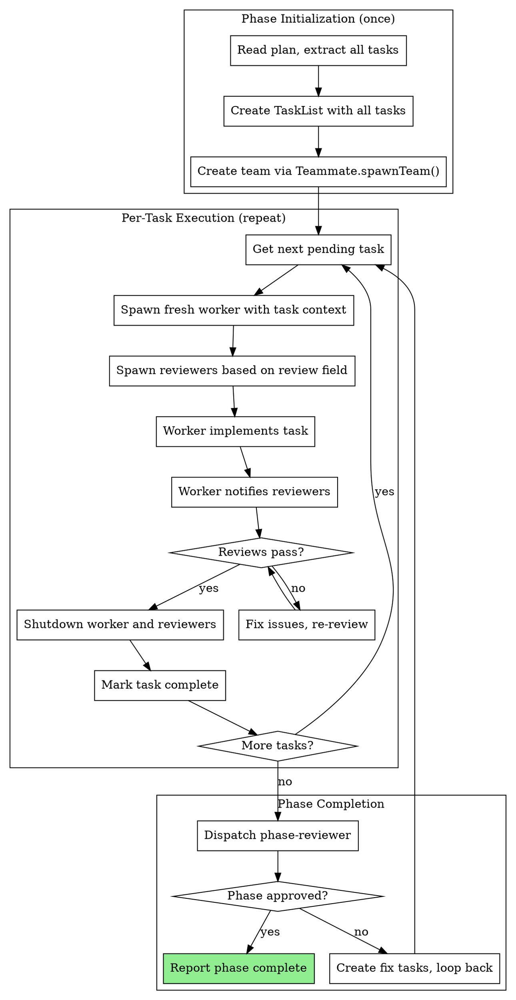
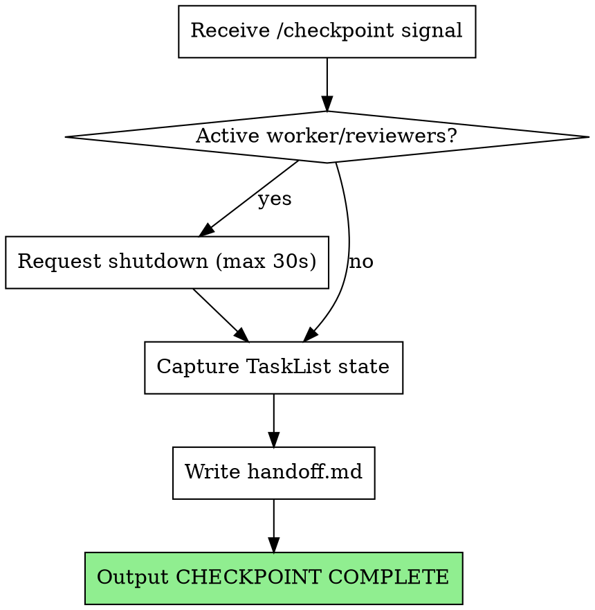
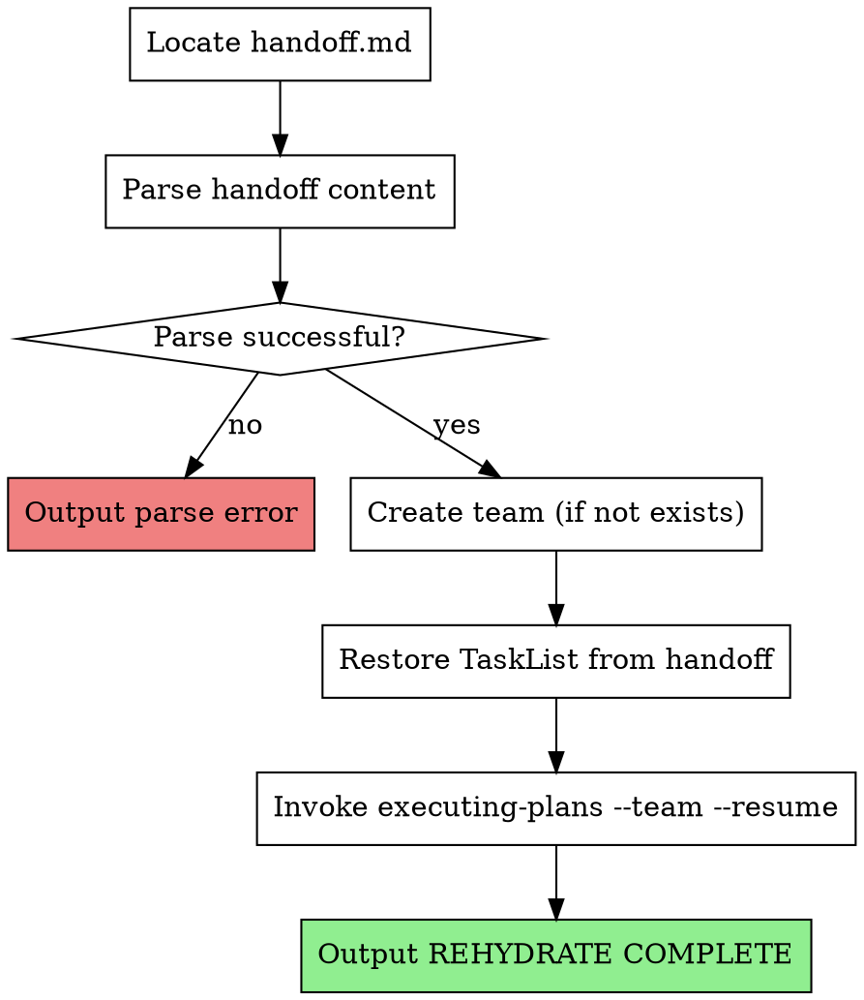

# Ephemeral Team Members Phase 1 Implementation Plan

> **For Claude:** Use tina:executing-plans to implement this plan.

**Goal:** Transform workers and reviewers from long-lived team members into ephemeral agents spawned fresh for each task, eliminating context bloat between tasks.

**Architecture:** Team lead remains long-lived (unchanged), but for each task spawns a fresh worker + reviewers. After task completes (reviews pass), team lead shuts them down. Next task gets fresh agents with clean context. Checkpoint/rehydrate simplified to just TaskList state (no team members to restore).

**Phase context:** This is Phase 1. Changes skills (team-lead-init, executing-plans, checkpoint, rehydrate) and agents (implementer, spec-reviewer, code-quality-reviewer) to support the ephemeral model. Later phases will add parallel workers and dynamic team composition.

---

### Task 1: Add review field to plan task format

**Files:**
- Modify: `/Users/joshua/Projects/tina/agents/planner.md`

**Model:** sonnet (straightforward documentation update)

**review:** spec-only

**Step 1: Read the planner agent**

Read `/Users/joshua/Projects/tina/agents/planner.md` to find the task structure documentation.

**Step 2: Add review field to task structure**

Find the "### Task Structure" section. After the `**Model:**` line and its guidance, add the review field:

```markdown
**review:** [optional - full (default), spec-only, or none]
```

**Review requirements guidance:**
- **full** (default, omit field): Both spec-reviewer and code-quality-reviewer
- **spec-only**: Just spec-reviewer (for tasks with clear, unambiguous implementation)
- **none**: No reviewers (for mechanical tasks like file moves, renames, config updates)

Only specify if task is simple enough to skip code quality review. When in doubt, omit the field (defaults to full).
```

Insert this AFTER the Model selection guidance paragraph and BEFORE the step examples.

**Step 3: Verify the change**

Run: `grep -A 10 "Model selection guidance" /Users/joshua/Projects/tina/agents/planner.md`
Expected: Shows Model guidance followed by review field documentation

**Step 4: Commit**

```bash
git add /Users/joshua/Projects/tina/agents/planner.md
git commit -m "docs: add review field to plan task format"
```

---

### Task 2: Rewrite team-lead-init for ephemeral model

**Files:**
- Modify: `/Users/joshua/Projects/tina/skills/team-lead-init/SKILL.md`

**Step 1: Read current team-lead-init**

Read `/Users/joshua/Projects/tina/skills/team-lead-init/SKILL.md` to understand current structure.

**Step 2: Replace steps 4 and 5 (worker/reviewer spawning)**

The current SKILL.md spawns workers and reviewers at phase start. Replace steps 4 and 5 with a single step that documents the per-task spawning approach:

Replace the "## STEP 4: CALL Task tool NOW to spawn workers" and "## STEP 5: CALL Task tool NOW to spawn reviewers" sections with:

```markdown
---

## STEP 4: Create tasks from plan (NO worker spawn yet)

Parse the plan file and create tasks via TaskCreate:

```json
TaskCreate({
  "subject": "[task subject from plan]",
  "description": "[full task description including review: field value]",
  "activeForm": "Working on [task subject]"
})
```

Create ALL tasks upfront. Do NOT spawn workers yet.

---

## STEP 5: Begin task execution loop

For each task (in order, one at a time):

1. **Spawn fresh worker** for this task:
```json
Task tool({
  "subagent_type": "tina:implementer",
  "team_name": "phase-<N>-execution",
  "name": "worker",
  "prompt": "Implement task: [task subject]. [task description]. Relevant files: [any hints from plan]."
})
```

2. **Spawn reviewers** based on task's review field:
   - `review: full` (default): Spawn spec-reviewer AND code-quality-reviewer
   - `review: spec-only`: Spawn only spec-reviewer
   - `review: none`: Skip reviewer spawning

```json
// For spec-reviewer (if needed)
Task tool({
  "subagent_type": "tina:spec-reviewer",
  "team_name": "phase-<N>-execution",
  "name": "spec-reviewer",
  "prompt": "Review task [ID] for spec compliance."
})

// For code-quality-reviewer (if review: full)
Task tool({
  "subagent_type": "tina:code-quality-reviewer",
  "team_name": "phase-<N>-execution",
  "name": "code-quality-reviewer",
  "prompt": "Review task [ID] for code quality."
})
```

3. **Wait for task completion** (worker implements, reviewers approve)

4. **Shut down worker and reviewers** via requestShutdown:
```json
Teammate tool({
  "operation": "requestShutdown",
  "target_agent_id": "worker",
  "reason": "Task complete"
})
// Repeat for each reviewer spawned
```

5. **Mark task complete** in TaskList

6. **Loop** to next task

---
```

**Step 3: Update Team Spawning section**

Replace the entire "## Team Spawning" section with:

```markdown
## Team Spawning (Ephemeral Model)

Team-lead creates the team ONCE at phase start, but spawns members PER TASK:

**Phase start (once):**
1. Create team via `Teammate.spawnTeam()` - creates the team container
2. Parse plan, create all tasks via TaskCreate
3. Do NOT spawn workers/reviewers yet

**Per task:**
1. Spawn fresh worker with task context in prompt
2. Spawn required reviewers (based on task's review field)
3. Worker implements, reviewers review
4. After all reviews pass, requestShutdown for worker and reviewers
5. Mark task complete
6. Proceed to next task with fresh agents

**Why ephemeral:**
- Fresh context per task (no bleeding between tasks)
- Worker gets exactly the context needed for THIS task
- Reviewers review with fresh eyes
- Team lead coordinates, doesn't accumulate implementation details
```

**Step 4: Update Team Shutdown section**

Replace the "## Team Shutdown" section with:

```markdown
## Team Shutdown

**Per-task shutdown:**
After each task completes (both reviews pass), shut down that task's worker and reviewers:

```json
Teammate tool({
  "operation": "requestShutdown",
  "target_agent_id": "worker",
  "reason": "Task [ID] complete"
})
```

Wait for shutdown approval before proceeding to next task.

**Phase-end cleanup:**
After all tasks complete and phase-reviewer approves:
- No workers/reviewers to shut down (already done per-task)
- Clean up team via Teammate.cleanup() (optional - team file removal)
- Update status.json to complete
```

**Step 5: Update Checkpoint Protocol section**

Replace the "## Checkpoint Protocol" section with:

```markdown
## Checkpoint Protocol

When supervisor signals checkpoint:

1. **Shut down any active worker/reviewers** for current task
   - Use requestShutdown with reason "checkpoint"
   - Wait for approval (max 30s)

2. **Invoke checkpoint skill**
   - Captures TaskList state (which tasks complete, which pending)
   - No team member state to capture (they're ephemeral)
   - Writes handoff.md with task progress

3. **Output "CHECKPOINT COMPLETE"**

**Key difference from persistent model:**
- No team composition to save (members are per-task)
- Only TaskList state matters for resumption
- Checkpoint is simpler: just task progress
```

**Step 6: Commit**

```bash
git add /Users/joshua/Projects/tina/skills/team-lead-init/SKILL.md
git commit -m "feat: rewrite team-lead-init for ephemeral worker/reviewer model"
```

---

### Task 3: Rewrite executing-plans Team Mode for ephemeral model

**Files:**
- Modify: `/Users/joshua/Projects/tina/skills/executing-plans/SKILL.md`

**Step 1: Read current executing-plans**

Read `/Users/joshua/Projects/tina/skills/executing-plans/SKILL.md` to understand current Team Mode sections.

**Step 2: Replace Team Mode Process diagram**

Find the "## Team Mode Process (Phase 2+)" section and replace the diagram with:

```markdown
## Team Mode Process (Ephemeral Model)

When invoked with `--team` flag or via team-lead-init, uses ephemeral workers/reviewers:


```

**Step 3: Replace Team Mode Implementation section**

Replace the "### Team Mode Implementation" section with:

```markdown
### Ephemeral Team Mode Implementation

**1. Phase Initialization (once):**

```
// Create team container (no members yet)
Teammate.spawnTeam({
  team_name: "phase-N-execution",
  description: "Phase N execution team"
})

// Create all tasks from plan
for task in plan.tasks:
  TaskCreate({
    subject: task.subject,
    description: task.description + "\nreview: " + (task.review || "full"),
    activeForm: "Working on " + task.subject
  })
```

**2. Per-Task Execution:**

```
// For each task:
task = get_next_pending_task()

// Spawn fresh worker WITH task context in prompt
Task tool({
  subagent_type: "tina:implementer",
  team_name: "phase-N-execution",
  name: "worker",
  prompt: "Task: " + task.subject + "\n\n" + task.description +
          "\n\nRelevant files: " + hints_from_plan
})

// Spawn reviewers based on review field
if task.review != "none":
  Task tool({
    subagent_type: "tina:spec-reviewer",
    team_name: "phase-N-execution",
    name: "spec-reviewer",
    prompt: "Review task " + task.id + " for spec compliance."
  })

if task.review == "full" or task.review == undefined:
  Task tool({
    subagent_type: "tina:code-quality-reviewer",
    team_name: "phase-N-execution",
    name: "code-quality-reviewer",
    prompt: "Review task " + task.id + " for code quality."
  })
```

**3. Review Notification:**

Worker notifies reviewers after implementation:

```
// Worker sends to each spawned reviewer
Teammate.write({
  target: "spec-reviewer",
  value: "Task " + task.id + " complete. Files: [list]. Git range: [base]..[head]. Please review."
})
```

**4. Review Response:**

If reviewer finds issues, they message worker directly:

```
Teammate.write({
  target: "worker",
  value: "Spec review FAILED. Issues:\n- [Issue 1]\n- [Issue 2]"
})
```

Worker fixes and re-notifies. Loop continues until all required reviews pass.

**5. Task Cleanup:**

After all reviews pass for a task:

```
// Shut down this task's worker and reviewers
Teammate.requestShutdown({
  target_agent_id: "worker",
  reason: "Task " + task.id + " complete"
})

// Repeat for each reviewer that was spawned
Teammate.requestShutdown({
  target_agent_id: "spec-reviewer",
  reason: "Task " + task.id + " complete"
})

// Mark task complete
TaskUpdate({
  taskId: task.id,
  status: "completed"
})
```

**6. Next Task:**

Proceed to next pending task with fresh worker and reviewers. Previous task's context is gone.
```

**Step 4: Update Team Composition section**

Find the "## Team Composition (Phase 2+)" section and replace with:

```markdown
## Team Composition (Ephemeral Model)

When running in team mode, team-lead spawns members per-task, not at phase start:

**Team (created once):**
- `phase-N-execution` - Team container created via Teammate.spawnTeam()

**Per-task members (spawned for each task, then shut down):**
- 1 worker: `tina:implementer` - implements the task
- 0-2 reviewers based on task's `review:` field:
  - `review: full` (default): spawn spec-reviewer AND code-quality-reviewer
  - `review: spec-only`: spawn only spec-reviewer
  - `review: none`: spawn no reviewers

**Member names:** Always `worker`, `spec-reviewer`, `code-quality-reviewer` (same names reused per task, but fresh instances)

**Message protocol:**
- Worker -> Reviewer: `"Task X complete, please review. Git range: abc..def"`
- Reviewer -> Worker: `"Review passed"` or `"Review FAILED. Issues: [list]"`
- Worker -> Team-lead: Only for escalation after 3 review iterations
```

**Step 5: Update Team Coordination Logic section**

Find the "## Team Coordination Logic" section and update the subsections:

Replace "### Task Assignment Strategy" with:

```markdown
### Task Execution Strategy

Team-lead executes tasks sequentially (one at a time):

1. **Get next pending task** from TaskList
2. **Spawn fresh worker** with task context in prompt (not via assignment)
3. **Spawn required reviewers** based on review field
4. **Wait for task completion** (reviews pass)
5. **Shut down worker and reviewers**
6. **Mark task complete**
7. **Repeat** for next task

```
// Pseudocode
while pending_tasks exist:
  task = TaskList.get_next_pending()

  worker = spawn_worker(task.context)
  reviewers = spawn_reviewers(task.review_field)

  wait_for_completion(worker, reviewers)

  shutdown(worker)
  shutdown(reviewers)

  TaskUpdate(task.id, status="completed")
```
```

Replace "### Review Tracking" with:

```markdown
### Review Tracking

Team-lead tracks review status per active task:

```json
{
  "current_task": {
    "id": "3",
    "spec_review": "pending|passed|failed",
    "quality_review": "pending|passed|failed",
    "iteration": 1
  }
}
```

Only ONE task active at a time. Review state resets for each new task.
```

**Step 6: Update Red Flags section**

Find the "**Team Mode Specific - Never:**" section and replace with:

```markdown
**Ephemeral Team Mode - Never:**
- Spawn workers at phase start (spawn per-task instead)
- Keep workers alive between tasks (shut them down after each task)
- Let workers accumulate context from multiple tasks
- Skip shutdown before starting next task
- Assign tasks to existing workers (spawn fresh worker with task context)
- Track review state across tasks (reset per task)

**Ephemeral Team Mode - Always:**
- Create team once at phase start (just the container)
- Spawn fresh worker WITH task context in prompt for each task
- Spawn only required reviewers based on review field
- Shut down worker and reviewers after task completes
- Reset review tracking for each new task
- Include all task context in spawn prompt (worker has no prior knowledge)
```

**Step 7: Update Resume Mode section**

Find the "## Resume Mode (--resume flag)" section and simplify it:

```markdown
## Resume Mode (--resume flag)

When invoked with `--resume` flag after rehydrate:

### What Changes

- **Skip task creation:** TaskList already populated from handoff
- **Skip team creation:** Team already exists (or recreate it - it's just a container)
- **No members to restore:** They're ephemeral, spawn fresh ones

### Resuming Execution

On resume:
1. Read TaskList to find first pending task
2. Spawn fresh worker and reviewers for that task
3. Continue normal per-task execution loop

**No WIP to handle:** If a task was in progress at checkpoint, it starts fresh:
- Previous worker's partial work may be committed (check git log)
- New worker sees task as pending, reviews commits, continues or restarts
- This is simpler than trying to restore mid-task state
```

**Step 8: Commit**

```bash
git add /Users/joshua/Projects/tina/skills/executing-plans/SKILL.md
git commit -m "feat: rewrite executing-plans Team Mode for ephemeral model"
```

---

### Task 4: Simplify checkpoint skill for ephemeral model

**Files:**
- Modify: `/Users/joshua/Projects/tina/skills/checkpoint/SKILL.md`

**Model:** sonnet (simplification, clear spec)

**review:** spec-only

**Step 1: Read current checkpoint skill**

Read `/Users/joshua/Projects/tina/skills/checkpoint/SKILL.md` to understand current structure.

**Step 2: Simplify the process diagram**

Replace the process diagram with a simpler version:

```markdown
## The Process


```

**Step 3: Simplify Step 1 (Team Shutdown)**

Replace "### Step 1: Request Team Shutdown" with:

```markdown
### Step 1: Shut Down Active Members (if any)

In the ephemeral model, only the CURRENT task's worker and reviewers might be active. Shut them down:

```json
// Check team config for active members
// ~/.claude/teams/phase-N-execution/config.json

// For each active member (worker, spec-reviewer, code-quality-reviewer if present)
Teammate tool({
  "operation": "requestShutdown",
  "target_agent_id": "[member-name]",
  "reason": "Checkpoint - context management"
})
```

Wait up to 30 seconds. If members don't respond, proceed anyway (they'll timeout).

**Note:** Unlike the persistent model, there's usually only 0-3 members to shut down (just the current task's agents).
```

**Step 4: Simplify Step 4 (handoff.md content)**

Replace the handoff.md template with a simpler version:

```markdown
### Step 4: Write handoff.md

Create `.claude/tina/phase-N/handoff.md`:

```markdown
# Phase N Checkpoint Handoff

## Timestamp
2026-01-27T10:30:00Z

## Reason
Context threshold exceeded

## Plan Path
docs/plans/2026-01-27-feature-phase-N.md

## Task States
| ID | Subject | Status |
|----|---------|--------|
| 1 | Implement feature A | completed |
| 2 | Implement feature B | pending |
| 3 | Add tests for A | pending |

## Current Task (if any)
Task 2 was in progress. Worker had started but not completed.
Check git log for any partial commits.

## Resumption Notes
- Task 2 should be retried from scratch with fresh worker
- Tasks 3+ are pending, execute normally
```

**What's NOT included (vs persistent model):**
- No team composition (members are ephemeral, respawn per task)
- No review tracking (resets per task anyway)
- No owner mapping (no persistent workers to track)

The handoff is simpler because we don't need to restore team member state.
```

**Step 5: Update State Files section**

Replace the "## State Files" section with:

```markdown
## State Files

**Handoff file:** `.claude/tina/phase-N/handoff.md`

Contains only what's needed to resume:
- Plan path (to re-read task definitions)
- Task states from TaskList (which are complete, which pending)
- Notes about current task if interrupted mid-execution

**What's NOT saved:**
- Team composition (spawn fresh members per task)
- Review tracking (resets per task)
- Worker assignments (no persistent workers)
```

**Step 6: Commit**

```bash
git add /Users/joshua/Projects/tina/skills/checkpoint/SKILL.md
git commit -m "feat: simplify checkpoint for ephemeral team model"
```

---

### Task 5: Simplify rehydrate skill for ephemeral model

**Files:**
- Modify: `/Users/joshua/Projects/tina/skills/rehydrate/SKILL.md`

**Model:** sonnet (simplification, clear spec)

**review:** spec-only

**Step 1: Read current rehydrate skill**

Read `/Users/joshua/Projects/tina/skills/rehydrate/SKILL.md` to understand current structure.

**Step 2: Simplify the process diagram**

Replace the process diagram with a simpler version:

```markdown
## The Process


```

**Step 3: Simplify Step 2 (Parse Handoff)**

Replace the parsed structure example with a simpler one:

```markdown
### Step 2: Parse Handoff Content

Read `.claude/tina/phase-N/handoff.md` and extract:

**Required:**
- Phase number (from path)
- Plan path (to re-read task definitions if needed)
- Task states (ID, subject, status)

**Example parsed structure:**

```json
{
  "phase": 2,
  "plan_path": "docs/plans/2026-01-27-feature-phase-2.md",
  "tasks": [
    { "id": "1", "subject": "Implement feature A", "status": "completed" },
    { "id": "2", "subject": "Implement feature B", "status": "pending" },
    { "id": "3", "subject": "Add tests for A", "status": "pending" }
  ]
}
```

**What's NOT parsed (vs persistent model):**
- No team composition (members are ephemeral)
- No review tracking (resets per task)
- No owner mapping (no persistent workers)
```

**Step 4: Replace Step 3 (Respawn Team) with simpler version**

Replace "### Step 3: Respawn Team" with:

```markdown
### Step 3: Create Team (if not exists)

In the ephemeral model, we only need the team container, not specific members:

```json
Teammate tool({
  "operation": "spawnTeam",
  "team_name": "phase-N-execution",
  "description": "Phase N execution team (resumed)"
})
```

If team already exists from before checkpoint, this step can be skipped.

**No members to spawn:** Workers and reviewers are spawned per-task by executing-plans, not at rehydrate time.
```

**Step 5: Simplify Step 4 (Recreate Task List)**

Replace "### Step 4: Recreate Task List" with:

```markdown
### Step 4: Restore TaskList from Handoff

Restore task states from handoff:

```
for task in handoff.tasks:
  // Check if task already exists in TaskList
  existing = TaskGet(task.id)

  if not existing:
    TaskCreate({
      subject: task.subject,
      description: "(Restored from checkpoint)",
      activeForm: "Working on " + task.subject
    })

  // Ensure status matches handoff
  TaskUpdate({
    taskId: task.id,
    status: task.status
  })
```

**Important:** Tasks that were `in_progress` at checkpoint become `pending`:
- The worker that was working on them is gone
- Fresh worker will start from scratch (may find partial commits to build on)
- This is simpler than trying to restore mid-task state
```

**Step 6: Remove Step 5 (Restore Review Tracking)**

Delete or replace the "### Step 5: Restore Review Tracking" section with:

```markdown
### Step 5: No Review State to Restore

In the ephemeral model, review tracking resets for each task:
- Each task gets fresh reviewers
- Review state is not persisted across tasks
- No `.claude/tina/phase-N/review-tracking.json` needed

Skip this step entirely.
```

**Step 7: Update Red Flags section**

Update the "## Red Flags" section:

```markdown
## Red Flags

**Never:**
- Try to restore team member state (they're ephemeral)
- Try to restore review tracking (resets per task)
- Mark tasks that were in_progress as still in_progress (make them pending)
- Spawn workers/reviewers during rehydrate (executing-plans does that per-task)

**Always:**
- Verify handoff.md exists before proceeding
- Create team container if it doesn't exist
- Restore TaskList with correct statuses
- Pass `--resume` flag to executing-plans
- Output REHYDRATE COMPLETE on success
```

**Step 8: Commit**

```bash
git add /Users/joshua/Projects/tina/skills/rehydrate/SKILL.md
git commit -m "feat: simplify rehydrate for ephemeral team model"
```

---

### Task 6: Simplify implementer agent for ephemeral model

**Files:**
- Modify: `/Users/joshua/Projects/tina/agents/implementer.md`

**Model:** sonnet (simplification)

**review:** spec-only

**Step 1: Read current implementer agent**

Read `/Users/joshua/Projects/tina/agents/implementer.md` to understand current Team Mode section.

**Step 2: Replace Team Mode Behavior section**

Replace the entire "## Team Mode Behavior" section with:

```markdown
## Team Mode Behavior (Ephemeral)

When spawned as a teammate, you exist for ONE TASK only:

### Context

Your spawn prompt contains everything you need:
- Task description and requirements
- Relevant file hints
- Any context from previous tasks the team lead thinks is relevant

You have NO context from previous tasks. This is intentional - fresh eyes on each task.

### Implementation Flow

1. Read your spawn prompt carefully - it contains the task
2. Implement following standard TDD workflow
3. Self-review, commit changes
4. Note git range for reviewers (commit before your work -> HEAD)

### Review Notification

After implementation complete, notify reviewers:

```
Teammate.write({
  target: "spec-reviewer",
  value: "Task complete. Files: [list]. Git range: [base]..[head]. Please review."
})

// If code-quality-reviewer exists for this task
Teammate.write({
  target: "code-quality-reviewer",
  value: "Task complete. Files: [list]. Git range: [base]..[head]. Please review."
})
```

### Handling Fix Requests

1. Reviewer messages you with issues
2. Fix the issues
3. Re-notify the reviewer
4. Repeat until reviewer approves

### When You're Done

Once all reviewers approve, the team lead will shut you down. You don't need to do anything - just wait for the shutdown request and approve it.

### Shutdown Protocol

When receiving shutdown request:
1. Approve immediately - your work is done
2. No state to save - you're ephemeral
```

**Step 3: Remove the old Checkpoint shutdown subsection**

The old "Checkpoint shutdown" behavior is no longer needed. Remove the section about WIP commits and checkpoint acknowledgment. The simplified shutdown protocol above handles all cases.

**Step 4: Commit**

```bash
git add /Users/joshua/Projects/tina/agents/implementer.md
git commit -m "feat: simplify implementer agent for ephemeral model"
```

---

### Task 7: Simplify spec-reviewer agent for ephemeral model

**Files:**
- Modify: `/Users/joshua/Projects/tina/agents/spec-reviewer.md`

**Model:** sonnet (simplification)

**review:** spec-only

**Step 1: Read current spec-reviewer agent**

Read `/Users/joshua/Projects/tina/agents/spec-reviewer.md` to understand current Team Mode section.

**Step 2: Replace Team Mode Behavior section**

Replace the entire "## Team Mode Behavior" section with:

```markdown
## Team Mode Behavior (Ephemeral)

When spawned as a teammate, you exist for ONE TASK only:

### Context

Your spawn prompt tells you which task to review. You have no context from previous tasks.

### Review Process

1. Wait for worker to notify you: `"Task complete. Files: [list]. Git range: [base]..[head]. Please review."`
2. Read the task spec (from your spawn prompt or TaskGet)
3. Review implementation against spec:
   - All requirements met?
   - Nothing extra added?
   - Tests match spec expectations?
4. Determine verdict: PASS or FAIL with specific issues

### Communicating Results

**If PASS:**

```
Teammate.write({
  target: "worker",
  value: "Spec review passed."
})
```

**If FAIL:**

```
Teammate.write({
  target: "worker",
  value: "Spec review FAILED. Issues:\n- [Issue 1]: [details]\n- [Issue 2]: [details]"
})
```

### Re-reviews

When worker notifies of fixes:
1. Review the changes
2. If all issues resolved: send pass
3. If issues remain: send fail with remaining issues

### Shutdown

Once review passes (or after 3 iterations), team lead shuts you down. Approve immediately.
```

**Step 3: Remove old Shutdown Protocol subsection**

Remove the detailed checkpoint shutdown behavior. The simple "Approve immediately" is sufficient for ephemeral agents.

**Step 4: Commit**

```bash
git add /Users/joshua/Projects/tina/agents/spec-reviewer.md
git commit -m "feat: simplify spec-reviewer agent for ephemeral model"
```

---

### Task 8: Simplify code-quality-reviewer agent for ephemeral model

**Files:**
- Modify: `/Users/joshua/Projects/tina/agents/code-quality-reviewer.md`

**Model:** sonnet (simplification)

**review:** spec-only

**Step 1: Read current code-quality-reviewer agent**

Read `/Users/joshua/Projects/tina/agents/code-quality-reviewer.md` to understand current Team Mode section.

**Step 2: Replace Team Mode Behavior section**

Replace the entire "## Team Mode Behavior" section with:

```markdown
## Team Mode Behavior (Ephemeral)

When spawned as a teammate, you exist for ONE TASK only:

### Context

Your spawn prompt tells you which task to review. You have no context from previous tasks.

### Review Process

1. Wait for worker to notify you: `"Task complete. Files: [list]. Git range: [base]..[head]. Please review."`
2. Read the changed files in git range
3. Review for code quality (NOT spec compliance - that's spec-reviewer's job):
   - Clean, readable code?
   - Follows existing patterns?
   - No unnecessary complexity?
   - Tests well-structured?
4. Determine verdict: PASS or FAIL with specific issues

### Communicating Results

**If PASS:**

```
Teammate.write({
  target: "worker",
  value: "Code quality review passed."
})
```

**If FAIL:**

```
Teammate.write({
  target: "worker",
  value: "Code quality review FAILED. Issues:\n- [Issue 1]: [file:line] [details]\n- [Issue 2]: [file:line] [details]"
})
```

### Severity Guidance

**Block on:**
- Security issues
- Performance problems
- Breaking existing patterns
- Untestable code

**Suggest but don't block:**
- Minor style preferences
- Naming bikeshedding

### Shutdown

Once review passes (or after 3 iterations), team lead shuts you down. Approve immediately.
```

**Step 3: Remove old Shutdown Protocol subsection**

Remove the detailed checkpoint shutdown behavior. The simple "Approve immediately" is sufficient for ephemeral agents.

**Step 4: Commit**

```bash
git add /Users/joshua/Projects/tina/agents/code-quality-reviewer.md
git commit -m "feat: simplify code-quality-reviewer agent for ephemeral model"
```

---

### Task 9: Final verification and cleanup

**Files:**
- Read: Multiple files for verification

**Model:** haiku (verification only)

**review:** none

**Step 1: Verify all skill frontmatters are valid**

Run: `head -5 /Users/joshua/Projects/tina/skills/team-lead-init/SKILL.md /Users/joshua/Projects/tina/skills/executing-plans/SKILL.md /Users/joshua/Projects/tina/skills/checkpoint/SKILL.md /Users/joshua/Projects/tina/skills/rehydrate/SKILL.md`

Expected: All should have valid YAML frontmatter with `---` delimiters, name, and description.

**Step 2: Verify all agent frontmatters are valid**

Run: `head -5 /Users/joshua/Projects/tina/agents/implementer.md /Users/joshua/Projects/tina/agents/spec-reviewer.md /Users/joshua/Projects/tina/agents/code-quality-reviewer.md`

Expected: All should have valid YAML frontmatter with name, description, and model fields.

**Step 3: Verify commit history**

Run: `git log --oneline -10`

Expected commits (newest first):
- `feat: simplify code-quality-reviewer agent for ephemeral model`
- `feat: simplify spec-reviewer agent for ephemeral model`
- `feat: simplify implementer agent for ephemeral model`
- `feat: simplify rehydrate for ephemeral team model`
- `feat: simplify checkpoint for ephemeral team model`
- `feat: rewrite executing-plans Team Mode for ephemeral model`
- `feat: rewrite team-lead-init for ephemeral worker/reviewer model`
- `docs: add review field to plan task format`

**Step 4: Summary**

Report:
- Phase 1 complete
- Files modified: 8 (writing-plans, team-lead-init, executing-plans, checkpoint, rehydrate, implementer, spec-reviewer, code-quality-reviewer)
- Key changes:
  - Workers/reviewers now spawned per-task with fresh context
  - Team lead shuts them down after each task completes
  - Checkpoint/rehydrate simplified to just TaskList state
  - Agents simplified for ephemeral lifecycle

---

## Phase Estimates

| Metric | Expected | Measurement Command |
|--------|----------|---------------------|
| Skill lines changed | ~400 | `git diff --stat HEAD~8..HEAD -- 'skills/**/*.md' \| tail -1` |
| Agent lines changed | ~150 | `git diff --stat HEAD~8..HEAD -- 'agents/*.md' \| tail -1` |
| Files touched | 8 | `git diff --name-only HEAD~8..HEAD \| wc -l` |

**Target files:**
- `agents/planner.md` - Add review field to task format documentation
- `skills/team-lead-init/SKILL.md` - Rewrite for per-task spawning
- `skills/executing-plans/SKILL.md` - Rewrite Team Mode for ephemeral model
- `skills/checkpoint/SKILL.md` - Simplify for ephemeral model
- `skills/rehydrate/SKILL.md` - Simplify for ephemeral model
- `agents/implementer.md` - Simplify Team Mode behavior
- `agents/spec-reviewer.md` - Simplify Team Mode behavior
- `agents/code-quality-reviewer.md` - Simplify Team Mode behavior

**ROI expectation:** Eliminates context bloat between tasks. Each task gets fresh workers with exactly the context needed, preventing confusion from accumulated state. Simplifies checkpoint/rehydrate by removing team member state management.
