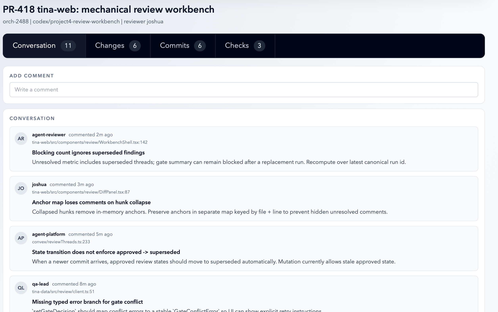
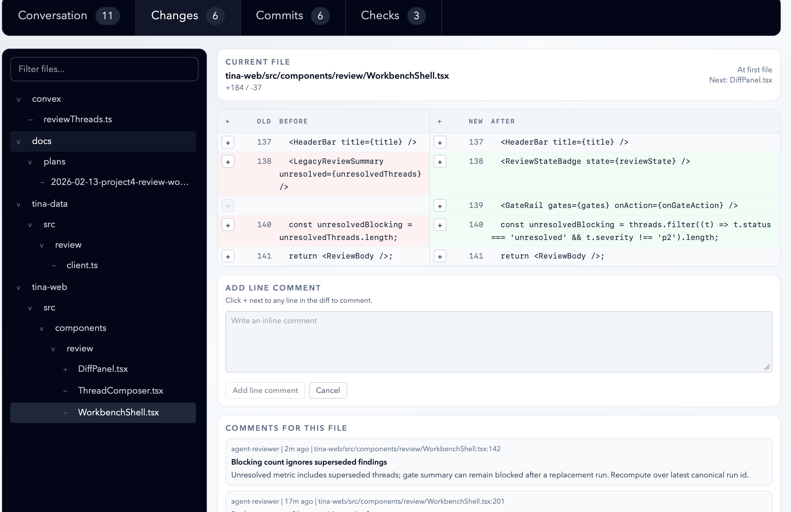
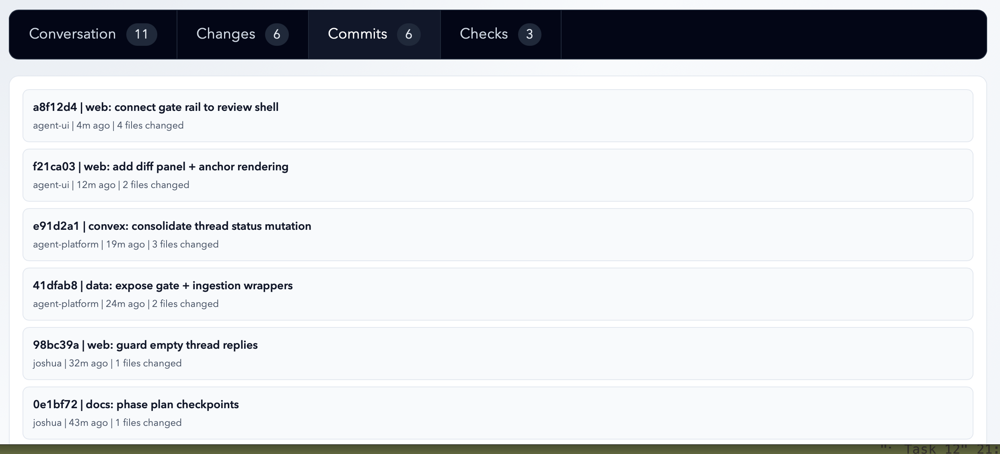
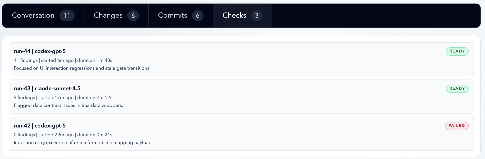

# Mechanical Review Workbench Design

Project 4 from the [IDE Program Roadmap](2026-02-10-tina-web-ide-program-roadmap.md).

## Goal

Deliver a GitHub-PR-style review surface where a review agent mechanically works through a configurable checklist of CLI and project checks, writes code findings, and produces a structured scorecard. Humans monitor in real-time via tina-web and step in at HITL gates when required.

## Wireframes

Visual references:






Interactive prototype with static data covering all 4 tabs:

`designs/src/designSets/project4-mechanical-review-workbench/`

- `data.ts` — seed data types and fixtures (ReviewFile, ReviewThread, AgentReviewRun, HitlGate, etc.)
- `index.tsx` — full interactive wireframe (tab switching, file tree, side-by-side diff, inline commenting, spring navigation)

## Context

Projects 1-3 are complete (work graph, control plane, feedback fabric). The existing `feedbackEntries` system is replaced entirely by the review domain described here.

## Architecture

```
┌─────────────────────────────────────┐
│ tina-web (React)                    │
│  - Review workbench UI (4 tabs)     │
│  - Convex subscriptions (threads,   │
│    checks, gates, commits)          │
│  - Daemon HTTP fetch (diffs, files) │
└──────────┬──────────────┬───────────┘
           │              │
    Convex queries    HTTP GET
           │              │
┌──────────▼──────┐ ┌────▼────────────┐
│ Convex          │ │ tina-daemon     │
│  - reviews      │ │  - HTTP server  │
│  - reviewThreads│ │  - git diff API │
│  - reviewChecks │ │  - file tree API│
│  - reviewGates  │ │  - (future:     │
│  - commits      │ │    terminal)    │
└─────────────────┘ └────▲────────────┘
                         │
                    filesystem
                         │
┌────────────────────────┴────────────┐
│ tina-session CLI                    │
│  review start / complete            │
│  review add-finding / resolve       │
│  review run-checks                  │
│  review start-check / complete-check│
│  review gate approve / block        │
└─────────────────────────────────────┘
```

### Data Boundary

- **Convex**: All review metadata — threads, checks, gates, review state. Real-time subscriptions drive the web UI.
- **Daemon HTTP**: Heavy/computed data — git diffs, file trees, file content. Served on-demand from worktree. No storage.
- **tina-session CLI**: The only agent-facing interface. Writes to Convex via tina-data internally.

### Node Routing

Single-node only for now (daemon serves on localhost). The API contract is node-agnostic (takes worktree path, returns data) so adding multi-node routing later doesn't change the API surface.

## Review Scoping

- Each **phase** gets its own review (agent-driven, automatic at phase boundaries)
- Each **orchestration** gets a rollup review (HITL surface for human gates)

## Data Model

### `reviews`

One per phase + one per orchestration.

| Field | Type | Notes |
|-------|------|-------|
| orchestrationId | Id | Required |
| phaseNumber | number \| null | null for orchestration-level |
| state | "open" \| "changes_requested" \| "approved" \| "superseded" | State machine |
| reviewerAgent | string | Agent that ran the review |
| startedAt | string | ISO 8601 |
| completedAt | string \| null | Set on complete |

### `reviewThreads`

Findings from the review agent's code review pass. Replaces `feedbackEntries`.

| Field | Type | Notes |
|-------|------|-------|
| reviewId | Id | Parent review |
| orchestrationId | Id | For cross-review queries |
| filePath | string | Source file path |
| line | number | Line number in file |
| commitSha | string | Commit this finding relates to |
| summary | string | Short title |
| body | string | Detailed explanation |
| severity | "p0" \| "p1" \| "p2" | p0 = critical, p2 = informational |
| status | "unresolved" \| "resolved" | |
| source | "human" \| "agent" | Who created it |
| author | string | Author name |
| gateImpact | "plan" \| "review" \| "finalize" | Which gate this finding can block |
| createdAt | string | ISO 8601 |
| resolvedAt | string \| null | |
| resolvedBy | string \| null | |

### `reviewChecks`

The review agent's scorecard. One row per check.

| Field | Type | Notes |
|-------|------|-------|
| reviewId | Id | Parent review |
| orchestrationId | Id | For cross-review queries |
| name | string | e.g. "typecheck", "test", "api-contracts" |
| kind | "cli" \| "project" | CLI command or markdown-defined |
| command | string \| null | For CLI checks |
| status | "running" \| "passed" \| "failed" | |
| comment | string \| null | Explanation on failure |
| output | string \| null | Captured stdout/stderr for CLI checks |
| startedAt | string | ISO 8601 |
| completedAt | string \| null | |
| durationMs | number \| null | |

### `reviewGates`

HITL checkpoints. Review-local state, not coupled to control plane.

| Field | Type | Notes |
|-------|------|-------|
| orchestrationId | Id | |
| gateId | "plan" \| "review" \| "finalize" | |
| status | "pending" \| "blocked" \| "approved" | |
| owner | string | Who is responsible for this gate |
| decidedBy | string \| null | |
| decidedAt | string \| null | |
| summary | string | Current state explanation |

### Data Retention

Phase-level review data (reviews, threads, checks) is auto-purged after a configurable age (default 30 days). Orchestration-level reviews are kept indefinitely. This keeps check output (which can be large) from accumulating unbounded while preserving the rollup view. Purge runs as a scheduled Convex cron or daemon-triggered mutation.

### Dropped

- `feedbackEntries` table and all related code (mutations, queries, components, tests)

### Kept As-Is

- `commits` table (already synced by daemon)
- `orchestrationEvents` table

## Daemon HTTP Server

Lightweight HTTP server on tina-daemon. Localhost only, no auth.

### Endpoints

```
GET /diff?worktree={path}&base={branch}
  → File list with stats (+/- counts, file status)
  → Used by Changes tab sidebar (instant, no heavy diff computation)

GET /diff/file?worktree={path}&base={branch}&file={path}
  → Structured diff hunks for a single file
  → Side-by-side format matching DiffRow shape (oldLine, newLine, oldText, newText, kind)
  → Fetched on file selection

GET /file?worktree={path}&path={file}&ref={sha}
  → File content at a specific git ref
```

Port configured in `config.toml`. Stateless — every request computes from the worktree's git repo.

## tina-session Review CLI

All commands infer orchestration/review context from the worktree's `supervisor-state.json`.

### Review Lifecycle

```bash
tina-session review start --phase 2
  # Creates review record in Convex, returns review ID
  # Omit --phase for orchestration-level review

tina-session review complete --status approved|changes_requested
  # Marks review done, sets final state
```

### Findings

```bash
tina-session review add-finding \
  --file src/foo.ts --line 42 --commit a8f12d4 \
  --severity p1 --gate review \
  --summary "Blocking count ignores superseded" \
  --body "Detailed explanation..."

tina-session review resolve-finding --id thr-311
```

### Checks

```bash
# Run all CLI checks from tina-checks.toml in one shot
# Writes each result to Convex as it completes (real-time in web)
# Returns full JSON summary to agent at the end
tina-session review run-checks

# Output:
# [
#   { "name": "typecheck", "command": "mise typecheck", "status": "passed", "exit_code": 0, "duration_ms": 4200, "output": "" },
#   { "name": "test", "command": "mise test", "status": "failed", "exit_code": 1, "duration_ms": 12800, "output": "FAIL..." }
# ]

# Project checks (agent evaluates markdown, reports result)
tina-session review start-check --name api-contracts --kind project
tina-session review complete-check --name api-contracts --status passed|failed --comment "Reason"
```

### Gates

```bash
tina-session review gate approve --gate review
tina-session review gate block --gate review --reason "Unresolved p0 findings"
```

## Check Suite Configuration

Defined in `tina-checks.toml` at the project root.

```toml
[[check]]
name = "typecheck"
command = "mise typecheck"

[[check]]
name = "test"
command = "mise test"

[[check]]
name = "lint"
command = "mise lint"

[[check]]
name = "api-contracts"
kind = "project"
path = "checks/api-contracts.md"
```

CLI checks have a `command` field. Project checks have `kind = "project"` and a `path` to a markdown file the review agent reads and follows.

## Review Agent Flow

The review agent is spawned by the orchestration state machine at phase boundaries.

```
1. tina-session review start --phase N
   → creates review record

2. tina-session review run-checks
   → runs all CLI checks from tina-checks.toml
   → results stream into Convex (web shows checks filling in real-time)
   → agent receives JSON summary of results

3. Agent reads project checks (markdown files from tina-checks.toml)
   → for each: reads instructions, evaluates against code
   → tina-session review start-check --name "api-contracts" --kind project
   → tina-session review complete-check --name "api-contracts" --status passed|failed

4. Agent reads the diff (from worktree git)
   → walks changed files, writes findings
   → tina-session review add-finding --file ... --severity ... --summary ...

5. Agent assesses overall state:
   → any failed checks or unresolved p0/p1 findings → changes_requested
   → all clean → approved
   → tina-session review complete --status approved|changes_requested

6. If changes_requested and gate requires HITL:
   → gate stays blocked, human reviews in web UI
   → human approves/blocks gate
   → orchestration proceeds or agent re-reviews after fixes
```

## Web UI

### Route

`/orchestrations/{id}/reviews/{reviewId}`

Phase reviews listed from orchestration detail page.

### Header (all tabs)

- PR-style title: orchestration name / phase label
- Metadata: orchestration ID, branch, reviewer
- Review state badge (open / changes_requested / approved / superseded)
- Gate status indicators for HITL gates

### Commits + Conversation Tab

**Commits:**
- List from Convex `commits` table filtered to this orchestration's branch
- Each row: sha | title, author, relative time, files changed

**Conversation:**
- Comment composer at top (human writes general comments → reviewThread with no file anchor)
- Chronological feed of all reviewThreads for this review
- Each entry: avatar initials, author, timestamp, file:line link, summary + body
- Clicking a file:line reference switches to Changes tab and scrolls to that line

### Checks Tab

- List from Convex `reviewChecks` subscription, fills in real-time
- Each row: name, kind (cli/project), status badge (running/passed/failed), duration
- Failed checks show comment/output explaining failure

### Changes Tab

- **Left sidebar**: file tree from daemon `GET /diff` (file list + stats only, no full diff)
- **Right panel**: single-file side-by-side diff from daemon `GET /diff/file` (fetched on file selection)
- Thread markers overlaid on diff lines (Convex reviewThreads subscription joined with diff)
- Inline comment composer (click + button on any line)
- Per-file comments section below diff
- Spring-to-next-file navigation on overscroll
- File filter input in sidebar

## Implementation Phases

### Phase 1: Data Foundation
- New Convex tables: `reviews`, `reviewThreads`, `reviewChecks`, `reviewGates`
- Mutations and queries for each table
- Tests
- Drop `feedbackEntries` table and all related code

### Phase 2: tina-session Review CLI
- `review start`, `review complete`
- `review add-finding`, `review resolve-finding`
- `review run-checks` (reads `tina-checks.toml`, runs CLI checks, writes to Convex)
- `review start-check`, `review complete-check` (project checks)
- `review gate approve`, `review gate block`

### Phase 3: Daemon HTTP Server
- HTTP server on tina-daemon (localhost port, configured in config.toml)
- `GET /diff` (file list + stats)
- `GET /diff/file` (single file structured hunks)
- `GET /file` (file content at ref)

### Phase 4: Web UI — Commits + Conversation
- Review detail page shell (header, tab bar, route)
- Commits list (Convex `commits` query)
- Conversation feed + comment composer (Convex `reviewThreads` subscription)
- Review state badge + gate indicators in header

### Phase 5: Web UI — Checks
- `reviewChecks` real-time subscription
- Status badges (running/passed/failed) with color coding
- Failure output display
- Real-time fill-in as review agent works through checklist

### Phase 6: Web UI — Changes
- File sidebar from daemon `GET /diff`
- Side-by-side diff panel from daemon `GET /diff/file`
- Thread marker overlay (Convex subscription joined with diff lines)
- Inline line commenting
- Spring-to-next-file navigation
- Per-file comments section

### Phase 7: Review Agent Integration
- Review agent skill/prompt following the flow in this doc
- Orchestration state machine wiring to spawn review at phase boundaries
- `tina-checks.toml` convention and project check markdown format

## Architectural Context

**Patterns to follow:**

- CLI subcommand group: follow `work` pattern (multi-level nesting) in `tina-session/src/main.rs:Commands::Work` — `review` becomes `Commands::Review { command: ReviewCommands }` with sub-enums for `start`, `complete`, `add-finding`, `run-checks`, `gate`
- CLI command implementation: `tina-session/src/commands/work/design.rs` — one file per sub-domain, functions return `anyhow::Result<u8>`
- Convex writes from CLI: `tina-session/src/convex.rs:run_convex()` — one-shot tokio runtime, `ConvexWriter::connect()`, call mutations, non-fatal error handling with `eprintln!("Warning: ...")`
- Context inference: `tina-session/src/state/schema.rs:SupervisorState::load()` — review commands should load supervisor state to get orchestration ID, phase number, worktree path
- Convex table schema: `convex/schema.ts` — use `v.union(v.literal(...))` for enums, ISO 8601 strings for timestamps (not epoch numbers), `v.id("tableName")` for FKs, indexes named `by_field` or `by_field1_field2`
- Convex mutations: `convex/feedbackEntries.ts` — validate FK existence, mutual exclusivity checks, `new Date().toISOString()` for timestamps, return inserted ID
- Convex queries: `convex/feedbackEntries.ts:listFeedbackEntriesByOrchestration` — use `.withIndex()`, optional filters, `.take(limit)` with default
- Convex tests: `convex/feedbackEntries.test.ts` — `convexTest(schema, modules)` per test, fixture functions in `convex/test_helpers.ts`, test all CRUD + error cases + filtering
- Web queries: `tina-web/src/services/data/queryDefs.ts` — centralized `QueryDef<A, Args>` with Effect schemas, consumed via `useTypedQuery` hook
- Web components: `tina-web/src/components/OrchestrationPage.tsx` — three-column layout pattern, `useTypedQuery` for data, `DataErrorBoundary` wrapper
- Web routing: `tina-web/src/App.tsx` — add review route as nested route under orchestrations
- Web tests: `tina-web/src/components/__tests__/` — mock `useTypedQuery`, use `renderWithAppRuntime`, test builders in `tina-web/src/test/builders/`

**Code to reuse:**

- `tina-session/src/convex.rs:ConvexWriter` — add review mutations to this client
- `tina-data` crate — add review query/mutation type definitions for shared use
- `convex/test_helpers.ts:createFeatureFixture` — extend with review fixture helpers
- `tina-web/src/hooks/useTypedQuery.ts` — use as-is for all Convex review data
- `tina-web/src/lib/query-state.ts:matchQueryResult` — loading/error/success pattern matching
- `tina-web/src/components/ui/status-badge.tsx` — reuse for review state + check status badges
- `tina-daemon/src/git.rs` — extend for diff computation (already parses git log output)
- `tina-daemon/src/watcher.rs:DaemonWatcher` — reference for adding new watch sources if needed

**Anti-patterns:**

- Don't use epoch numbers for timestamps in Convex — existing convention is ISO 8601 strings (design doc says `number` for timestamps, should be `string`)
- Don't call Convex directly from agents — all agent writes go through `tina-session` CLI
- Don't add `fetch()` calls inline in web components — daemon data goes through react-query (TanStack Query) behind custom hooks (e.g. `useDiffFiles`, `useDiffFile`). This keeps the daemon HTTP layer consistent with how Convex data is consumed (hooks that return loading/error/data).

**Integration points:**

- Entry: review page route added to `tina-web/src/App.tsx`
- Entry: `review` subcommand added to `tina-session/src/main.rs:Commands` enum
- Entry: HTTP server spawned as task in `tina-daemon/src/main.rs` event loop (alongside heartbeat)
- Connects to: `convex/schema.ts` (new tables), `tina-session/src/convex.rs` (new ConvexWriter methods), `tina-data` (new shared types)
- Connects to: orchestration state machine in `tina-session/src/commands/orchestrate.rs` — review phase triggers review agent spawn
- Replaces: `convex/feedbackEntries.ts`, `tina-web/src/components/FeedbackSection.tsx`, `tina-web/src/components/FeedbackSummarySection.tsx`, `tina-web/src/services/data/queryDefs.ts` (FeedbackEntryListQuery, FeedbackEntryByTargetQuery, BlockingFeedbackSummaryQuery)
- Daemon HTTP: needs `axum` dependency added to `tina-daemon/Cargo.toml`, port configured in `~/Library/Application Support/tina/config.toml`
- Web HTTP: add `@tanstack/react-query` to tina-web, daemon URL via `VITE_DAEMON_URL` env var, custom hooks wrapping react-query for daemon data

**Risks:**

- `reviewChecks.output` can be large (full test suite output). Store full output so it's visible in the UI. Auto-purge phase-level review data (checks, threads) older than a configurable age (e.g. 30 days). Orchestration-level reviews kept longer.

## Success Criteria

- A phase review runs mechanically: CLI checks execute, project checks are evaluated, code findings are written — all visible in real-time on tina-web.
- HITL gates can block orchestration progression until explicit human approval in the web UI.
- The Changes tab renders diffs with inline thread markers and commenting, combining daemon HTTP (diffs) and Convex (threads).
- Agents interact exclusively through `tina-session review` CLI commands.
