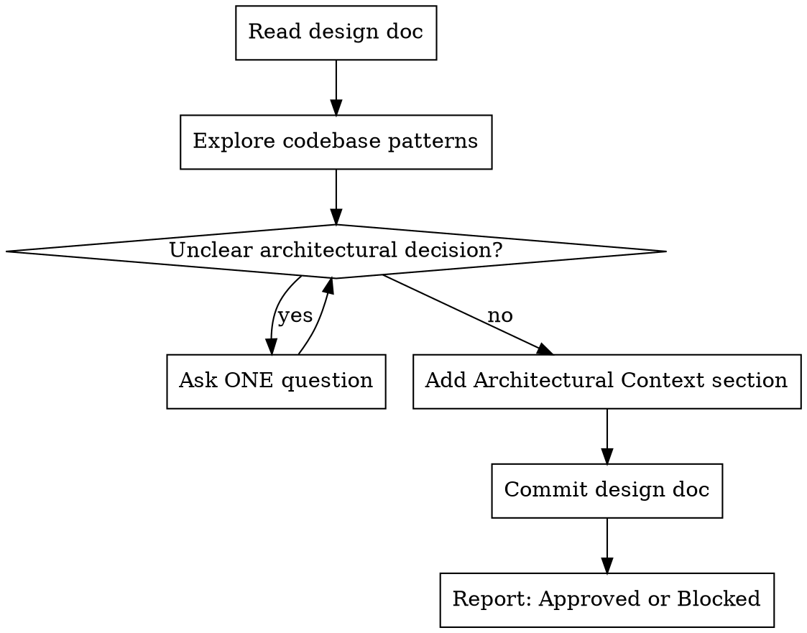

# Architectural Review

Review designs before implementation. Add context about patterns to follow, code to reuse, and integration points. Gate designs that don't fit architecture.

**Announce:** "I'm using the architect skill to review this design."

## The Process



## Codebase Exploration

Before adding context, find:
1. **Similar features** - How are they structured?
2. **Shared utilities** - What exists to reuse?
3. **Test patterns** - How are similar things tested?
4. **Recent changes** - Relevant recent commits?

Use Glob/Grep to find patterns. Read key files for conventions.

## Asking Questions

When architectural decisions are unclear, ask **one question at a time**:
- Prefer multiple choice
- Focus on architecture, not implementation details
- Wait for answer before next question

## Architectural Context Section

Add this section to the design doc. **Keep it concise** - file:line references, not explanations.

```markdown
## Architectural Context

**Patterns to follow:**
- [Pattern]: `path/to/example.ts:123-145`
- [Pattern]: `path/to/file.ts`

**Code to reuse:**
- `path/to/utility.ts` - [one-line description]

**Anti-patterns:**
- Don't [thing] - see `path/to/bad.ts`

**Integration:**
- Entry: [where]
- Connects to: [what]
```

## Gate Decision

After adding context, report:
- **Status:** Approved / Blocked
- **If blocked:** What must change before proceeding

**Approved** = Design fits architecture, proceed to planning.
**Blocked** = Architectural concerns must be addressed first.

## Commit

```bash
git commit -m "docs: add architectural context to <feature> design"
```

## Red Flags

**Never:**
- Skip codebase exploration
- Add generic advice without file:line refs
- Dump everything without asking when unclear
- Approve without understanding existing patterns

**Always:**
- Explore before advising
- Ask when unclear (one at a time)
- Keep context section concise
- Give clear Approved/Blocked verdict
