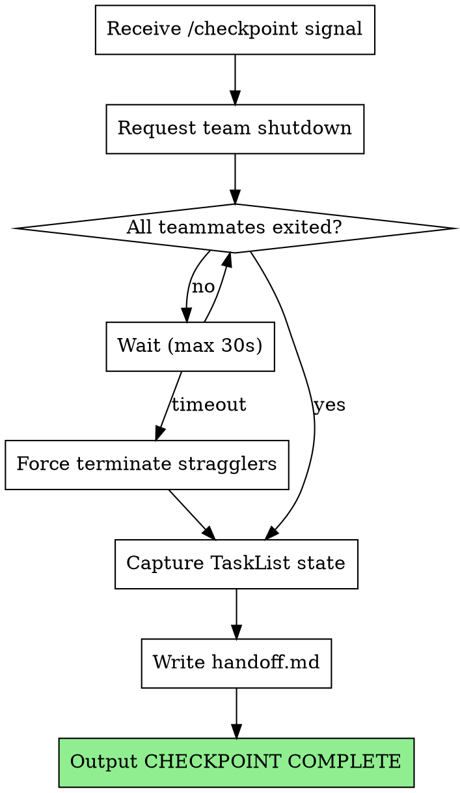

# Checkpoint

## Overview

Coordinates graceful shutdown of a team execution session and captures handoff state. Ensures context can be restored in a fresh session.

**Core principle:** Capture enough state that a new supervisor can resume without re-reading all context. Team composition, task progress, and review tracking.

## When to Use

- Supervisor detects context threshold exceeded
- File `.claude/tina/checkpoint-needed` exists
- Manual `/checkpoint` invocation

## When NOT to Use

- Mid-task execution (finish current task first)
- When team is blocked (resolve block or escalate first)
- Normal phase completion (that's handled by team-lead-init)

## The Process



## Implementation Details

### Step 1: Request Team Shutdown

For each active teammate (check team config at ~/.claude/teams/phase-N-execution/config.json to get member names):

Use the Teammate tool with:
- operation: "requestShutdown"
- target_agent_id: (teammate name, e.g., "worker-1", "worker-2", "spec-reviewer", "code-quality-reviewer")
- reason: "Checkpoint triggered - context management"

This signals all teammates to finish current work and exit gracefully.

### Step 2: Wait for Teammates

Wait for shutdown approval messages from teammates (up to 30 seconds total).

If any teammates don't respond within 30 seconds, they will time out and the checkpoint can proceed. The checkpoint skill does not have a forceTerminate operation - teammates either approve or timeout.

### Step 3: Capture Task State

Use the TaskList tool to get current task states

Record for each task:
- ID, subject, status
- Owner (which worker had it)
- blockedBy relationships

### Step 4: Write handoff.md

Create `.claude/tina/phase-N/handoff.md`:

```markdown
# Phase N Checkpoint Handoff

## Timestamp
2026-01-26T10:30:00Z

## Reason
Context threshold exceeded

## Team Composition
- worker-1: tina:implementer
- worker-2: tina:implementer
- spec-reviewer: tina:spec-reviewer
- code-quality-reviewer: tina:code-quality-reviewer

## Task States
| ID | Subject | Status | Owner |
|----|---------|--------|-------|
| 1 | Implement feature A | completed | worker-1 |
| 2 | Implement feature B | in_progress | worker-2 |
| 3 | Add tests for A | pending | - |

## Review Tracking
- Task 1: spec-review passed, code-quality passed
- Task 2: not yet reviewed

## Resumption Notes
- Task 2 was in progress - worker had read the spec but not started coding
- Task 3 blocked by Task 1 (now unblocked)
```

### Step 5: Signal Completion

Output exactly:

```
CHECKPOINT COMPLETE
```

Supervisor watches for this signal to confirm checkpoint succeeded.

## State Files

**Handoff file:** `.claude/tina/phase-N/handoff.md`

Contains everything needed to resume:
- Team composition (roles and agent types)
- Task states with ownership
- Review tracking (what passed/failed)
- Resumption notes (context about in-progress work)

## Error Handling

**Teammate won't exit:**
- Wait 30 seconds maximum
- Force terminate after timeout
- Log which teammates required force termination

**TaskList fails:**
- Retry once
- If still fails, write handoff.md with error note
- Still output CHECKPOINT COMPLETE (partial handoff better than none)

**Cannot write handoff.md:**
- Output error to console
- Do NOT output CHECKPOINT COMPLETE
- Supervisor will detect failure and escalate

## Integration

**Invoked by:**
- Supervisor when context threshold exceeded
- Manual user invocation via `/checkpoint`

**Uses:**
- Teammate tool with operation "requestShutdown" - Graceful team shutdown
- TaskList tool - Capture current task states

**State files:**
- `.claude/tina/phase-N/handoff.md` - Handoff state for resumption
- `.claude/tina/checkpoint-needed` - Signal file (deleted after checkpoint)

**Paired with:**
- `tina:rehydrate` - Reads handoff.md to restore context

## Red Flags

**Never:**
- Skip team shutdown (leaves orphaned workers)
- Checkpoint mid-task (wait for task boundary)
- Forget CHECKPOINT COMPLETE signal
- Write handoff.md without task states

**Always:**
- Wait for graceful shutdown before capturing state
- Include review tracking in handoff
- Force terminate after timeout (don't hang forever)
- Delete `.claude/tina/checkpoint-needed` after successful checkpoint
