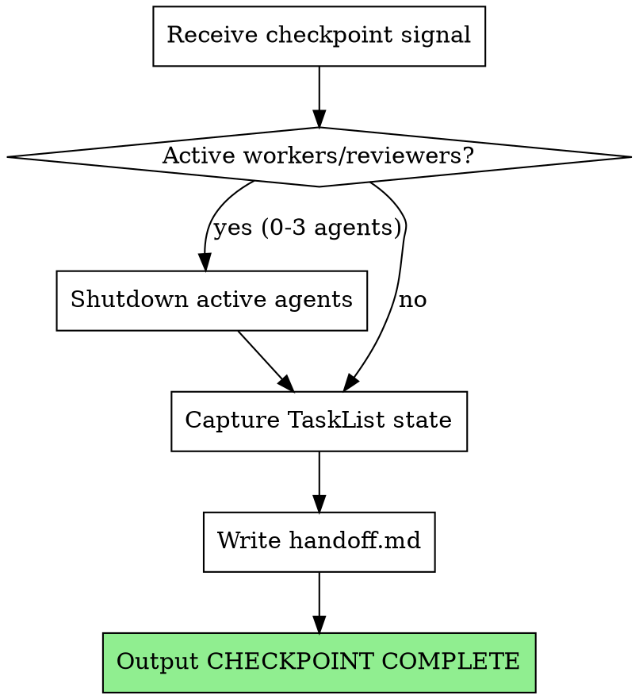

# Checkpoint

## Overview

Coordinates graceful shutdown of current task workers/reviewers and captures handoff state. Ensures context can be restored in a fresh session.

**Core principle:** Capture enough state that a new supervisor can resume without re-reading all context. Plan path and task progress only - team composition is ephemeral and resets per task.

## When to Use

- Supervisor detects context threshold exceeded
- File `.claude/tina/checkpoint-needed` exists
- Manual `/checkpoint` invocation

## When NOT to Use

- Mid-task execution (finish current task first)
- When team is blocked (resolve block or escalate first)
- Normal phase completion (that's handled by team-lead-init)

## The Process



## Implementation Details

### Step 1: Shutdown Active Agents (if any)

With ephemeral teams, only the current task's worker and reviewers might be active (0-3 agents total):
- 1 worker (if task in progress)
- 1 spec-reviewer (if spec review in progress)
- 1 code-quality-reviewer (if code quality review in progress)

For each active agent (check team config at ~/.claude/teams/phase-N-execution/config.json):

Use the Teammate tool with:
- operation: "requestShutdown"
- target_agent_id: (agent name)
- reason: "Checkpoint triggered - context management"

Wait for shutdown approval (up to 30 seconds). If timeout, checkpoint proceeds anyway.

### Step 2: Capture Task State

Use the TaskList tool to get current task states

Record for each task:
- ID, subject, status
- Owner (if task in progress)
- blockedBy relationships

### Step 3: Write handoff.md

Create `.claude/tina/phase-N/handoff.md`:

```markdown
# Phase N Checkpoint Handoff

## Timestamp
2026-01-26T10:30:00Z

## Reason
Context threshold exceeded

## Plan Path
.claude/tina/phase-N/plan.md

## Task States
| ID | Subject | Status | Owner |
|----|---------|--------|-------|
| 1 | Implement feature A | completed | - |
| 2 | Implement feature B | in_progress | worker |
| 3 | Add tests for A | pending | - |

## Current Task Notes
- Task 2 was in progress - worker had read the spec but not started coding
- Task 3 blocked by Task 1 (now unblocked)
```

Note: Team composition and review tracking are NOT saved - they're ephemeral and reset per task.

### Step 4: Signal Completion

Output exactly:

```
CHECKPOINT COMPLETE
```

Supervisor watches for this signal to confirm checkpoint succeeded.

## State Files

**Handoff file:** `.claude/tina/phase-N/handoff.md`

**What IS saved:**
- Plan path (where to find the implementation plan)
- Task states with current status
- Current task notes (context about in-progress work)

**What is NOT saved:**
- Team composition (ephemeral, resets per task)
- Review tracking (ephemeral, resets per task)
- Agent names/IDs (generated fresh each time)

## Error Handling

**Agent won't exit:**
- Wait 30 seconds maximum
- Proceed with checkpoint after timeout
- At most 0-3 agents to wait for (much simpler than full team)

**TaskList fails:**
- Retry once
- If still fails, write handoff.md with error note
- Still output CHECKPOINT COMPLETE (partial handoff better than none)

**Cannot write handoff.md:**
- Output error to console
- Do NOT output CHECKPOINT COMPLETE
- Supervisor will detect failure and escalate

## Integration

**Invoked by:**
- Supervisor when context threshold exceeded
- Manual user invocation via `/checkpoint`

**Uses:**
- Teammate tool with operation "requestShutdown" - Graceful team shutdown
- TaskList tool - Capture current task states

**State files:**
- `.claude/tina/phase-N/handoff.md` - Handoff state for resumption
- `.claude/tina/checkpoint-needed` - Signal file (deleted after checkpoint)

**Paired with:**
- `tina:rehydrate` - Reads handoff.md to restore context

## Red Flags

**Never:**
- Skip agent shutdown (leaves orphaned workers/reviewers)
- Checkpoint mid-task without noting current progress
- Forget CHECKPOINT COMPLETE signal
- Write handoff.md without task states
- Save team composition (it's ephemeral)
- Save review tracking (it resets per task)

**Always:**
- Wait for graceful shutdown before capturing state
- Include plan path in handoff
- Proceed after 30s timeout (don't hang forever)
- Delete `.claude/tina/checkpoint-needed` after successful checkpoint
