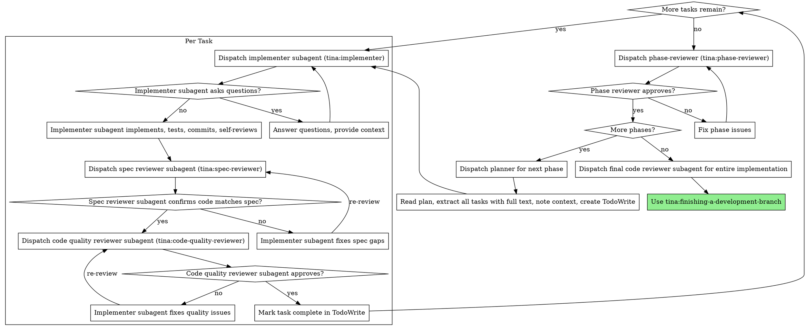
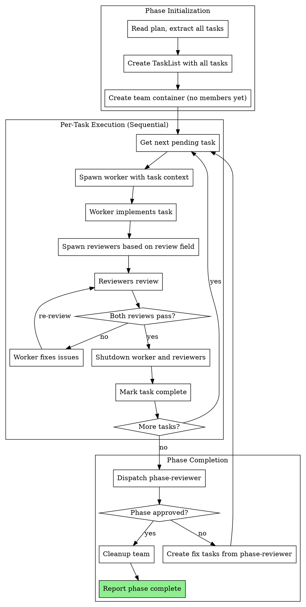

# Executing Plans

Execute plan by dispatching fresh subagent per task, with two-stage review after each: spec compliance review first, then code quality review.

**Core principle:** Fresh subagent per task + two-stage review (spec then quality) = high quality, fast iteration

## When to Use

- You have a written implementation plan
- Tasks are mostly independent (can be worked on separately)
- You want automated quality gates (spec compliance + code quality review)

## The Process



## Team Mode Process (Ephemeral Model)

When invoked with `--team` flag or via team-lead-init, uses ephemeral per-task execution:



### Result Contract and Dual-Grammar Recognition

Team-lead in executing-plans mode accepts both v2 structured headers and legacy freeform messages permanently.

**v2 format:** Message starts with `role:` header line. Parse key-value headers (role, task_id, status, git_range, files_changed, issues, confidence) then freeform body after blank line.

**Legacy format:** Message does not start with `role:`. Interpret freeform text for verdict, git range, and issues using LLM reasoning.

**Acceptance matrix (v2 only):**
| role | status | required fields |
|------|--------|----------------|
| worker | pass | task_id, status, git_range |
| worker | gaps/error | task_id, status, issues |
| spec-reviewer | pass | task_id, status |
| spec-reviewer | gaps/error | task_id, status, issues |
| code-quality-reviewer | pass | task_id, status |
| code-quality-reviewer | gaps/error | task_id, status, issues |

Claude agents emit v2 as best-effort. Codex agents (via codex-cli) emit v2 deterministically. Always handle legacy gracefully.

### Ephemeral Team Mode Implementation

**1. Phase Initialization:**

Create team container and tasks (no members spawned yet):

```
Teammate.spawnTeam({
  name: "phase-N-execution",
  description: "Phase N task execution"
})

# Create all tasks from plan
for task in plan.tasks:
  TaskCreate({
    subject: task.subject,
    description: task.full_text + context,
    metadata: { review_policy: <load from .claude/tina/supervisor-state.json> }
  })
```

**2. Per-Task Execution:**

For each task, assign ownership and spawn fresh worker with context in prompt. If the task has a model in its metadata, run a routing check first:

```bash
# Get model from task metadata (if plan specifies one)
MODEL="${TASK_MODEL:-}"
if [ -n "$MODEL" ]; then
    CLI=$(tina-session config cli-for-model --model "$MODEL")
else
    CLI="claude"
fi
```

```
# Assign task to worker BEFORE spawning
TaskUpdate({
  taskId: task.id,
  status: "in_progress",
  owner: "worker"
})
```

If `CLI == "claude"`:
```
Task tool:
  team_name: "phase-N-execution"
  name: "worker"
  agent: "tina:implementer"
  prompt: |
    Task: [full task text]
    Context: [scene-setting context]
    Files likely involved: [file list]
    Review policy: [review_policy from supervisor-state.json]
```

If `CLI == "codex"`:
```
Task tool:
  team_name: "phase-N-execution"
  name: "worker"
  agent: "tina:codex-cli"
  prompt: |
    feature: [feature-name]
    phase: [phase-number]
    task_id: [task-id]
    role: executor
    cwd: [worktree-path]
    model: [model]
    prompt_content: |
      Task: [full task text]
      Context: [scene-setting context]
      Files likely involved: [file list]
```

**3. Spawn Reviewers Based on Review Field:**

After worker completes, spawn reviewers based on task's review requirements. Use the same routing check as for workers:

```bash
MODEL="${TASK_MODEL:-}"
if [ -n "$MODEL" ]; then
    CLI=$(tina-session config cli-for-model --model "$MODEL")
else
    CLI="claude"
fi
```

If `CLI == "claude"`:
```
# If task.review includes "spec" or default:
Task tool:
  team_name: "phase-N-execution"
  name: "spec-reviewer"
  agent: "tina:spec-reviewer"
  prompt: |
    Task: [full task text]
    Git range: abc123..def456
    Files changed: [list]
    Review policy: [review_policy from supervisor-state.json]

# If task.review includes "quality" or default:
Task tool:
  team_name: "phase-N-execution"
  name: "code-quality-reviewer"
  agent: "tina:code-quality-reviewer"
  prompt: |
    Git range: abc123..def456
    Files changed: [list]
    Review policy: [review_policy from supervisor-state.json]
```

If `CLI == "codex"`:
```
# Spec review via codex:
Task tool:
  team_name: "phase-N-execution"
  name: "spec-reviewer"
  agent: "tina:codex-cli"
  prompt: |
    feature: [feature-name]
    phase: [phase-number]
    task_id: [task-id]
    role: reviewer
    cwd: [worktree-path]
    model: [model]
    prompt_content: |
      Review implementation for spec compliance.
      Task: [full task text]
      Git range: abc123..def456
      Files changed: [list]

# Quality review via codex:
Task tool:
  team_name: "phase-N-execution"
  name: "code-quality-reviewer"
  agent: "tina:codex-cli"
  prompt: |
    feature: [feature-name]
    phase: [phase-number]
    task_id: [task-id]
    role: reviewer
    cwd: [worktree-path]
    model: [model]
    prompt_content: |
      Review code quality and architecture.
      Git range: abc123..def456
      Files changed: [list]
```

**4. Review Notification:**

Worker notifies reviewers via direct message:

```
SendMessage({
  type: "message",
  recipient: "spec-reviewer",
  content: "Implementation complete. Files: src/foo.ts. Git range: abc123..def456. Please review.",
  summary: "Implementation complete, ready for review"
})

SendMessage({
  type: "message",
  recipient: "code-quality-reviewer",
  content: "Implementation complete. Files: src/foo.ts. Git range: abc123..def456. Please review.",
  summary: "Implementation complete, ready for review"
})
```

**5. Review Response:**

Reviewer messages worker directly with issues:

```
SendMessage({
  type: "message",
  recipient: "worker",
  content: "Spec review failed. Issues:\n- Missing validation\n- Wrong return type\nPlease fix and notify when ready.",
  summary: "Spec review failed, issues found"
})
```

Worker fixes and re-notifies. Reviewer re-reviews.

**6. Task Cleanup:**

After both reviews pass, shutdown all task members:

```
SendMessage({ type: "shutdown_request", recipient: "worker", content: "Task complete" })
SendMessage({ type: "shutdown_request", recipient: "spec-reviewer", content: "Review complete" })
SendMessage({ type: "shutdown_request", recipient: "code-quality-reviewer", content: "Review complete" })

TaskUpdate({ taskId: task.id, status: "completed" })
```

Then proceed to next task with fresh spawns.

## Team Coordination Logic

### Task Execution Strategy

Team-lead executes tasks sequentially (one at a time):

1. **Get next task:** Find first task with status = pending
2. **Assign task:** `TaskUpdate({ taskId, status: "in_progress", owner: "worker" })`
3. **Spawn worker:** Create fresh worker with full task context in prompt
4. **Worker implements:** Worker follows TDD, commits, self-reviews
5. **Spawn reviewers:** Based on task's review field (default: both)
6. **Review cycle:** Worker ↔ Reviewers until both pass
7. **Cleanup:** Shutdown worker and reviewers, mark task complete
8. **Loop:** Return to step 1

```
# Sequential task execution
for task in TaskList where status = pending:
  # Assign task to worker before spawning
  TaskUpdate({ taskId: task.id, status: "in_progress", owner: "worker" })

  # Spawn worker with context
  spawn_worker(task.full_text, task.context)

  # Wait for implementation
  wait_for_worker_completion()

  # Spawn reviewers
  spawn_reviewers(task.review_type)

  # Review loop until both pass
  review_loop()

  # Cleanup this task's members
  shutdown_task_members()
  TaskUpdate({ taskId: task.id, status: "completed" })
```

### Review Tracking

Only one task active at a time. State resets per task:

```json
{
  "current_task": "task-3",
  "spec_review": "pending|passed|failed",
  "quality_review": "pending|passed|failed",
  "review_iterations": 0
}
```

State is discarded after task completes. Next task starts fresh.

### Message Handling

Team-lead monitors for messages and applies dual-grammar recognition:

**From workers (v2 or legacy):**
- v2 `status: pass` or legacy "Implementation complete" → Spawn reviewers
- v2 `status: gaps` or legacy "Task blocked on X" → Note blocker, assess next steps
- v2 `status: error` or legacy error indication → Apply retry policy

**From reviewers (v2 or legacy):**
- v2 `status: pass` or legacy "Review passed" / "APPROVED" → Track as passed, check if both complete
- v2 `status: gaps` or legacy "Issues found: [list]" → Worker fixes, re-review
- v2 `status: error` or legacy "Review loop exceeded" → Team-lead intervenes

**Invalid result handling:**
If a v2 message fails acceptance matrix validation, retry the agent once with stricter instructions requesting v2 headers. On second failure, follow existing escalation.

### Infinite Loop Prevention

If task bounces between worker and reviewer 3+ times:

1. Team-lead intervenes
2. Messages both parties: "Review loop detected. Explain core disagreement."
3. If unresolvable: Mark task blocked, continue with other tasks
4. Include blocked task in phase-reviewer context

### Phase Reviewer Integration

After all regular tasks complete:

1. Get git range: first commit of phase → HEAD
2. Dispatch phase-reviewer (NOT a teammate - use Task tool):

```
Task tool:
  subagent_type: tina:phase-reviewer
  prompt: |
    Design doc: [path]
    Phase completed: [N]
    Git range: [base]..[head]
    Blocked tasks (if any): [list with reasons]
```

3. If phase-reviewer finds issues:
   - Create fix tasks from issues
   - Execute fix tasks (spawn worker with fix context)
   - Worker implements, reviewers review
   - Re-run phase-reviewer after fixes

4. If phase-reviewer rejects 3 times:
   - Mark phase blocked
   - Include phase-reviewer feedback in blocked reason

### Completion Criteria

Phase execution complete when:
- All tasks (including fix tasks) have status = complete
- Phase-reviewer approved
- No unresolved blocked tasks (or blocked tasks documented)

## Resume Mode (--resume flag)

When invoked with `--resume` flag after rehydrate:

### What Changes

- **Skip task creation:** TaskList already exists from previous session
- **No members to restore:** Ephemeral model means no long-lived members
- **Continue from first pending:** Find first task with status = pending

### Resume Process

```
1. Read existing TaskList
2. Find first task where status = pending
3. Continue normal per-task execution from that point
```

### Handling In-Progress Tasks

If a task was `in_progress` at checkpoint:
- Reset to `pending` (worker was shutdown, work may be incomplete)
- Fresh worker will check git log for any committed work
- Worker continues from last committed state

No special handling needed - ephemeral model naturally handles resume by starting fresh with each task.

## Agents

Use the Task tool with these agent types:
- `tina:implementer` - Implements a single task (when model routes to claude)
- `tina:spec-reviewer` - Verifies implementation matches spec (when model routes to claude)
- `tina:code-quality-reviewer` - Reviews code quality after spec compliance passes (when model routes to claude)
- `tina:phase-reviewer` - Verifies phase follows architecture after all tasks complete
- `tina:codex-cli` - Adapter for executing tasks via Codex CLI (when model routes to codex)

## Team Composition (Ephemeral Model)

Team is a container created once per phase. Members are spawned per-task:

**Team container:** Created at phase start, holds no permanent members

**Per-task members (spawned fresh each task):**
- `worker` - `tina:implementer` (spawned with full task context)
- `spec-reviewer` - `tina:spec-reviewer` (if task needs spec review)
- `code-quality-reviewer` - `tina:code-quality-reviewer` (if task needs quality review)

**Team name:** `phase-N-execution` where N is the phase number

**Member names reused:** Each task uses same names (`worker`, `spec-reviewer`, `code-quality-reviewer`) but fresh instances

**Message protocol:**
- Worker → Reviewer: `"Implementation complete. Files: [list]. Git range: abc..def. Please review."`
- Reviewer → Worker: `"Review passed"` or `"Issues found: [list]. Please fix and notify."`
- Team-lead monitors for completion, then shuts down all members

## Example Workflow

```
You: I'm using executing-plans to implement this plan.

[Read plan file once: docs/plans/feature-plan.md]
[Extract all 5 tasks with full text and context]
[Create TodoWrite with all tasks]

Task 1: Hook installation script

[Get Task 1 text and context (already extracted)]
[Dispatch implementation subagent with full task text + context]

Implementer: "Before I begin - should the hook be installed at user or system level?"

You: "User level (~/.config/superpowers/hooks/)"

Implementer: "Got it. Implementing now..."
[Later] Implementer:
  - Implemented install-hook command
  - Added tests, 5/5 passing
  - Self-review: Found I missed --force flag, added it
  - Committed

[Dispatch spec compliance reviewer]
Spec reviewer: ✅ Spec compliant - all requirements met, nothing extra

[Get git SHAs, dispatch code quality reviewer]
Code reviewer: Strengths: Good test coverage, clean. Issues: None. Approved.

[Mark Task 1 complete]

Task 2: Recovery modes

[Get Task 2 text and context (already extracted)]
[Dispatch implementation subagent with full task text + context]

Implementer: [No questions, proceeds]
Implementer:
  - Added verify/repair modes
  - 8/8 tests passing
  - Self-review: All good
  - Committed

[Dispatch spec compliance reviewer]
Spec reviewer: ❌ Issues:
  - Missing: Progress reporting (spec says "report every 100 items")
  - Extra: Added --json flag (not requested)

[Implementer fixes issues]
Implementer: Removed --json flag, added progress reporting

[Spec reviewer reviews again]
Spec reviewer: ✅ Spec compliant now

[Dispatch code quality reviewer]
Code reviewer: Strengths: Solid. Issues (Important): Magic number (100)

[Implementer fixes]
Implementer: Extracted PROGRESS_INTERVAL constant

[Code reviewer reviews again]
Code reviewer: ✅ Approved

[Mark Task 2 complete]

...

[After all tasks]
[Dispatch phase-reviewer]
Phase reviewer:
  - Pattern conformance: ✅ All patterns followed
  - Integration: ✅ Data flow verified
  - Reuse: ✅ Existing utilities used
  - Status: Approved

[More phases? No - dispatch final code-reviewer]
Final reviewer: All requirements met, ready to merge

Done!
```

## Phase Review

After all tasks in a phase complete, dispatch the phase-reviewer:

```
Task tool:
  subagent_type: tina:phase-reviewer
  prompt: |
    Design doc: docs/plans/2026-01-26-feature-design.md
    Plan file: docs/plans/2026-01-26-feature-phase-1.md
    Phase completed: 1
    Git range: abc1234..def5678
    Output file: .claude/tina/phase-1/review.md

    Write your review to the output file. Include metrics comparison and severity tier.
```

Phase reviewer checks:
1. **Pattern conformance** - Code follows Architectural Context patterns
2. **Integration** - Data flow traced from entry to output
3. **Reuse** - Existing utilities used, no duplication
4. **Metrics** - Actual vs expected, drift calculation, severity tier

**If issues found:** Dispatch implementer to fix, then re-dispatch phase-reviewer.

**If approved with Warning:** Log metrics, orchestrator may trigger reassessment.

**If approved with Pass:** Orchestrator proceeds to next phase.

**If Stop:** Orchestrator halts and surfaces issue to user.

## Advantages

**vs. Manual execution:**
- Subagents follow TDD naturally
- Fresh context per task (no confusion)
- Parallel-safe (subagents don't interfere)
- Subagent can ask questions (before AND during work)
- Review checkpoints automatic

**Efficiency gains:**
- No file reading overhead (controller provides full text)
- Controller curates exactly what context is needed
- Subagent gets complete information upfront
- Questions surfaced before work begins (not after)

**Quality gates:**
- Self-review catches issues before handoff
- Two-stage review: spec compliance, then code quality
- Review loops ensure fixes actually work
- Spec compliance prevents over/under-building
- Code quality ensures implementation is well-built

**Cost:**
- More subagent invocations (implementer + 2 reviewers per task)
- Controller does more prep work (extracting all tasks upfront)
- Review loops add iterations
- But catches issues early (cheaper than debugging later)

## Red Flags

**Never:**
- Skip reviews (spec compliance OR code quality OR phase review)
- Proceed with unfixed issues
- Dispatch multiple implementation subagents in parallel (conflicts)
- Make subagent read plan file (provide full text instead)
- Skip scene-setting context (subagent needs to understand where task fits)
- Ignore subagent questions (answer before letting them proceed)
- Accept "close enough" on spec compliance (spec reviewer found issues = not done)
- Skip review loops (reviewer found issues = implementer fixes = review again)
- Let implementer self-review replace actual review (both are needed)
- **Start code quality review before spec compliance is ✅** (wrong order)
- Move to next task while either review has open issues
- **Skip phase review after all tasks complete**
- **Proceed to next phase with unfixed phase-reviewer issues**

**If subagent asks questions:**
- Answer clearly and completely
- Provide additional context if needed
- Don't rush them into implementation

**If reviewer finds issues:**
- Implementer (same subagent) fixes them
- Reviewer reviews again
- Repeat until approved
- Don't skip the re-review

**If subagent fails task:**
- Dispatch fix subagent with specific instructions
- Don't try to fix manually (context pollution)

**Team Mode Specific - Never:**
- Spawn workers/reviewers at phase start (spawn per-task instead)
- Keep workers alive between tasks (shutdown after each task)
- Spawn multiple workers for parallel execution (sequential only)
- Mark task complete before both reviews pass
- Let review loops continue indefinitely (cap at 3)
- Forget to shutdown task members before moving to next task

**Team Mode Specific - Always:**
- Create team container at phase start (holds no permanent members)
- **Assign task before spawning worker:** `TaskUpdate({ taskId, status: "in_progress", owner: "worker" })`
- Spawn worker with full task context in prompt
- Spawn reviewers after worker completes (based on review field)
- Shutdown all task members after reviews pass
- Wait for BOTH spec and quality reviews before shutdown
- Intervene in review loops after 3 iterations

## Integration

**Required workflow skills:**
- **tina:writing-plans** - Creates the plan this skill executes
- **tina:requesting-code-review** - Code review template for reviewer subagents
- **tina:finishing-a-development-branch** - Complete development after all tasks

**Routing:**
- **tina-session config cli-for-model** - Determines whether a model routes to claude or codex
- **tina:codex-cli** - Used when task model routes to codex (replaces implementer/reviewer agents)

**Subagents should use:**
- **tina:test-driven-development** - Subagents follow TDD for each task
