# Executing Plans

Execute plan by dispatching fresh subagent per task, with two-stage review after each: spec compliance review first, then code quality review.

**Core principle:** Fresh subagent per task + two-stage review (spec then quality) = high quality, fast iteration

## When to Use

- You have a written implementation plan
- Tasks are mostly independent (can be worked on separately)
- You want automated quality gates (spec compliance + code quality review)

## The Process

```dot
digraph process {
    rankdir=TB;

    subgraph cluster_per_task {
        label="Per Task";
        "Dispatch implementer subagent (supersonic:implementer)" [shape=box];
        "Implementer subagent asks questions?" [shape=diamond];
        "Answer questions, provide context" [shape=box];
        "Implementer subagent implements, tests, commits, self-reviews" [shape=box];
        "Dispatch spec reviewer subagent (supersonic:spec-reviewer)" [shape=box];
        "Spec reviewer subagent confirms code matches spec?" [shape=diamond];
        "Implementer subagent fixes spec gaps" [shape=box];
        "Dispatch code quality reviewer subagent (supersonic:code-quality-reviewer)" [shape=box];
        "Code quality reviewer subagent approves?" [shape=diamond];
        "Implementer subagent fixes quality issues" [shape=box];
        "Mark task complete in TodoWrite" [shape=box];
    }

    "Read plan, extract all tasks with full text, note context, create TodoWrite" [shape=box];
    "More tasks remain?" [shape=diamond];
    "Dispatch phase-reviewer (supersonic:phase-reviewer)" [shape=box];
    "Phase reviewer approves?" [shape=diamond];
    "Fix phase issues" [shape=box];
    "More phases?" [shape=diamond];
    "Dispatch planner for next phase" [shape=box];
    "Dispatch final code reviewer subagent for entire implementation" [shape=box];
    "Use superpowers:finishing-a-development-branch" [shape=box style=filled fillcolor=lightgreen];

    "Read plan, extract all tasks with full text, note context, create TodoWrite" -> "Dispatch implementer subagent (supersonic:implementer)";
    "Dispatch implementer subagent (supersonic:implementer)" -> "Implementer subagent asks questions?";
    "Implementer subagent asks questions?" -> "Answer questions, provide context" [label="yes"];
    "Answer questions, provide context" -> "Dispatch implementer subagent (supersonic:implementer)";
    "Implementer subagent asks questions?" -> "Implementer subagent implements, tests, commits, self-reviews" [label="no"];
    "Implementer subagent implements, tests, commits, self-reviews" -> "Dispatch spec reviewer subagent (supersonic:spec-reviewer)";
    "Dispatch spec reviewer subagent (supersonic:spec-reviewer)" -> "Spec reviewer subagent confirms code matches spec?";
    "Spec reviewer subagent confirms code matches spec?" -> "Implementer subagent fixes spec gaps" [label="no"];
    "Implementer subagent fixes spec gaps" -> "Dispatch spec reviewer subagent (supersonic:spec-reviewer)" [label="re-review"];
    "Spec reviewer subagent confirms code matches spec?" -> "Dispatch code quality reviewer subagent (supersonic:code-quality-reviewer)" [label="yes"];
    "Dispatch code quality reviewer subagent (supersonic:code-quality-reviewer)" -> "Code quality reviewer subagent approves?";
    "Code quality reviewer subagent approves?" -> "Implementer subagent fixes quality issues" [label="no"];
    "Implementer subagent fixes quality issues" -> "Dispatch code quality reviewer subagent (supersonic:code-quality-reviewer)" [label="re-review"];
    "Code quality reviewer subagent approves?" -> "Mark task complete in TodoWrite" [label="yes"];
    "Mark task complete in TodoWrite" -> "More tasks remain?";
    "More tasks remain?" -> "Dispatch implementer subagent (supersonic:implementer)" [label="yes"];
    "More tasks remain?" -> "Dispatch phase-reviewer (supersonic:phase-reviewer)" [label="no"];
    "Dispatch phase-reviewer (supersonic:phase-reviewer)" -> "Phase reviewer approves?";
    "Phase reviewer approves?" -> "Fix phase issues" [label="no"];
    "Fix phase issues" -> "Dispatch phase-reviewer (supersonic:phase-reviewer)";
    "Phase reviewer approves?" -> "More phases?" [label="yes"];
    "More phases?" -> "Dispatch planner for next phase" [label="yes"];
    "More phases?" -> "Dispatch final code reviewer subagent for entire implementation" [label="no"];
    "Dispatch planner for next phase" -> "Read plan, extract all tasks with full text, note context, create TodoWrite";
    "Dispatch final code reviewer subagent for entire implementation" -> "Use superpowers:finishing-a-development-branch";
}
```



## Agents

Use the Task tool with these agent types:
- `supersonic:implementer` - Implements a single task
- `supersonic:spec-reviewer` - Verifies implementation matches spec
- `supersonic:code-quality-reviewer` - Reviews code quality after spec compliance passes
- `supersonic:phase-reviewer` - Verifies phase follows architecture after all tasks complete

## Team Composition (Phase 2+)

When running in team mode (invoked via team-lead), executing-plans uses the Teammate tool:

**Default team:**
- 2 workers: `supersonic:implementer`
- 1 spec-reviewer: `supersonic:spec-reviewer`
- 1 code-quality-reviewer: `supersonic:code-quality-reviewer`

**Team name:** `phase-N-execution` where N is the phase number

**Teammate message targets:**
- `spec-reviewer` - For spec compliance reviews
- `code-quality-reviewer` - For code quality reviews
- `worker-1`, `worker-2` - For individual workers

**Message protocol:**
- Worker → Reviewer: `"Task X complete, please review. Git range: abc..def"`
- Reviewer → Worker: `"Review passed"` or `"Fix issues: [list]. Assigned fix-issue task."`
- Worker → Team-lead: `"Idle, no tasks available"`

## Example Workflow

```
You: I'm using executing-plans to implement this plan.

[Read plan file once: docs/plans/feature-plan.md]
[Extract all 5 tasks with full text and context]
[Create TodoWrite with all tasks]

Task 1: Hook installation script

[Get Task 1 text and context (already extracted)]
[Dispatch implementation subagent with full task text + context]

Implementer: "Before I begin - should the hook be installed at user or system level?"

You: "User level (~/.config/superpowers/hooks/)"

Implementer: "Got it. Implementing now..."
[Later] Implementer:
  - Implemented install-hook command
  - Added tests, 5/5 passing
  - Self-review: Found I missed --force flag, added it
  - Committed

[Dispatch spec compliance reviewer]
Spec reviewer: ✅ Spec compliant - all requirements met, nothing extra

[Get git SHAs, dispatch code quality reviewer]
Code reviewer: Strengths: Good test coverage, clean. Issues: None. Approved.

[Mark Task 1 complete]

Task 2: Recovery modes

[Get Task 2 text and context (already extracted)]
[Dispatch implementation subagent with full task text + context]

Implementer: [No questions, proceeds]
Implementer:
  - Added verify/repair modes
  - 8/8 tests passing
  - Self-review: All good
  - Committed

[Dispatch spec compliance reviewer]
Spec reviewer: ❌ Issues:
  - Missing: Progress reporting (spec says "report every 100 items")
  - Extra: Added --json flag (not requested)

[Implementer fixes issues]
Implementer: Removed --json flag, added progress reporting

[Spec reviewer reviews again]
Spec reviewer: ✅ Spec compliant now

[Dispatch code quality reviewer]
Code reviewer: Strengths: Solid. Issues (Important): Magic number (100)

[Implementer fixes]
Implementer: Extracted PROGRESS_INTERVAL constant

[Code reviewer reviews again]
Code reviewer: ✅ Approved

[Mark Task 2 complete]

...

[After all tasks]
[Dispatch phase-reviewer]
Phase reviewer:
  - Pattern conformance: ✅ All patterns followed
  - Integration: ✅ Data flow verified
  - Reuse: ✅ Existing utilities used
  - Status: Approved

[More phases? No - dispatch final code-reviewer]
Final reviewer: All requirements met, ready to merge

Done!
```

## Phase Review

After all tasks in a phase complete, dispatch the phase-reviewer:

```
Task tool:
  subagent_type: supersonic:phase-reviewer
  prompt: |
    Design doc: docs/plans/2026-01-26-feature-design.md
    Phase completed: 1
    Git range: abc1234..def5678
```

Phase reviewer checks:
1. **Pattern conformance** - Code follows Architectural Context patterns
2. **Integration** - Data flow traced from entry to output
3. **Reuse** - Existing utilities used, no duplication

**If issues found:** Dispatch implementer to fix, then re-dispatch phase-reviewer.

**If approved:** Check if more phases remain. If yes, dispatch planner for next phase.

## Advantages

**vs. Manual execution:**
- Subagents follow TDD naturally
- Fresh context per task (no confusion)
- Parallel-safe (subagents don't interfere)
- Subagent can ask questions (before AND during work)
- Review checkpoints automatic

**Efficiency gains:**
- No file reading overhead (controller provides full text)
- Controller curates exactly what context is needed
- Subagent gets complete information upfront
- Questions surfaced before work begins (not after)

**Quality gates:**
- Self-review catches issues before handoff
- Two-stage review: spec compliance, then code quality
- Review loops ensure fixes actually work
- Spec compliance prevents over/under-building
- Code quality ensures implementation is well-built

**Cost:**
- More subagent invocations (implementer + 2 reviewers per task)
- Controller does more prep work (extracting all tasks upfront)
- Review loops add iterations
- But catches issues early (cheaper than debugging later)

## Red Flags

**Never:**
- Skip reviews (spec compliance OR code quality OR phase review)
- Proceed with unfixed issues
- Dispatch multiple implementation subagents in parallel (conflicts)
- Make subagent read plan file (provide full text instead)
- Skip scene-setting context (subagent needs to understand where task fits)
- Ignore subagent questions (answer before letting them proceed)
- Accept "close enough" on spec compliance (spec reviewer found issues = not done)
- Skip review loops (reviewer found issues = implementer fixes = review again)
- Let implementer self-review replace actual review (both are needed)
- **Start code quality review before spec compliance is ✅** (wrong order)
- Move to next task while either review has open issues
- **Skip phase review after all tasks complete**
- **Proceed to next phase with unfixed phase-reviewer issues**

**If subagent asks questions:**
- Answer clearly and completely
- Provide additional context if needed
- Don't rush them into implementation

**If reviewer finds issues:**
- Implementer (same subagent) fixes them
- Reviewer reviews again
- Repeat until approved
- Don't skip the re-review

**If subagent fails task:**
- Dispatch fix subagent with specific instructions
- Don't try to fix manually (context pollution)

## Integration

**Required workflow skills:**
- **superpowers:writing-plans** - Creates the plan this skill executes
- **superpowers:requesting-code-review** - Code review template for reviewer subagents
- **superpowers:finishing-a-development-branch** - Complete development after all tasks

**Subagents should use:**
- **superpowers:test-driven-development** - Subagents follow TDD for each task
