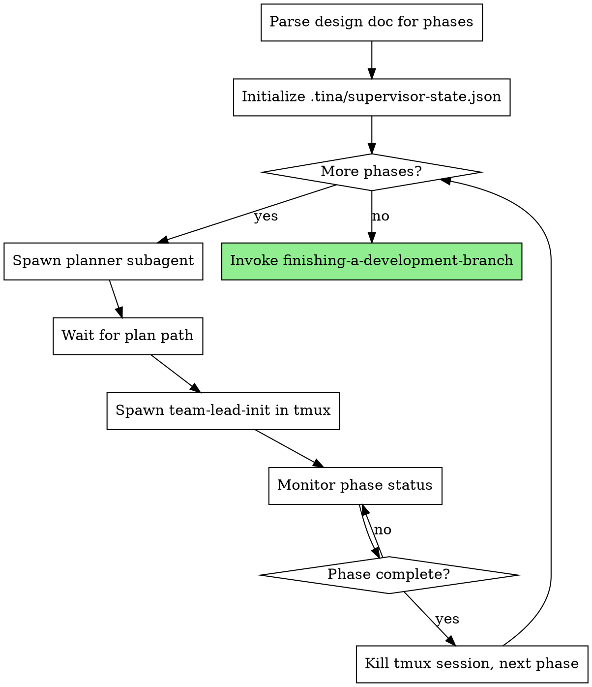

# Orchestrated Automation

## Overview

Automates the full development pipeline from design document to implementation. Spawns planner subagents for each phase, then team-leads in tmux sessions for execution. Monitors progress.

**Core principle:** Supervisor maintains zero context about plan content - only tracks file paths, phase numbers, and process state. Fresh context per phase via tmux.

**Announce at start:** "I'm using the orchestrate skill to automate implementation of this design."

## When to Use

- You have a complete design document with `## Phase N` sections
- You want fully automated execution without manual intervention
- The design has been reviewed by `supersonic:architect`

## When NOT to Use

- Design is incomplete or unapproved
- You want manual control over each phase
- Single-phase designs (use `supersonic:writing-plans` + `supersonic:executing-plans` directly)

## The Process



## Invocation

```
/supersonic:orchestrate docs/plans/2026-01-26-myfeature-design.md
```

## Phase 1 Behavior (Current Implementation)

This phase implements basic orchestration without team-based execution:

1. **Parse design doc** - Count `## Phase N` sections
2. **Initialize state** - Create `.tina/supervisor-state.json`
3. **For each phase:**
   - Spawn `supersonic:planner` subagent with design doc + phase number
   - Wait for plan path
   - Spawn `supersonic:team-lead-init` in tmux with plan path
   - Monitor `.tina/phase-N/status.json` until complete
   - Kill tmux session, proceed to next phase
4. **Completion** - Invoke `supersonic:finishing-a-development-branch`

## Implementation Notes

**Monitoring:** Polls `.tina/phase-N/status.json` every 10 seconds until phase status is "complete" or "blocked".

**Tmux session naming:** Uses pattern `supersonic-phase-N` where N is the phase number.

**Cleanup:** Supervisor state and phase directories persist in `.tina/` for resumption. Can be manually removed after successful completion if desired.

## State Files

**Supervisor state:** `.tina/supervisor-state.json`
```json
{
  "design_doc_path": "docs/plans/2026-01-26-feature-design.md",
  "total_phases": 3,
  "current_phase": 2,
  "active_tmux_session": "supersonic-phase-2",
  "plan_paths": {
    "1": "docs/plans/2026-01-26-feature-phase-1.md",
    "2": "docs/plans/2026-01-26-feature-phase-2.md"
  }
}
```

**Phase status:** `.tina/phase-N/status.json`
```json
{
  "status": "executing",
  "started_at": "2026-01-26T10:00:00Z"
}
```

## Resumption

If interrupted, re-run with same design doc path:
- Reads existing supervisor state
- Detects active tmux sessions
- Resumes from current phase

## Integration

**Spawns:**
- `supersonic:planner` - Creates implementation plan for each phase
- Team-lead in tmux - Executes phase via `team-lead-init`

**Invokes after completion:**
- `supersonic:finishing-a-development-branch` - Handles merge/PR workflow

**State files:**
- `.tina/supervisor-state.json` - Supervisor resumption state
- `.tina/phase-N/status.json` - Per-phase execution status

**Depends on existing:**
- `supersonic:executing-plans` - Team-lead delegates to this for task execution
- `supersonic:planner` - Creates phase plans from design doc
- `supersonic:architect` - Design must be architect-reviewed before orchestration
- `supersonic:phase-reviewer` - Called by executing-plans after tasks complete

**Future integrations (Phase 2+):**
- Teammate tool for team-based execution
- Checkpoint/rehydrate for context management
- Helper agent for blocked state diagnosis

## Error Handling

**Design doc has no phases:**
- Error immediately: "Design doc must have `## Phase N` sections"

**Planner fails:**
- Retry once, then escalate to user

**Team-lead tmux session dies:**
- Check if phase was complete (proceed if yes)
- Otherwise escalate to user

## Red Flags

**Never:**
- Read plan content (only track file paths)
- Parse plan structure (that's team-lead's job)
- Skip phase completion verification
- Leave orphaned tmux sessions

**Always:**
- Wait for planner to return path before spawning team-lead
- Verify phase complete via status.json before proceeding
- Clean up tmux session after phase completes
