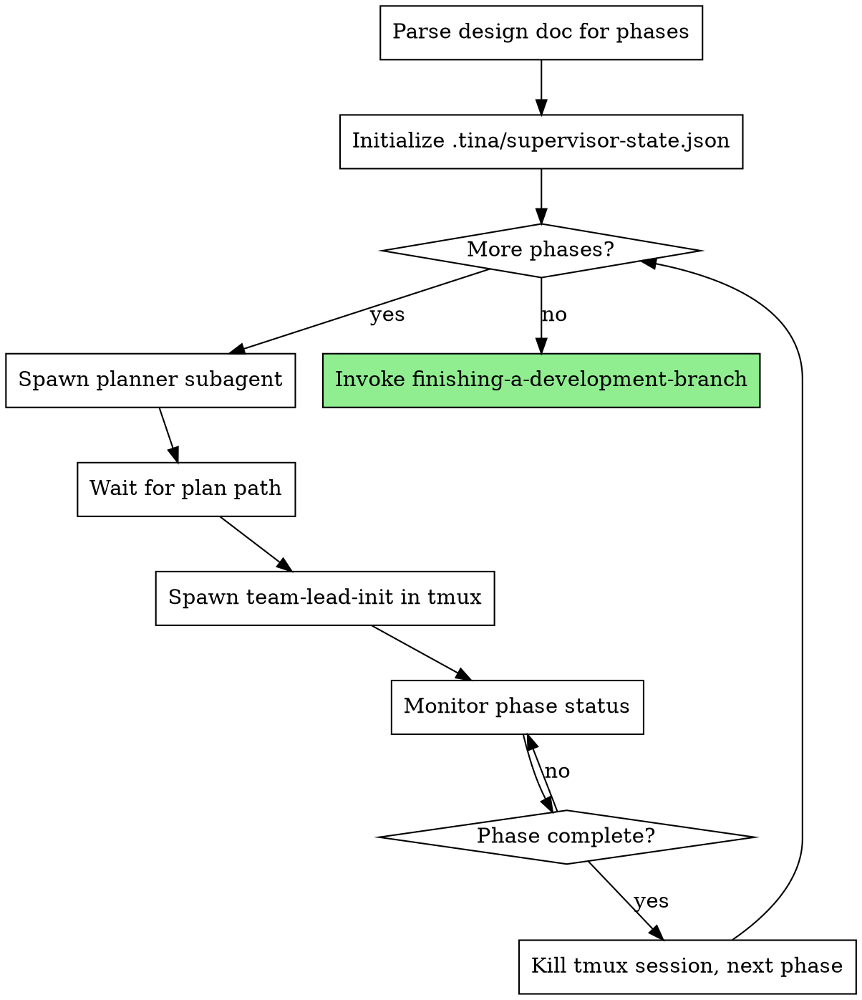

# Orchestrated Automation

## Overview

Automates the full development pipeline from design document to implementation. Spawns planner subagents for each phase, then team-leads in tmux sessions for execution. Monitors progress.

**Core principle:** Supervisor maintains zero context about plan content - only tracks file paths, phase numbers, and process state. Fresh context per phase via tmux.

**Announce at start:** "I'm using the orchestrate skill to automate implementation of this design."

## When to Use

- You have a complete design document with `## Phase N` sections
- You want fully automated execution without manual intervention
- The design has been reviewed by `supersonic:architect`

## When NOT to Use

- Design is incomplete or unapproved
- You want manual control over each phase
- Single-phase designs (use `supersonic:writing-plans` + `supersonic:executing-plans` directly)

## The Process



## Invocation

```
/supersonic:orchestrate docs/plans/2026-01-26-myfeature-design.md
```

## Phase 1 Behavior (Current Implementation)

This phase implements basic orchestration without team-based execution:

1. **Parse design doc** - Count `## Phase N` sections
2. **Initialize state** - Create `.tina/supervisor-state.json`
3. **For each phase:**
   - Spawn `supersonic:planner` subagent with design doc + phase number
   - Wait for plan path
   - Spawn `supersonic:team-lead-init` in tmux with plan path
   - Monitor `.tina/phase-N/status.json` until complete
   - Kill tmux session, proceed to next phase
4. **Completion** - Invoke `supersonic:finishing-a-development-branch`

## Implementation Notes

**Monitoring:** Polls `.tina/phase-N/status.json` every 10 seconds until phase status is "complete" or "blocked".

**Tmux session naming:** Uses pattern `supersonic-phase-N` where N is the phase number.

**Cleanup:** Supervisor state and phase directories persist in `.tina/` for resumption. Can be manually removed after successful completion if desired.

## Implementation Details

**Note:** The variables `$DESIGN_DOC`, `$PHASE_NUM`, and `$PLAN_PATH` are placeholders representing values from the execution context. The tmux invocation `claude --prompt '/team-lead-init $PLAN_PATH'` starts a new Claude CLI session that will execute the team-lead-init skill with the provided plan path argument.

### Step 1: Parse Design Doc

```bash
# Count phases
TOTAL_PHASES=$(grep -c "^## Phase [0-9]" "$DESIGN_DOC")
if [ "$TOTAL_PHASES" -eq 0 ]; then
  echo "Error: Design doc must have ## Phase N sections"
  exit 1
fi
```

### Step 2: Initialize or Resume State

**If `.tina/supervisor-state.json` exists:** Resume from saved state
**Otherwise:** Initialize new state

```bash
if [ -f ".tina/supervisor-state.json" ]; then
  # Resume: read current phase
  CURRENT_PHASE=$(jq -r '.current_phase' .tina/supervisor-state.json)
  echo "Resuming from phase $CURRENT_PHASE"
else
  # Initialize: create state file
  mkdir -p .tina
  cat > .tina/supervisor-state.json << EOF
{
  "design_doc_path": "$DESIGN_DOC",
  "total_phases": $TOTAL_PHASES,
  "current_phase": 0,
  "active_tmux_session": null,
  "plan_paths": {}
}
EOF
  CURRENT_PHASE=0
fi
```

### Step 3: Phase Loop

For each phase from `CURRENT_PHASE + 1` to `TOTAL_PHASES`:

**3a. Spawn Planner**

Use Task tool to spawn planner:
```
# In Claude Code, use Task tool with:
# subagent_type: "supersonic:planner"
# prompt: "Design doc: <path>\nPlan phase: <N>"
```

Wait for planner to return plan path (e.g., `docs/plans/2026-01-26-feature-phase-1.md`)

**3b. Update Supervisor State**

```bash
tmp_file=$(mktemp)
jq ".current_phase = $PHASE_NUM" .tina/supervisor-state.json > "$tmp_file" && mv "$tmp_file" .tina/supervisor-state.json

# Add plan path to state
tmp_file=$(mktemp)
jq ".plan_paths[\"$PHASE_NUM\"] = \"$PLAN_PATH\"" .tina/supervisor-state.json > "$tmp_file" && mv "$tmp_file" .tina/supervisor-state.json
```

**3c. Initialize Phase Directory**

```bash
mkdir -p ".tina/phase-$PHASE_NUM"
cat > ".tina/phase-$PHASE_NUM/status.json" << EOF
{
  "status": "pending",
  "started_at": null
}
EOF
```

**3d. Spawn Team-Lead in Tmux**

```bash
SESSION_NAME="supersonic-phase-$PHASE_NUM"
tmux new-session -d -s "$SESSION_NAME" \
  "cd $(pwd) && claude --prompt '/team-lead-init $PLAN_PATH'"

# Update active session in state
tmp_file=$(mktemp)
jq ".active_tmux_session = \"$SESSION_NAME\"" .tina/supervisor-state.json > "$tmp_file" && mv "$tmp_file" .tina/supervisor-state.json
```

**3e. Monitor Phase Status**

Poll every 10 seconds until phase completes:

```bash
while true; do
  # Check if status file exists
  if [ ! -f ".tina/phase-$PHASE_NUM/status.json" ]; then
    echo "Error: Phase $PHASE_NUM status file not found"
    exit 1
  fi

  STATUS=$(jq -r '.status' ".tina/phase-$PHASE_NUM/status.json")

  case "$STATUS" in
    "complete")
      echo "Phase $PHASE_NUM complete"
      break
      ;;
    "blocked")
      REASON=$(jq -r '.reason' ".tina/phase-$PHASE_NUM/status.json")
      echo "Phase $PHASE_NUM blocked: $REASON"
      # Escalate to user
      exit 1
      ;;
    *)
      sleep 10
      ;;
  esac
done

# Note: In production, consider adding a timeout mechanism to prevent infinite loops
```

**3f. Cleanup and Proceed**

```bash
# Kill tmux session (errors suppressed if session already terminated)
tmux kill-session -t "$SESSION_NAME" 2>/dev/null || true

# Clear active session in state
tmp_file=$(mktemp)
jq ".active_tmux_session = null" .tina/supervisor-state.json > "$tmp_file" && mv "$tmp_file" .tina/supervisor-state.json
```

### Checkpoint Handling

Supervisor monitors for checkpoint signal and coordinates context reset:

**1. Detect checkpoint needed:**

Within the monitor loop (Step 3e), check for signal file:

```bash
# In monitor loop, check for signal file
if [ -f ".tina/checkpoint-needed" ]; then
  echo "Checkpoint signal detected"
  # Proceed to checkpoint handling
fi
```

**2. Send checkpoint command:**

```bash
tmux send-keys -t "$SESSION_NAME" "/checkpoint" Enter
```

**3. Wait for handoff:**

Poll for handoff file update (max 5 minutes):

```bash
HANDOFF_FILE=".tina/phase-$PHASE_NUM/handoff.md"
TIMEOUT=300
START=$(date +%s)

while true; do
  if [ -f "$HANDOFF_FILE" ]; then
    # Check if modified after checkpoint signal
    HANDOFF_TIME=$(stat -f %m "$HANDOFF_FILE" 2>/dev/null || stat -c %Y "$HANDOFF_FILE")
    SIGNAL_TIME=$(stat -f %m ".tina/checkpoint-needed" 2>/dev/null || stat -c %Y ".tina/checkpoint-needed")
    if [ "$HANDOFF_TIME" -gt "$SIGNAL_TIME" ]; then
      echo "Handoff written"
      break
    fi
  fi

  ELAPSED=$(($(date +%s) - START))
  if [ "$ELAPSED" -gt "$TIMEOUT" ]; then
    echo "Checkpoint timeout - escalating"
    # Mark phase blocked, escalate to user
    exit 1
  fi

  sleep 5
done
```

**4. Send clear and rehydrate:**

```bash
# Clear context
tmux send-keys -t "$SESSION_NAME" "/clear" Enter
sleep 2

# Rehydrate from handoff
tmux send-keys -t "$SESSION_NAME" "/rehydrate" Enter

# Remove checkpoint signal
rm ".tina/checkpoint-needed"
```

**5. Continue monitoring:**

After rehydrate, return to normal phase monitoring loop (Step 3e).

### Step 4: Completion

After all phases complete, invoke the finishing skill:

```bash
# Use Skill tool to invoke finishing workflow
# User will be presented with merge/PR options
```

Note: The actual invocation happens in the Claude session - this skill documents the orchestration flow. The supervisor will communicate to the user that all phases are complete.

### Tmux Commands Reference

**Create session:**
```bash
tmux new-session -d -s <name> "<command>"
```

**Check session exists:**
```bash
tmux has-session -t <name> 2>/dev/null && echo "exists"
```

**Kill session:**
```bash
tmux kill-session -t <name>
```

**Send command to session:**
```bash
tmux send-keys -t <name> "<command>" Enter
```

## State Files

**Supervisor state:** `.tina/supervisor-state.json`
```json
{
  "design_doc_path": "docs/plans/2026-01-26-feature-design.md",
  "total_phases": 3,
  "current_phase": 2,
  "active_tmux_session": "supersonic-phase-2",
  "plan_paths": {
    "1": "docs/plans/2026-01-26-feature-phase-1.md",
    "2": "docs/plans/2026-01-26-feature-phase-2.md"
  }
}
```

**Phase status:** `.tina/phase-N/status.json`
```json
{
  "status": "executing",
  "started_at": "2026-01-26T10:00:00Z"
}
```

## Resumption

If interrupted, re-run with same design doc path:
- Reads existing supervisor state
- Detects active tmux sessions
- Resumes from current phase

## Integration

**Spawns:**
- `supersonic:planner` - Creates implementation plan for each phase
- Team-lead in tmux - Executes phase via `team-lead-init`

**Invokes after completion:**
- `supersonic:finishing-a-development-branch` - Handles merge/PR workflow

**State files:**
- `.tina/supervisor-state.json` - Supervisor resumption state
- `.tina/phase-N/status.json` - Per-phase execution status
- `.tina/phase-N/handoff.md` - Context handoff document for checkpoint/rehydrate

**Checkpoint cycle:**
- Statusline script creates `.tina/checkpoint-needed` when context > threshold
- Supervisor detects signal, sends `/checkpoint` to team-lead
- Team-lead runs checkpoint skill, writes handoff, outputs "CHECKPOINT COMPLETE"
- Supervisor sends `/clear`, then `/rehydrate`
- Team-lead runs rehydrate skill, restores state, resumes execution

**Depends on existing:**
- `supersonic:executing-plans` - Team-lead delegates to this for task execution
- `supersonic:planner` - Creates phase plans from design doc
- `supersonic:architect` - Design must be architect-reviewed before orchestration
- `supersonic:phase-reviewer` - Called by executing-plans after tasks complete

**Phase 2 integrations (now available):**
- Team-based execution via Teammate tool (workers + reviewers)
- Message-based coordination between teammates
- Review tracking and loop prevention

**Phase 3 integrations (now available):**
- Checkpoint/rehydrate for context management via `.tina/checkpoint-needed` signal
- Statusline context monitoring with automatic checkpoint triggering

**Future integrations (Phase 4+):**
- Helper agent for blocked state diagnosis

## Error Handling

**Design doc has no phases:**
- Error immediately: "Design doc must have `## Phase N` sections"

**Planner fails:**
- Retry once, then escalate to user

**Team-lead tmux session dies:**
- Check if phase was complete (proceed if yes)
- Otherwise escalate to user

## Red Flags

**Never:**
- Read plan content (only track file paths)
- Parse plan structure (that's team-lead's job)
- Skip phase completion verification
- Leave orphaned tmux sessions

**Always:**
- Wait for planner to return path before spawning team-lead
- Verify phase complete via status.json before proceeding
- Clean up tmux session after phase completes
