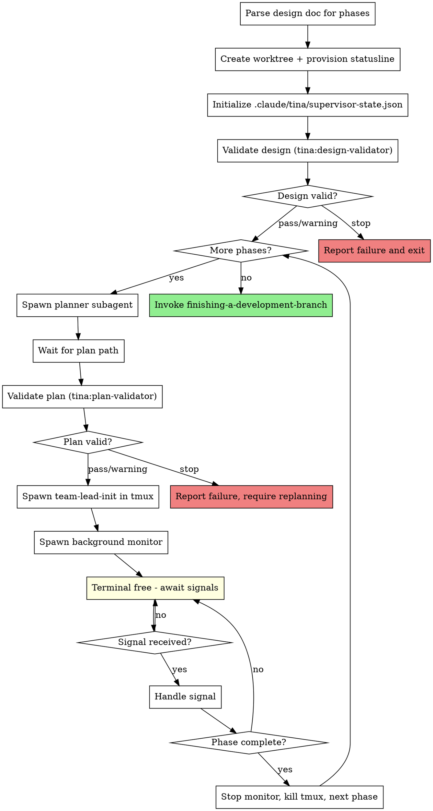

# EXECUTE THESE STEPS IN ORDER

You are a THIN COORDINATOR. Execute each step below. Do not skip steps.

## FORBIDDEN ACTIONS (if you do these, STOP immediately)
- Reading files other than design doc header
- Using Explore agent
- Creating tasks with TaskCreate
- Writing code
- Making implementation decisions

---

## STEP 1: Count phases

Run this command NOW:
```bash
grep -cE "^##+ Phase [0-9]" <DESIGN_DOC_PATH>
```

Store the result as TOTAL_PHASES.

---

## STEP 2: Create worktree

Follow the worktree creation steps from the skill (Step 1b).

---

## STEP 3: Initialize supervisor state

Create `.claude/tina/supervisor-state.json` per the skill.

---

## STEP 4: For PHASE_NUM = 1 to TOTAL_PHASES

### 4a. CALL Task tool NOW to spawn planner:

```json
{
  "subagent_type": "tina:planner",
  "model": "opus",
  "description": "Plan phase N",
  "prompt": "Design doc: <PATH>\nPhase: <N>\n\nCreate implementation plan. Return ONLY: PLAN_PATH: <path>"
}
```

Wait for response. Extract path from `PLAN_PATH: ...` line.

### 4b. Run tmux commands NOW:

```bash
SESSION_NAME="tina-phase-$PHASE_NUM"
tmux new-session -d -s "$SESSION_NAME" "cd $WORKTREE_PATH && ~/.local/bin/claudesp --dangerously-skip-permissions --model claude-opus-4-5-20251101"
```

Wait 3 seconds, then:

```bash
tmux send-keys -t "$SESSION_NAME" "/team-lead-init $PLAN_PATH" C-m
```

### 4c. CALL Task tool NOW to spawn background monitor:

```json
{
  "subagent_type": "tina:monitor",
  "model": "haiku",
  "run_in_background": true,
  "description": "Monitor phase N",
  "prompt": "Monitor phase execution:\n- phase_num: <N>\n- worktree_path: <PATH>\n- tmux_session: tina-phase-<N>\n- context_threshold: 50"
}
```

### 4d. STOP HERE - Terminal is now free

The monitor runs in background. Check its output file periodically for signals.
When you see `[SIGNAL] phase_complete`, proceed to next phase (repeat Step 4).

---

## STEP 5: After all phases complete

Invoke `tina:finishing-a-development-branch` for merge/PR workflow.

---

The full skill with details follows. EXECUTE THE STEPS ABOVE - don't just read them.

---

# Orchestrated Automation

## Overview

Automates the full development pipeline from design document to implementation. Spawns planner subagents for each phase, then team-leads in tmux sessions for execution. Monitors progress.

**Core principle:** Supervisor maintains zero context about plan content - only tracks file paths, phase numbers, and process state. Fresh context per phase via tmux.

**Announce at start:** "I'm using the orchestrate skill to automate implementation of this design."

## When to Use

- You have a complete design document with `## Phase N` sections
- You want fully automated execution without manual intervention
- The design has been reviewed by `tina:architect`

## When NOT to Use

- Design is incomplete or unapproved
- You want manual control over each phase
- Single-phase designs (use `tina:writing-plans` + `tina:executing-plans` directly)

## The Process

```
Architecture:

┌─────────────────────┐
│   Orchestrator      │  ← User's claude-code session, stays responsive
│   (parent)          │
└─────────┬───────────┘
          │ spawns (run_in_background: true)
          ▼
┌─────────────────────┐
│  Monitoring Agent   │  ← Haiku model, polls files every 5 seconds
│  (background)       │
└─────────┬───────────┘
          │ monitors
          ▼
┌─────────────────────┐
│  .claude/tina/phase-N/     │
│  - status.json      │  ← Phase status, task updates
│  - context-metrics  │  ← Context usage %
└─────────────────────┘
```



## Invocation

```
/tina:orchestrate docs/plans/2026-01-26-myfeature-design.md
```

## Phase 1 Behavior (Current Implementation)

This phase implements basic orchestration without team-based execution:

1. **Parse design doc** - Count `## Phase N` sections
2. **Create worktree** - Isolated workspace with statusline for context monitoring
3. **Initialize state** - Create `.claude/tina/supervisor-state.json` with worktree path
4. **For each phase:**
   - Spawn `tina:planner` subagent with design doc + phase number
   - Wait for plan path
   - Spawn `tina:team-lead-init` in tmux with plan path
   - Monitor `.claude/tina/phase-N/status.json` and context metrics until complete
   - Create `.claude/tina/checkpoint-needed` if context threshold exceeded
   - Kill tmux session, proceed to next phase
5. **Completion** - Invoke `tina:finishing-a-development-branch` for merge/PR/cleanup

## Implementation Notes

**Monitoring:** Delegated to a background haiku agent (`tina:monitor`) that polls status files every 5 seconds and outputs structured signals. The orchestrator remains responsive to user interaction while monitoring runs in background.

**Tmux session naming:** Uses pattern `tina-phase-N` where N is the phase number.

**Cleanup:** Supervisor state and phase directories persist in `.claude/tina/` for resumption. Can be manually removed after successful completion if desired.

## Model Policy

Different agents use different models based on their needs. "Opus" always means Opus 4.5.

| Agent | Model | Rationale |
|-------|-------|-----------|
| **Team-lead** (tmux) | opus | Coordinates team, needs strong reasoning |
| **Design Validator** | opus | Analyzes design feasibility, runs baseline commands - needs reasoning |
| **Plan Validator** | opus | Cross-references plan with design, checks estimates - needs reasoning |
| **Planner** | opus | Creates detailed implementation plans, needs deep codebase understanding |
| **Helper** | opus | Diagnoses blocked states, needs analytical reasoning |
| **Monitor** | haiku | Simple file polling, outputs signals - cheap and fast is sufficient |
| **Implementer** | opus (default) | Writes code - see flexibility note below |
| **Reviewers** | opus (default) | Reviews code - see flexibility note below |

### Implementer/Reviewer Model Flexibility

Implementers and reviewers default to opus, but can use sonnet or haiku for tasks that are:
- **Simple and mechanical** - clear input/output, no design decisions
- **Well-specified** - detailed steps with exact code provided in plan
- **Low risk** - limited opportunity to stray from spec or introduce quality issues

**When to downgrade:**
- Haiku: Trivial changes (rename, add import, update config value)
- Sonnet: Straightforward implementation (add simple function, write basic test)
- Opus: Complex logic, architectural decisions, ambiguous requirements

**How to specify:** The planner can annotate tasks with a recommended model:
```markdown
### Task 3: Add config validation
**Model:** sonnet (straightforward validation logic, clear spec)
```

If not specified, implementers/reviewers use opus by default.

**Why this flexibility matters:**
- Opus for complex work ensures quality
- Sonnet/haiku for simple tasks saves cost without sacrificing correctness
- Planner (opus) makes the judgment call since it understands task complexity

## Implementation Details

**Note:** The variables `$DESIGN_DOC`, `$PHASE_NUM`, and `$PLAN_PATH` are placeholders representing values from the execution context. Tmux sessions are created in two steps: first starting a Claude CLI session with `tmux new-session`, then waiting 3 seconds for Claude to initialize before sending the skill invocation command via `tmux send-keys`. This avoids shell escaping issues when passing complex arguments inline and ensures Claude is ready to receive input.

### Step 1: Parse Design Doc

```bash
# Count phases (supports ## or ### headings)
TOTAL_PHASES=$(grep -cE "^##+ Phase [0-9]" "$DESIGN_DOC")
if [ "$TOTAL_PHASES" -eq 0 ]; then
  echo "Error: Design doc must have ## Phase N or ### Phase N sections"
  exit 1
fi
```

### Step 1b: Create Worktree

Create an isolated workspace so statusline configuration and .tina state are contained within the worktree.

**Why inline instead of using-git-worktrees skill:** The orchestrate skill is fully automated and cannot prompt the user for input. The using-git-worktrees skill is designed for interactive use with user prompts for directory selection and global worktree options. Here we implement worktree creation inline with auto-decisions: always uses `.worktrees`, no global option consideration, no user prompting.

**1. Determine worktree directory:**

```bash
# Check in priority order
if [ -d ".worktrees" ]; then
  WORKTREE_DIR=".worktrees"
elif [ -d "worktrees" ]; then
  WORKTREE_DIR="worktrees"
else
  WORKTREE_DIR=".worktrees"
  mkdir -p "$WORKTREE_DIR"
fi
```

**2. Verify directory is gitignored:**

```bash
if ! git check-ignore -q "$WORKTREE_DIR" 2>/dev/null; then
  echo "$WORKTREE_DIR" >> .gitignore
  git add .gitignore
  git commit -m "chore: add $WORKTREE_DIR to gitignore"
fi
```

**3. Extract feature name from design doc:**

```bash
# Extract feature name from design doc filename
# e.g., 2026-01-26-auth-redesign-design.md -> auth-redesign
FEATURE_NAME=$(basename "$DESIGN_DOC" | sed 's/^[0-9-]*//; s/-design\.md$//')
BRANCH_NAME="tina/$FEATURE_NAME"
```

**4. Create branch and worktree:**

```bash
WORKTREE_PATH="$WORKTREE_DIR/$FEATURE_NAME"

# Handle branch name conflicts (append timestamp if exists)
if git show-ref --verify --quiet "refs/heads/$BRANCH_NAME"; then
  TIMESTAMP=$(date +%Y%m%d-%H%M%S)
  BRANCH_NAME="${BRANCH_NAME}-${TIMESTAMP}"
  echo "Branch already exists, using: $BRANCH_NAME"
fi

# Handle worktree path conflicts (append timestamp if exists)
if [ -d "$WORKTREE_PATH" ]; then
  TIMESTAMP=${TIMESTAMP:-$(date +%Y%m%d-%H%M%S)}
  WORKTREE_PATH="${WORKTREE_PATH}-${TIMESTAMP}"
  echo "Worktree path already exists, using: $WORKTREE_PATH"
fi

# Create worktree with error handling
if ! git worktree add "$WORKTREE_PATH" -b "$BRANCH_NAME"; then
  echo "Error: Failed to create worktree at $WORKTREE_PATH with branch $BRANCH_NAME"
  exit 1
fi
```

**5. Store paths for subsequent steps:**

```bash
# These variables are used by all subsequent steps
echo "WORKTREE_PATH=$WORKTREE_PATH"
echo "BRANCH_NAME=$BRANCH_NAME"
```

**6. Run project setup in worktree:**

```bash
cd "$WORKTREE_PATH"

# Auto-detect and run appropriate setup
if [ -f package.json ]; then npm install; fi
if [ -f Cargo.toml ]; then cargo build; fi
if [ -f requirements.txt ]; then pip install -r requirements.txt; fi
if [ -f pyproject.toml ]; then poetry install; fi
if [ -f go.mod ]; then go mod download; fi
```

**7. Verify clean baseline:**

```bash
# Run tests to ensure worktree starts clean
# Use project-appropriate test command
TEST_PASSED=true
if [ -f package.json ]; then
  if ! npm test; then TEST_PASSED=false; fi
elif [ -f Cargo.toml ]; then
  if ! cargo test; then TEST_PASSED=false; fi
elif [ -f pytest.ini ] || [ -f pyproject.toml ] || [ -f setup.py ]; then
  if ! pytest; then TEST_PASSED=false; fi
elif [ -f go.mod ]; then
  if ! go test ./...; then TEST_PASSED=false; fi
fi

# If tests fail: warn and proceed (automated mode cannot prompt)
# If tests pass: continue to orchestration
if [ "$TEST_PASSED" = "false" ]; then
  echo "Warning: Tests failed in worktree. Proceeding anyway but baseline is not clean."
fi
```

**8. Provision statusline for context monitoring:**

```bash
# Create .claude directory in worktree
mkdir -p "$WORKTREE_PATH/.claude"

# Write context monitoring script
cat > "$WORKTREE_PATH/.claude/tina-write-context.sh" << 'SCRIPT'
#!/bin/bash
set -e
TINA_DIR="${PWD}/.tina"
mkdir -p "$TINA_DIR"
INPUT=$(cat)
echo "$INPUT" | jq '{
  used_pct: (.context_window.used_percentage // 0),
  tokens: (.context_window.total_input_tokens // 0),
  max: (.context_window.context_window_size // 200000),
  timestamp: now | todate
}' > "$TINA_DIR/context-metrics.json"
echo "ctx:$(echo "$INPUT" | jq -r '.context_window.used_percentage // 0 | floor')%"
SCRIPT
chmod +x "$WORKTREE_PATH/.claude/tina-write-context.sh"

# Write local settings pointing to the script
cat > "$WORKTREE_PATH/.claude/settings.local.json" << EOF
{"statusLine": {"type": "command", "command": "$WORKTREE_PATH/.claude/tina-write-context.sh"}}
EOF
```

This enables automatic context tracking within the worktree. The statusline script writes `.claude/tina/context-metrics.json` on each status update. The supervisor monitor loop reads this file to decide when to trigger checkpoints.

**Important:** All subsequent steps (Step 2 onwards) execute within this worktree. The `.claude/tina/` directory created in Step 2 will be inside the worktree, keeping orchestration state isolated from the main workspace.

### Step 2: Initialize or Resume State

**If `.claude/tina/supervisor-state.json` exists:** Resume from saved state
**Otherwise:** Initialize new state

```bash
# Initialize session tracking (may be set during resume)
ACTIVE_SESSION=""

if [ -f ".claude/tina/supervisor-state.json" ]; then
  # Resume: read current phase
  CURRENT_PHASE=$(jq -r '.current_phase' .claude/tina/supervisor-state.json)
  echo "Resuming from phase $CURRENT_PHASE"

  # Check validation status on resume
  DESIGN_VALIDATED=$(jq -r '.design_validated // false' .claude/tina/supervisor-state.json)
  if [ "$DESIGN_VALIDATED" = "false" ]; then
    echo "Design not validated yet - will validate before proceeding"
    # Validation will run in Step 2c
  fi

  # Read worktree path
  WORKTREE_PATH=$(jq -r '.worktree_path' .claude/tina/supervisor-state.json)
  BRANCH_NAME=$(jq -r '.branch_name' .claude/tina/supervisor-state.json)

  # Verify worktree exists
  if ! git worktree list | grep -q "$WORKTREE_PATH"; then
    echo "Error: Worktree not found at $WORKTREE_PATH"
    echo "Cannot resume - worktree may have been removed"
    exit 1
  fi

  # Check for existing tmux session
  ACTIVE_SESSION=$(jq -r '.active_tmux_session // ""' .claude/tina/supervisor-state.json)
  if [ -n "$ACTIVE_SESSION" ] && tmux has-session -t "$ACTIVE_SESSION" 2>/dev/null; then
    echo "Found active session: $ACTIVE_SESSION"
    echo "Reconnecting to existing phase execution..."
    # Skip to monitor loop for current phase
    SESSION_NAME="$ACTIVE_SESSION"
    PHASE_NUM=$CURRENT_PHASE
    # Jump to Step 3e (monitoring)
  else
    echo "No active session found, will start fresh from phase $((CURRENT_PHASE + 1))"
    # Clear stale session reference
    if [ -n "$ACTIVE_SESSION" ]; then
      tmp_file=$(mktemp)
      jq '.active_tmux_session = null' .claude/tina/supervisor-state.json > "$tmp_file" && mv "$tmp_file" .claude/tina/supervisor-state.json
    fi
  fi
else
  # Initialize: create state file
  mkdir -p .tina
  cat > .claude/tina/supervisor-state.json << EOF
{
  "design_doc_path": "$DESIGN_DOC",
  "worktree_path": "$WORKTREE_PATH",
  "branch_name": "$BRANCH_NAME",
  "total_phases": $TOTAL_PHASES,
  "current_phase": 0,
  "active_tmux_session": null,
  "plan_paths": {},
  "recovery_attempts": {},
  "design_validated": false,
  "validation_status": null
}
EOF
  CURRENT_PHASE=0
fi

# Initialize cumulative metrics tracking
if [ ! -f ".claude/tina/cumulative-metrics.json" ]; then
  cat > .claude/tina/cumulative-metrics.json << EOF
{
  "phases_completed": 0,
  "total_impl_lines": 0,
  "total_test_lines": 0,
  "total_expected_impl": 0,
  "total_expected_test": 0,
  "cumulative_impl_drift_pct": 0,
  "cumulative_test_drift_pct": 0,
  "phase_metrics": {}
}
EOF
fi
```

### Step 2c: Validate Design

Before starting phases, validate the design document meets requirements for measurable success.

**Skip if resuming:** Only run on fresh orchestration (current_phase == 0).

```bash
if [ "$CURRENT_PHASE" -eq 0 ]; then
  echo "Validating design document..."

  # Create validation output directory
  mkdir -p "$WORKTREE_PATH/.claude/tina/validation"

  # Spawn design validator
  # Task tool parameters:
  #   subagent_type: "tina:design-validator"
  #   model: "opus"
  #   prompt: |
  #     Design doc: $DESIGN_DOC
  #     Output file: $WORKTREE_PATH/.claude/tina/validation/design-report.md
  #
  #     Validate this design and write your report to the output file.
  #     Return ONLY: VALIDATION_STATUS: Pass/Warning/Stop

  # Parse validation status
  VALIDATION_STATUS=$(echo "$VALIDATOR_OUTPUT" | grep "^VALIDATION_STATUS:" | cut -d' ' -f2)

  case "$VALIDATION_STATUS" in
    "Pass")
      echo "Design validated successfully"
      tmp_file=$(mktemp)
      jq '.design_validated = true | .validation_status = "pass"' .claude/tina/supervisor-state.json > "$tmp_file" && mv "$tmp_file" .claude/tina/supervisor-state.json
      ;;

    "Warning")
      echo "Design validated with warnings - proceeding with caution"
      echo "See: $WORKTREE_PATH/.claude/tina/validation/design-report.md"
      tmp_file=$(mktemp)
      jq '.design_validated = true | .validation_status = "warning"' .claude/tina/supervisor-state.json > "$tmp_file" && mv "$tmp_file" .claude/tina/supervisor-state.json
      ;;

    "Stop")
      echo "Design validation FAILED"
      tmp_file=$(mktemp)
      jq '.design_validated = true | .validation_status = "stop"' .claude/tina/supervisor-state.json > "$tmp_file" && mv "$tmp_file" .claude/tina/supervisor-state.json
      echo ""
      cat "$WORKTREE_PATH/.claude/tina/validation/design-report.md"
      echo ""
      echo "Design must be revised before orchestration can proceed."
      echo "Review the report above and update the design document."
      exit 1
      ;;

    *)
      echo "Unknown validation status: $VALIDATION_STATUS - treating as warning"
      tmp_file=$(mktemp)
      jq '.design_validated = true | .validation_status = "unknown"' .claude/tina/supervisor-state.json > "$tmp_file" && mv "$tmp_file" .claude/tina/supervisor-state.json
      ;;
  esac
fi
```

### Step 2b: Orphaned Session Cleanup

Before starting new phases, clean up any orphaned tmux sessions from previous runs:

```bash
# Find all tina tmux sessions
ORPHANED=$(tmux list-sessions -F '#{session_name}' 2>/dev/null | grep '^tina-phase-' || true)

for SESSION in $ORPHANED; do
  # Extract phase number from session name
  PHASE=$(echo "$SESSION" | sed 's/tina-phase-//')

  # Check if this session is our active session
  if [ "$SESSION" = "$ACTIVE_SESSION" ]; then
    echo "Keeping active session: $SESSION"
    continue
  fi

  # Check if phase is complete
  if [ -f ".claude/tina/phase-$PHASE/status.json" ]; then
    STATUS=$(jq -r '.status' ".claude/tina/phase-$PHASE/status.json")
    if [ "$STATUS" = "complete" ]; then
      echo "Cleaning up completed phase session: $SESSION"
      tmux kill-session -t "$SESSION" 2>/dev/null || true
      continue
    fi
  fi

  # Orphaned session for incomplete phase - ask supervisor how to handle
  echo "Warning: Found orphaned session $SESSION for incomplete phase $PHASE"
  echo "Options: kill (discard work) or adopt (reconnect)"
  # For now, leave it and warn - supervisor can manually handle
done
```

**Important:** Only automatically clean up sessions for completed phases. Orphaned sessions for incomplete phases may contain recoverable work.

### Step 3: Phase Loop

For each phase from `CURRENT_PHASE + 1` to `TOTAL_PHASES`:

**3a. Spawn Planner Subagent**

Spawn the planner as an isolated subagent. The planner reads the design doc, explores the codebase, and writes the plan - all in its own context. The orchestrator only receives the plan path back.

**Why subagent:** Planning requires reading the design doc, exploring code, and writing detailed implementation steps. This work happens in the planner's context, not the orchestrator's. The orchestrator stays lean - it only tracks file paths.

```
Task tool parameters:
  subagent_type: "tina:planner"
  model: "opus"
  prompt: |
    Design doc: $DESIGN_DOC
    Phase: $PHASE_NUM

    Create implementation plan for this phase.
    Return ONLY the plan path when done.
```

**Planner returns:** A single line: `PLAN_PATH: docs/plans/2026-01-26-feature-phase-1.md`

Parse the path from the planner's response:
```bash
PLAN_PATH=$(echo "$PLANNER_OUTPUT" | grep "^PLAN_PATH:" | cut -d' ' -f2)
```

The orchestrator does NOT read the plan content. It passes the path to team-lead-init, which reads and executes the plan in its own tmux session.

**If planner fails:**
```bash
echo "Planner failed for phase $PHASE_NUM, retrying..."
# Retry once with same prompt
# If still fails:
echo "Planner failed twice for phase $PHASE_NUM"
echo "Error: <planner error output>"
exit 1
```

**Important:** Planner failure means the design doc phase section may be malformed or the planner agent is broken. After one retry, escalate to human rather than continuing.

**3b. Update Supervisor State**

```bash
tmp_file=$(mktemp)
jq ".current_phase = $PHASE_NUM" .claude/tina/supervisor-state.json > "$tmp_file" && mv "$tmp_file" .claude/tina/supervisor-state.json

# Add plan path to state
tmp_file=$(mktemp)
jq ".plan_paths[\"$PHASE_NUM\"] = \"$PLAN_PATH\"" .claude/tina/supervisor-state.json > "$tmp_file" && mv "$tmp_file" .claude/tina/supervisor-state.json
```

**3b-2. Validate Plan**

Before spawning team-lead, validate the plan against the design document.

```bash
echo "Validating plan for phase $PHASE_NUM..."

# Create validation output directory
mkdir -p "$WORKTREE_PATH/.claude/tina/phase-$PHASE_NUM"

# Spawn plan validator
# Task tool parameters:
#   subagent_type: "tina:plan-validator"
#   model: "opus"
#   prompt: |
#     Design doc: $DESIGN_DOC
#     Plan file: $PLAN_PATH
#     Phase: $PHASE_NUM
#     Output file: $WORKTREE_PATH/.claude/tina/phase-$PHASE_NUM/plan-validation.md
#
#     Validate this plan against the design and write your report to the output file.
#     Return ONLY: VALIDATION_STATUS: Pass/Warning/Stop

# Parse validation status
PLAN_VALIDATION_STATUS=$(echo "$VALIDATOR_OUTPUT" | grep "^VALIDATION_STATUS:" | cut -d' ' -f2)

case "$PLAN_VALIDATION_STATUS" in
  "Pass")
    echo "Plan validated successfully for phase $PHASE_NUM"
    ;;

  "Warning")
    echo "Plan validated with warnings for phase $PHASE_NUM - proceeding with caution"
    echo "See: $WORKTREE_PATH/.claude/tina/phase-$PHASE_NUM/plan-validation.md"
    ;;

  "Stop")
    echo "Plan validation FAILED for phase $PHASE_NUM"
    echo ""
    cat "$WORKTREE_PATH/.claude/tina/phase-$PHASE_NUM/plan-validation.md"
    echo ""
    echo "Plan must be revised before execution can proceed."
    echo "Options:"
    echo "1. Re-run planner with additional guidance"
    echo "2. Manually edit the plan file"
    echo "3. Update design document if scope changed"
    exit 1
    ;;

  *)
    echo "Unknown validation status: $PLAN_VALIDATION_STATUS - treating as warning"
    ;;
esac
```

**3c. Initialize Phase Directory**

```bash
mkdir -p ".claude/tina/phase-$PHASE_NUM"
cat > ".claude/tina/phase-$PHASE_NUM/status.json" << EOF
{
  "status": "pending",
  "started_at": null
}
EOF
```

**3d. Spawn Team-Lead in Tmux**

```bash
SESSION_NAME="tina-phase-$PHASE_NUM"

# Step 1: Start session with Claude
tmux new-session -d -s "$SESSION_NAME" \
  "cd $WORKTREE_PATH && ~/.local/bin/claudesp --dangerously-skip-permissions --model claude-opus-4-5-20251101"

# Step 2: Wait for Claude to initialize, then send the command
sleep 3
tmux send-keys -t "$SESSION_NAME" "/team-lead-init $PLAN_PATH" C-m

# Update active session in state
tmp_file=$(mktemp)
jq ".active_tmux_session = \"$SESSION_NAME\"" .claude/tina/supervisor-state.json > "$tmp_file" && mv "$tmp_file" .claude/tina/supervisor-state.json
```

**3d-2. Spawn Background Monitoring Agent**

Use Task tool to spawn a haiku monitoring agent in the background:

```
Task tool parameters:
  subagent_type: "tina:monitor"
  model: "haiku"
  run_in_background: true
  prompt: |
    Monitor phase execution:
    - phase_num: $PHASE_NUM
    - worktree_path: $WORKTREE_PATH
    - tmux_session: $SESSION_NAME
    - context_threshold: 50
```

The Task tool returns an `output_file` path. Store this for signal checking:

```bash
# Store monitor output file path in supervisor state
tmp_file=$(mktemp)
jq ".monitor_output_file = \"$MONITOR_OUTPUT_FILE\"" .claude/tina/supervisor-state.json > "$tmp_file" && mv "$tmp_file" .claude/tina/supervisor-state.json
```

**Terminal is now free** - the orchestrator can respond to user queries while monitoring runs in background.

**3e. Monitor Phase Status (Background)**

The monitoring agent runs in background. The orchestrator periodically checks its output for signals.

**Checking monitor output:**

Read the last few lines of the monitor output file to check for signals:

```bash
# Quick check - read last 20 lines of monitor output
MONITOR_OUTPUT=$(jq -r '.monitor_output_file' .claude/tina/supervisor-state.json)
tail -20 "$MONITOR_OUTPUT" 2>/dev/null
```

**Signal detection and handling:**

When checking output, look for `[SIGNAL]` lines and handle accordingly:

| Signal | Action |
|--------|--------|
| `[SIGNAL] phase_complete phase=N` | Stop monitor, proceed to next phase |
| `[SIGNAL] phase_blocked phase=N reason="..."` | Stop monitor, spawn helper agent |
| `[SIGNAL] context_threshold phase=N pct=...` | Trigger checkpoint flow |
| `[SIGNAL] session_died phase=N` | Attempt recovery via rehydrate |

**When user asks about progress:**

Read monitor output and report recent `[UPDATE]` lines:
```bash
tail -10 "$MONITOR_OUTPUT" | grep "^\[UPDATE\]"
```

**Handling `phase_complete` signal:**

```bash
# Stop the monitoring agent
# Use TaskStop with the monitor's task_id

# Proceed to cleanup (Step 3f)
```

**Handling `phase_blocked` signal:**

```bash
# Stop the monitoring agent
REASON=$(echo "$SIGNAL_LINE" | sed 's/.*reason="\([^"]*\)".*/\1/')
echo "Phase $PHASE_NUM blocked: $REASON"

# Spawn helper agent for diagnosis
# (See "Blocked State Handling" section below)
```

**Handling `context_threshold` signal:**

```bash
# Create checkpoint-needed signal file
USED_PCT=$(echo "$SIGNAL_LINE" | sed 's/.*pct=\([0-9.]*\).*/\1/')
echo "{\"triggered_at\": \"$(date -u +%Y-%m-%dT%H:%M:%SZ)\", \"context_pct\": $USED_PCT, \"threshold\": 50}" > "$WORKTREE_PATH/.claude/tina/checkpoint-needed"
echo "Context at ${USED_PCT}%, triggering checkpoint"

# Proceed to checkpoint handling (see Checkpoint Handling section)
# Monitor continues running - it doesn't exit on context_threshold
```

**Handling `session_died` signal:**

```bash
# Check if phase was actually complete
if [ -f ".claude/tina/phase-$PHASE_NUM/status.json" ]; then
  STATUS=$(jq -r '.status' ".claude/tina/phase-$PHASE_NUM/status.json")
  if [ "$STATUS" = "complete" ]; then
    echo "Phase $PHASE_NUM was complete, continuing"
    # Proceed to Step 3f
  fi
fi

# Attempt recovery via rehydrate
echo "Attempting recovery..."

# Step 1: Start session with Claude
tmux new-session -d -s "$SESSION_NAME" \
  "cd $WORKTREE_PATH && ~/.local/bin/claudesp --dangerously-skip-permissions --model claude-opus-4-5-20251101"

# Step 2: Wait for Claude to initialize, then send the rehydrate command
sleep 3
tmux send-keys -t "$SESSION_NAME" "/rehydrate" C-m

# Track recovery attempt
RECOVERY_COUNT=$(jq -r ".recovery_attempts[\"$PHASE_NUM\"] // 0" .claude/tina/supervisor-state.json)
RECOVERY_COUNT=$((RECOVERY_COUNT + 1))
tmp_file=$(mktemp)
jq ".recovery_attempts[\"$PHASE_NUM\"] = $RECOVERY_COUNT" .claude/tina/supervisor-state.json > "$tmp_file" && mv "$tmp_file" .claude/tina/supervisor-state.json

if [ "$RECOVERY_COUNT" -gt 1 ]; then
  echo "Recovery failed twice, escalating"
  exit 1
fi

# Respawn monitoring agent for the recovered session
# (Use Task tool again with same parameters)
```

**3e-2. Consume Phase Reviewer Output**

When phase completes, the executing-plans skill dispatches the phase reviewer. The phase reviewer writes its report to `.claude/tina/phase-N/review.md` and outputs a severity tier.

**Read phase reviewer output:**

```bash
REVIEW_FILE="$WORKTREE_PATH/.claude/tina/phase-$PHASE_NUM/review.md"

# Wait for review file (max 5 minutes)
TIMEOUT=300
START=$(date +%s)
while [ ! -f "$REVIEW_FILE" ]; do
  ELAPSED=$(($(date +%s) - START))
  if [ "$ELAPSED" -gt "$TIMEOUT" ]; then
    echo "Phase reviewer timeout - escalating"
    exit 1
  fi
  sleep 5
done

# Extract severity from review
SEVERITY=$(grep -E "^\*\*Status:\*\*" "$REVIEW_FILE" | sed 's/.*\*\*Status:\*\* //' | tr '[:upper:]' '[:lower:]')
METRIC_DRIFT=$(grep -E "^\*\*Severity tier:\*\*" "$REVIEW_FILE" | sed 's/.*drift: //' | sed 's/%.*//')
```

**Handle severity:**

```bash
case "$SEVERITY" in
  "pass")
    echo "Phase $PHASE_NUM passed review"
    # Update cumulative metrics
    tina_update_cumulative_metrics "$PHASE_NUM" "$REVIEW_FILE"
    # Proceed to next phase (existing flow)
    ;;

  "warning")
    echo "Phase $PHASE_NUM passed with warnings"
    # Update cumulative metrics
    tina_update_cumulative_metrics "$PHASE_NUM" "$REVIEW_FILE"

    # Check cumulative drift
    CUMULATIVE_DRIFT=$(tina_get_cumulative_drift)
    if [ "$CUMULATIVE_DRIFT" -gt 50 ]; then
      echo "Cumulative drift exceeds 50% - triggering reassessment"
      tina_trigger_reassessment "$PHASE_NUM"
    else
      echo "Cumulative drift at ${CUMULATIVE_DRIFT}% - proceeding with caution"
      # Proceed to next phase
    fi
    ;;

  "stop")
    echo "Phase $PHASE_NUM failed review - halting"
    # Surface to user with full context
    cat << EOF
=== PHASE REVIEW FAILED ===
Phase: $PHASE_NUM
Severity: STOP

Review summary:
$(cat "$REVIEW_FILE")

Action required: Manual intervention needed before continuing.
Options:
1. Fix issues and re-run phase
2. Adjust estimates in remaining phases
3. Abort orchestration
EOF
    exit 1
    ;;

  *)
    echo "Unknown severity: $SEVERITY - treating as warning"
    # Fall through to warning handling
    ;;
esac
```

**User interaction while monitoring:**

The terminal remains responsive. Users can:
- Ask about progress (orchestrator reads monitor output)
- Give new instructions
- Manually trigger checkpoint via `/tina:checkpoint`
- Stop orchestration

When user interacts, check monitor output for any pending signals before responding.

### Reading Monitor Output

The orchestrator periodically checks the monitor's output file for signals. This should be done:
- Every 10 seconds when idle
- Before responding to user queries
- After any user interaction

**Check for signals:**

```bash
MONITOR_OUTPUT=$(jq -r '.monitor_output_file' .claude/tina/supervisor-state.json)

# Read last 50 lines and look for signals
SIGNALS=$(tail -50 "$MONITOR_OUTPUT" 2>/dev/null | grep "^\[SIGNAL\]" || true)

if [ -n "$SIGNALS" ]; then
  # Process each signal (most recent last)
  echo "$SIGNALS" | while read -r SIGNAL_LINE; do
    case "$SIGNAL_LINE" in
      *"phase_complete"*)
        # Handle completion
        ;;
      *"phase_blocked"*)
        # Handle blocked state
        ;;
      *"context_threshold"*)
        # Handle context threshold
        ;;
      *"session_died"*)
        # Handle session death
        ;;
    esac
  done
fi
```

**Signal deduplication:**

To avoid processing the same signal twice, track the last processed line number:

```bash
# Read current line count
CURRENT_LINES=$(wc -l < "$MONITOR_OUTPUT" 2>/dev/null || echo 0)
LAST_PROCESSED=$(jq -r '.monitor_last_line // 0' .claude/tina/supervisor-state.json)

if [ "$CURRENT_LINES" -gt "$LAST_PROCESSED" ]; then
  # Only read new lines
  NEW_LINES=$((CURRENT_LINES - LAST_PROCESSED))
  SIGNALS=$(tail -$NEW_LINES "$MONITOR_OUTPUT" | grep "^\[SIGNAL\]" || true)

  # Update last processed
  tmp_file=$(mktemp)
  jq ".monitor_last_line = $CURRENT_LINES" .claude/tina/supervisor-state.json > "$tmp_file" && mv "$tmp_file" .claude/tina/supervisor-state.json
fi
```

**3f. Cleanup and Proceed**

```bash
# Stop the background monitoring agent (if still running)
# Use TaskStop tool with the monitor's task_id

# Kill tmux session (errors suppressed if session already terminated)
tmux kill-session -t "$SESSION_NAME" 2>/dev/null || true

# Clear active session and monitor in state
tmp_file=$(mktemp)
jq ".active_tmux_session = null | .monitor_output_file = null" .claude/tina/supervisor-state.json > "$tmp_file" && mv "$tmp_file" .claude/tina/supervisor-state.json
```

### Checkpoint Handling

When the background monitor outputs `[SIGNAL] context_threshold`, the orchestrator coordinates context reset:

**1. Detect checkpoint needed:**

The background monitor outputs the signal when context exceeds threshold. The orchestrator creates the signal file:

```bash
# When [SIGNAL] context_threshold detected in monitor output
USED_PCT=$(echo "$SIGNAL_LINE" | sed 's/.*pct=\([0-9.]*\).*/\1/')
echo "{\"triggered_at\": \"$(date -u +%Y-%m-%dT%H:%M:%SZ)\", \"context_pct\": $USED_PCT, \"threshold\": 50}" > "$WORKTREE_PATH/.claude/tina/checkpoint-needed"
echo "Context at ${USED_PCT}%, triggering checkpoint"
```

**2. Send checkpoint command:**

```bash
tmux send-keys -t "$SESSION_NAME" "/checkpoint" C-m
```

**3. Wait for handoff:**

Poll for handoff file update (max 5 minutes):

```bash
HANDOFF_FILE="$WORKTREE_PATH/.claude/tina/phase-$PHASE_NUM/handoff.md"
TIMEOUT=300
START=$(date +%s)

while true; do
  if [ -f "$HANDOFF_FILE" ]; then
    # Check if modified after checkpoint signal
    HANDOFF_TIME=$(stat -f %m "$HANDOFF_FILE" 2>/dev/null || stat -c %Y "$HANDOFF_FILE")
    SIGNAL_TIME=$(stat -f %m "$WORKTREE_PATH/.claude/tina/checkpoint-needed" 2>/dev/null || stat -c %Y "$WORKTREE_PATH/.claude/tina/checkpoint-needed")
    if [ "$HANDOFF_TIME" -gt "$SIGNAL_TIME" ]; then
      echo "Handoff written"
      break
    fi
  fi

  ELAPSED=$(($(date +%s) - START))
  if [ "$ELAPSED" -gt "$TIMEOUT" ]; then
    echo "Checkpoint timeout - escalating"
    # Mark phase blocked, escalate to user
    exit 1
  fi

  sleep 5
done
```

**4. Send clear and rehydrate:**

```bash
# Clear context
tmux send-keys -t "$SESSION_NAME" "/clear" C-m
sleep 2

# Rehydrate from handoff
tmux send-keys -t "$SESSION_NAME" "/rehydrate" C-m

# Remove checkpoint signal
rm "$WORKTREE_PATH/.claude/tina/checkpoint-needed"
```

**5. Continue monitoring:**

After rehydrate, return to normal phase monitoring loop (Step 3e).

### Reassessment Handling

When cumulative drift exceeds threshold or a phase returns Warning status, the orchestrator can trigger reassessment.

**Reassessment options:**

1. **Continue with caution** - Log warning, proceed to next phase
2. **Replan remaining phases** - Spawn planner with updated context
3. **Escalate to human** - Pause and wait for user decision

**Reassessment logic:**

```bash
tina_trigger_reassessment() {
  local phase_num="$1"
  local cumulative_drift=$(tina_get_cumulative_drift)
  local remaining_phases=$((TOTAL_PHASES - phase_num))

  echo "=== REASSESSMENT TRIGGERED ==="
  echo "Completed: $phase_num / $TOTAL_PHASES phases"
  echo "Cumulative drift: ${cumulative_drift}%"
  echo "Remaining phases: $remaining_phases"

  # Read cumulative metrics
  cat "$WORKTREE_PATH/.claude/tina/cumulative-metrics.json" | jq '.'

  # Decision tree
  if [ "$cumulative_drift" -gt 75 ]; then
    echo "DECISION: Escalate to human (drift too high)"
    echo "Recommendation: Consider aborting or major replanning"
    exit 1
  elif [ "$remaining_phases" -le 1 ]; then
    echo "DECISION: Continue (only 1 phase remaining)"
    echo "Warning: Final phase may not achieve goal"
    # Proceed
  else
    echo "DECISION: Replan remaining phases"
    # Spawn planner with cumulative context
    # Planner receives actual metrics to adjust remaining estimates
    tina_replan_remaining "$phase_num"
  fi
}

tina_replan_remaining() {
  local completed_phase="$1"
  local next_phase=$((completed_phase + 1))

  echo "Spawning planner with updated context for phase $next_phase"

  # The planner receives cumulative metrics so it can adjust estimates
  # This is done by including the metrics file path in the planner prompt
  # Planner prompt includes:
  # - Original design doc
  # - Phase number to plan
  # - Cumulative metrics file path (for context on what's been achieved)
}
```

### Cumulative Metrics Helpers

**Update cumulative metrics after phase completion:**

```bash
tina_update_cumulative_metrics() {
  local phase_num="$1"
  local review_file="$2"
  local metrics_file="$WORKTREE_PATH/.claude/tina/cumulative-metrics.json"

  # Extract metrics from review file
  # The review file has a metrics table we need to parse
  local impl_actual=$(grep "Impl lines" "$review_file" | sed 's/.*| +\([0-9]*\).*/\1/' | head -1)
  local test_actual=$(grep "Test lines" "$review_file" | sed 's/.*| +\([0-9]*\).*/\1/' | head -1)
  local impl_expected=$(grep "Impl lines" "$review_file" | sed 's/.*| ~\([0-9]*\).*/\1/' | head -1)
  local test_expected=$(grep "Test lines" "$review_file" | sed 's/.*| ~\([0-9]*\).*/\1/' | head -1)
  local drift=$(grep "Metric drift:" "$review_file" | sed 's/.*drift: \([0-9]*\)%.*/\1/' | head -1)

  # Default to 0 if parsing fails
  impl_actual=${impl_actual:-0}
  test_actual=${test_actual:-0}
  impl_expected=${impl_expected:-0}
  test_expected=${test_expected:-0}
  drift=${drift:-0}

  # Update cumulative metrics
  local tmp_file=$(mktemp)
  jq --arg phase "$phase_num" \
     --argjson impl "$impl_actual" \
     --argjson test "$test_actual" \
     --argjson exp_impl "$impl_expected" \
     --argjson exp_test "$test_expected" \
     --argjson drift "$drift" '
    .phases_completed += 1 |
    .total_impl_lines += $impl |
    .total_test_lines += $test |
    .total_expected_impl += $exp_impl |
    .total_expected_test += $exp_test |
    .phase_metrics[$phase] = {impl: $impl, test: $test, drift: $drift} |
    .cumulative_impl_drift_pct = (if .total_expected_impl > 0 then (((.total_expected_impl - .total_impl_lines) | fabs) / .total_expected_impl * 100 | floor) else 0 end) |
    .cumulative_test_drift_pct = (if .total_expected_test > 0 then (((.total_expected_test - .total_test_lines) | fabs) / .total_expected_test * 100 | floor) else 0 end)
  ' "$metrics_file" > "$tmp_file" && mv "$tmp_file" "$metrics_file"
}

tina_get_cumulative_drift() {
  local metrics_file="$WORKTREE_PATH/.claude/tina/cumulative-metrics.json"
  local impl_drift=$(jq -r '.cumulative_impl_drift_pct // 0' "$metrics_file")
  local test_drift=$(jq -r '.cumulative_test_drift_pct // 0' "$metrics_file")

  # Return the worse of the two
  if [ "$impl_drift" -gt "$test_drift" ]; then
    echo "$impl_drift"
  else
    echo "$test_drift"
  fi
}
```

### Blocked State Handling

When a phase enters blocked state, supervisor spawns a helper agent for diagnosis before escalating:

**1. Spawn helper agent:**

```
Task tool parameters:
  subagent_type: "tina:helper"
  model: "opus"
  prompt: |
    Diagnose blocked phase: $PHASE_NUM
    Reason: $REASON
    Phase dir: .claude/tina/phase-$PHASE_NUM
```

**2. Wait for diagnostic file:**

Poll for helper's diagnostic output (max 2 minutes):

```bash
DIAGNOSTIC_FILE=".claude/tina/phase-$PHASE_NUM/diagnostic.md"
TIMEOUT=120
START=$(date +%s)

while true; do
  if [ -f "$DIAGNOSTIC_FILE" ]; then
    echo "Diagnostic received"
    break
  fi

  ELAPSED=$(($(date +%s) - START))
  if [ "$ELAPSED" -gt "$TIMEOUT" ]; then
    echo "Diagnostic timeout - escalating to user"
    exit 1
  fi

  sleep 5
done
```

**3. Read recommendation:**

```bash
RECOMMENDATION=$(jq -r '.recommendation' "$DIAGNOSTIC_FILE")
RECOVERY_CMD=$(jq -r '.recovery_command // empty' "$DIAGNOSTIC_FILE")
```

Helper writes one of:
- `RECOVERABLE` - Issue can be fixed automatically (includes `recovery_command`)
- `ESCALATE` - Requires human intervention

**4. Handle recommendation:**

```bash
case "$RECOMMENDATION" in
  "RECOVERABLE")
    # Check if we've already attempted recovery for this phase
    ALREADY_TRIED=$(jq -r ".recovery_attempts[\"$PHASE_NUM\"] // false" .claude/tina/supervisor-state.json)

    if [ "$ALREADY_TRIED" = "true" ]; then
      echo "Recovery already attempted for phase $PHASE_NUM - escalating"
      exit 1
    fi

    # Mark recovery attempt
    tmp_file=$(mktemp)
    jq ".recovery_attempts[\"$PHASE_NUM\"] = true" .claude/tina/supervisor-state.json > "$tmp_file" && mv "$tmp_file" .claude/tina/supervisor-state.json

    echo "Attempting recovery via /rehydrate"
    tmux send-keys -t "$SESSION_NAME" "/rehydrate" C-m

    # Reset phase status to allow re-monitoring
    cat > ".claude/tina/phase-$PHASE_NUM/status.json" << EOF
{
  "status": "executing",
  "recovered_at": "$(date -u +%Y-%m-%dT%H:%M:%SZ)"
}
EOF

    # Continue monitoring (return to loop)
    ;;

  *)
    # ESCALATE or unknown - requires human
    echo "Phase $PHASE_NUM requires human intervention"
    echo "Reason: $REASON"
    echo "Diagnostic: $(cat $DIAGNOSTIC_FILE)"
    exit 1
    ;;
esac
```

**Note:** Recovery is only attempted once per phase. If the same phase blocks again after recovery, it immediately escalates to the user.

### Step 4: Completion

After all phases complete successfully:

**4a. Verify all phases complete:**

```bash
ALL_COMPLETE=true
for i in $(seq 1 $TOTAL_PHASES); do
  if [ ! -f ".claude/tina/phase-$i/status.json" ]; then
    echo "Error: Missing status for phase $i"
    ALL_COMPLETE=false
    break
  fi

  STATUS=$(jq -r '.status' ".claude/tina/phase-$i/status.json")
  if [ "$STATUS" != "complete" ]; then
    echo "Error: Phase $i not complete (status: $STATUS)"
    ALL_COMPLETE=false
    break
  fi
done

if [ "$ALL_COMPLETE" != "true" ]; then
  echo "Cannot proceed to completion - not all phases complete"
  exit 1
fi
```

**4b. Clean up all tmux sessions:**

```bash
for i in $(seq 1 $TOTAL_PHASES); do
  SESSION="tina-phase-$i"
  tmux kill-session -t "$SESSION" 2>/dev/null || true
done
```

**4c. Update supervisor state:**

```bash
tmp_file=$(mktemp)
jq '.status = "complete" | .completed_at = now | .active_tmux_session = null' .claude/tina/supervisor-state.json > "$tmp_file" && mv "$tmp_file" .claude/tina/supervisor-state.json
```

**4d. Invoke finishing workflow:**

The worktree contains all implementation work. Present options via finishing-a-development-branch skill:

1. **Merge locally:** Merge worktree branch to base, remove worktree
2. **Create PR:** Push branch, create PR, keep worktree
3. **Keep as-is:** Leave worktree for manual handling
4. **Discard:** Remove worktree and branch

```bash
# Use the finishing skill
# /tina:finishing-a-development-branch
```

The skill handles user choice, worktree cleanup (for options 1, 4), and branch management.

**4e. Report completion:**

```
All phases complete!

Phase summary:
- Phase 1: [plan path] - complete
- Phase 2: [plan path] - complete
...

Total commits: [count]
Files changed: [count]

Ready for merge/PR workflow.
```

### Tmux Commands Reference

**Create session:**
```bash
tmux new-session -d -s <name> "<command>"
```

**Check session exists:**
```bash
tmux has-session -t <name> 2>/dev/null && echo "exists"
```

**Kill session:**
```bash
tmux kill-session -t <name>
```

**Send command to session:**
```bash
# Wait for session to initialize before sending keys
sleep 3
tmux send-keys -t <name> "<command>" C-m
```

## State Files

**Supervisor state:** `.claude/tina/supervisor-state.json`
```json
{
  "design_doc_path": "docs/plans/2026-01-26-feature-design.md",
  "worktree_path": ".worktrees/feature",
  "branch_name": "tina/feature",
  "total_phases": 3,
  "current_phase": 2,
  "active_tmux_session": "tina-phase-2",
  "monitor_output_file": "/tmp/claude-task-abc123.out",
  "plan_paths": {
    "1": "docs/plans/2026-01-26-feature-phase-1.md",
    "2": "docs/plans/2026-01-26-feature-phase-2.md"
  },
  "recovery_attempts": {
    "1": 0,
    "2": 1
  },
  "design_validated": false,
  "validation_status": null,
  "status": "executing",
  "started_at": "2026-01-26T10:00:00Z",
  "completed_at": null
}
```

**Field descriptions:**
- `design_doc_path`: Original design document that started orchestration
- `worktree_path`: Path to the worktree for this orchestration run
- `branch_name`: Git branch created for this run
- `total_phases`: Number of phases parsed from design doc
- `current_phase`: Last phase that was started (0 = not started)
- `active_tmux_session`: Currently running tmux session name (null if none)
- `monitor_output_file`: Path to background monitor's output file (for reading signals)
- `plan_paths`: Map of phase number to generated plan file path
- `recovery_attempts`: Map of phase number to recovery attempt count
- `design_validated`: Whether design validation has run (true after Step 2c completes)
- `validation_status`: Result of design validation (pass/warning/stop, null if not run)
- `status`: Overall status (executing, complete, blocked)
- `started_at`: When orchestration began
- `completed_at`: When all phases completed (null if not complete)

**Phase directory:** `.claude/tina/phase-N/`

Contains per-phase state files:
- `status.json` - Execution status (pending/executing/complete)
- `plan-validation.md` - Plan validator report (written before execution)
- `review.md` - Phase reviewer report (written after execution)
- `handoff.md` - Context handoff document (for checkpoint/rehydrate)

**Phase status:** `.claude/tina/phase-N/status.json`
```json
{
  "status": "executing",
  "started_at": "2026-01-26T10:00:00Z"
}
```

**Context metrics:** `.claude/tina/context-metrics.json` (in worktree)
```json
{
  "used_pct": 45.2,
  "tokens": 90400,
  "max": 200000,
  "timestamp": "2026-01-26T10:15:00Z"
}
```

Written by statusline script on each status update. Supervisor reads this to decide checkpoints.

**Cumulative metrics:** `.claude/tina/cumulative-metrics.json`
```json
{
  "phases_completed": 3,
  "total_impl_lines": 450,
  "total_test_lines": 380,
  "total_expected_impl": 500,
  "total_expected_test": 600,
  "cumulative_impl_drift_pct": 10,
  "cumulative_test_drift_pct": 37,
  "phase_metrics": {
    "1": {"impl": 150, "test": 200, "drift": 5},
    "2": {"impl": 180, "test": 100, "drift": 25},
    "3": {"impl": 120, "test": 80, "drift": 45}
  }
}
```

**Baseline metrics:** `.claude/tina/baseline-metrics.json`
```json
{
  "captured_at": "2026-01-26T10:00:00Z",
  "design_doc": "docs/plans/2026-01-26-feature-design.md",
  "metrics": {
    "coverage": "62.5%",
    "raw_output": "Lines: 62.5% (1250/2000)"
  }
}
```

Written by design validator during validation. Used by phase reviewer to compare progress against baseline.

**Plan validation:** `.claude/tina/phase-N/plan-validation.md`

Written by plan validator before execution of each phase. Contains:
- Target alignment analysis (design targets vs plan targets)
- Scope coverage verification (deliverables checked)
- Estimate plausibility assessment
- ROI check (if applicable)
- Final severity tier and recommendation

Used by orchestrator to gate execution. If validation fails (Stop), execution halts and user must revise plan or design.

## Resumption

If supervisor is interrupted (Ctrl+C, crash, terminal closed), re-run with same design doc path:

**State reconstruction:**
1. Read `.claude/tina/supervisor-state.json` for current phase, active session, and worktree path
2. Verify worktree still exists: `git worktree list | grep "$WORKTREE_PATH"`
3. If worktree missing: error and exit (cannot resume without worktree)
4. Check if `active_tmux_session` still exists via `tmux has-session`
5. If session exists: reconnect to monitoring loop
6. If session doesn't exist but phase incomplete: respawn team-lead with `/rehydrate`
7. If phase complete: proceed to next phase

**Resumption scenarios:**

| State | active_tmux_session | phase status | Action |
|-------|---------------------|--------------|--------|
| Session alive | exists, running | executing | Reconnect to monitor loop |
| Session died | exists in state, not running | executing | Respawn with /rehydrate |
| Phase done | null or stale | complete | Proceed to next phase |
| Phase blocked | null or stale | blocked | Spawn helper agent |

**Command:**
```bash
# Simply re-run orchestrate with same design doc
/tina:orchestrate docs/plans/2026-01-26-feature-design.md
```

The supervisor automatically detects existing state and resumes appropriately.

## Integration

**Spawns:**
- `tina:design-validator` - Validates design before planning (once at start)
- `tina:plan-validator` - Validates plan against design before execution (per phase)
- `tina:planner` - Creates implementation plan for each phase
- `tina:monitor` - Background haiku agent for phase monitoring (run_in_background: true)
- Team-lead in tmux - Executes phase via `team-lead-init`

**Invokes:**
- `tina:using-git-worktrees` pattern - Worktree creation at start (integrated, not invoked as skill)
- `tina:finishing-a-development-branch` - Handles merge/PR/cleanup workflow after completion

**State files:**
- `.claude/tina/supervisor-state.json` - Supervisor resumption state (includes worktree_path)
- `.claude/tina/phase-N/status.json` - Per-phase execution status
- `.claude/tina/phase-N/handoff.md` - Context handoff document for checkpoint/rehydrate
- `.claude/tina/context-metrics.json` - Context window usage from statusline
- `.claude/tina/checkpoint-needed` - Signal file when threshold exceeded

**Checkpoint cycle:**
- Statusline script writes `.claude/tina/context-metrics.json` with usage data
- Supervisor monitor loop reads metrics, creates `.claude/tina/checkpoint-needed` when threshold exceeded
- Supervisor detects signal, sends `/checkpoint` to team-lead
- Team-lead runs checkpoint skill, writes handoff, outputs "CHECKPOINT COMPLETE"
- Supervisor sends `/clear`, then `/rehydrate`
- Team-lead runs rehydrate skill, restores state, resumes execution

**Depends on existing:**
- `tina:executing-plans` - Team-lead delegates to this for task execution
- `tina:planner` - Creates phase plans from design doc
- `tina:architect` - Design must be architect-reviewed before orchestration
- `tina:phase-reviewer` - Called by executing-plans after tasks complete
- `tina:using-git-worktrees` - Pattern for worktree creation (integrated into Step 1b)

**Phase 2 integrations (now available):**
- Team-based execution via Teammate tool (workers + reviewers)
- Message-based coordination between teammates
- Review tracking and loop prevention

**Phase 3 integrations (now available):**
- Checkpoint/rehydrate for context management via `.claude/tina/checkpoint-needed` signal
- Statusline context monitoring with automatic checkpoint triggering

**Phase 4 integrations (now available):**
- Helper agent (`tina:helper`) for blocked state diagnosis
- Planner retry logic (one retry before escalation)
- Tmux session death detection and recovery
- Recovery attempt tracking to prevent infinite loops

**Phase 5 integrations (now available):**
- Supervisor resumption from supervisor-state.json with tmux session reconnection
- Orphaned session detection and cleanup before new phases
- Completion workflow with finishing-a-development-branch integration

**All planned integrations complete.** The orchestration system is fully functional.

**Metrics tracking:**
- Phase reviewer writes `.claude/tina/phase-N/review.md` with severity and metrics
- Orchestrator updates `.claude/tina/cumulative-metrics.json` after each phase
- Cumulative drift calculated as average of per-phase drifts
- Threshold: 50% cumulative drift triggers reassessment

## Error Handling

**Design doc has no phases:**
- Error immediately: "Design doc must have `## Phase N` sections"
- Exit with error code

**Planner fails:**
- Retry once with same prompt
- If still fails: output error, exit (human intervention needed)

**Team-lead tmux session dies:**
- Check if phase was complete (proceed if yes)
- Attempt recovery via `/rehydrate` in new session
- Track recovery attempts in supervisor-state.json
- If recovery fails twice: escalate to human

**Phase blocked:**
- Spawn helper agent for diagnosis
- Helper writes `.claude/tina/phase-N/diagnostic.md`
- If helper recommends RECOVERABLE: attempt one recovery
- If helper recommends ESCALATE or recovery fails: escalate to human

**Checkpoint timeout:**
- Team-lead doesn't write handoff within 5 minutes
- Force kill tmux session
- Mark phase as blocked with reason "checkpoint timeout"
- Spawn helper agent (may be able to diagnose from partial state)

**Recovery tracking:**
- Supervisor tracks recovery attempts per phase in `recovery_attempts` field
- Maximum 1 recovery attempt per phase per error type
- Prevents infinite retry loops

## Red Flags

**Never:**
- Read plan content (only track file paths)
- Parse plan structure (that's team-lead's job)
- Skip phase completion verification
- Leave orphaned tmux sessions (always attempt cleanup)

**Always:**
- Wait for planner to return path before spawning team-lead
- Verify phase complete via status.json before proceeding
- Clean up tmux session after phase completes
- Run orphaned session cleanup before starting new phases
- Warn about orphaned sessions for incomplete phases
