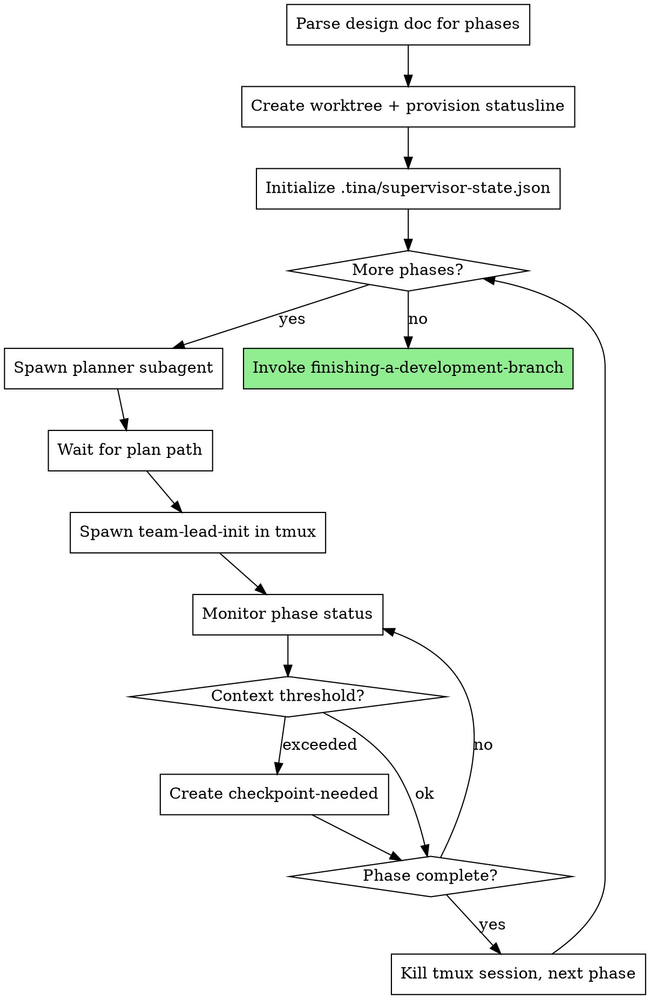

# Orchestrated Automation

## Overview

Automates the full development pipeline from design document to implementation. Spawns planner subagents for each phase, then team-leads in tmux sessions for execution. Monitors progress.

**Core principle:** Supervisor maintains zero context about plan content - only tracks file paths, phase numbers, and process state. Fresh context per phase via tmux.

**Announce at start:** "I'm using the orchestrate skill to automate implementation of this design."

## When to Use

- You have a complete design document with `## Phase N` sections
- You want fully automated execution without manual intervention
- The design has been reviewed by `tina:architect`

## When NOT to Use

- Design is incomplete or unapproved
- You want manual control over each phase
- Single-phase designs (use `tina:writing-plans` + `tina:executing-plans` directly)

## The Process



## Invocation

```
/tina:orchestrate docs/plans/2026-01-26-myfeature-design.md
```

## Phase 1 Behavior (Current Implementation)

This phase implements basic orchestration without team-based execution:

1. **Parse design doc** - Count `## Phase N` sections
2. **Create worktree** - Isolated workspace with statusline for context monitoring
3. **Initialize state** - Create `.tina/supervisor-state.json` with worktree path
4. **For each phase:**
   - Spawn `tina:planner` subagent with design doc + phase number
   - Wait for plan path
   - Spawn `tina:team-lead-init` in tmux with plan path
   - Monitor `.tina/phase-N/status.json` and context metrics until complete
   - Create `.tina/checkpoint-needed` if context threshold exceeded
   - Kill tmux session, proceed to next phase
5. **Completion** - Invoke `tina:finishing-a-development-branch` for merge/PR/cleanup

## Implementation Notes

**Monitoring:** Polls `.tina/phase-N/status.json` every 10 seconds until phase status is "complete" or "blocked".

**Tmux session naming:** Uses pattern `tina-phase-N` where N is the phase number.

**Cleanup:** Supervisor state and phase directories persist in `.tina/` for resumption. Can be manually removed after successful completion if desired.

## Implementation Details

**Note:** The variables `$DESIGN_DOC`, `$PHASE_NUM`, and `$PLAN_PATH` are placeholders representing values from the execution context. The tmux invocation `claude --prompt '/team-lead-init $PLAN_PATH'` starts a new Claude CLI session that will execute the team-lead-init skill with the provided plan path argument.

### Step 1: Parse Design Doc

```bash
# Count phases
TOTAL_PHASES=$(grep -c "^## Phase [0-9]" "$DESIGN_DOC")
if [ "$TOTAL_PHASES" -eq 0 ]; then
  echo "Error: Design doc must have ## Phase N sections"
  exit 1
fi
```

### Step 1b: Create Worktree

Create an isolated workspace so statusline configuration and .tina state are contained within the worktree.

**Why inline instead of using-git-worktrees skill:** The orchestrate skill is fully automated and cannot prompt the user for input. The using-git-worktrees skill is designed for interactive use with user prompts for directory selection and global worktree options. Here we implement worktree creation inline with auto-decisions: always uses `.worktrees`, no global option consideration, no user prompting.

**1. Determine worktree directory:**

```bash
# Check in priority order
if [ -d ".worktrees" ]; then
  WORKTREE_DIR=".worktrees"
elif [ -d "worktrees" ]; then
  WORKTREE_DIR="worktrees"
else
  WORKTREE_DIR=".worktrees"
  mkdir -p "$WORKTREE_DIR"
fi
```

**2. Verify directory is gitignored:**

```bash
if ! git check-ignore -q "$WORKTREE_DIR" 2>/dev/null; then
  echo "$WORKTREE_DIR" >> .gitignore
  git add .gitignore
  git commit -m "chore: add $WORKTREE_DIR to gitignore"
fi
```

**3. Extract feature name from design doc:**

```bash
# Extract feature name from design doc filename
# e.g., 2026-01-26-auth-redesign-design.md -> auth-redesign
FEATURE_NAME=$(basename "$DESIGN_DOC" | sed 's/^[0-9-]*//; s/-design\.md$//')
BRANCH_NAME="tina/$FEATURE_NAME"
```

**4. Create branch and worktree:**

```bash
WORKTREE_PATH="$WORKTREE_DIR/$FEATURE_NAME"

# Handle branch name conflicts (append timestamp if exists)
if git show-ref --verify --quiet "refs/heads/$BRANCH_NAME"; then
  TIMESTAMP=$(date +%Y%m%d-%H%M%S)
  BRANCH_NAME="${BRANCH_NAME}-${TIMESTAMP}"
  echo "Branch already exists, using: $BRANCH_NAME"
fi

# Handle worktree path conflicts (append timestamp if exists)
if [ -d "$WORKTREE_PATH" ]; then
  TIMESTAMP=${TIMESTAMP:-$(date +%Y%m%d-%H%M%S)}
  WORKTREE_PATH="${WORKTREE_PATH}-${TIMESTAMP}"
  echo "Worktree path already exists, using: $WORKTREE_PATH"
fi

# Create worktree with error handling
if ! git worktree add "$WORKTREE_PATH" -b "$BRANCH_NAME"; then
  echo "Error: Failed to create worktree at $WORKTREE_PATH with branch $BRANCH_NAME"
  exit 1
fi
```

**5. Store paths for subsequent steps:**

```bash
# These variables are used by all subsequent steps
echo "WORKTREE_PATH=$WORKTREE_PATH"
echo "BRANCH_NAME=$BRANCH_NAME"
```

**6. Run project setup in worktree:**

```bash
cd "$WORKTREE_PATH"

# Auto-detect and run appropriate setup
if [ -f package.json ]; then npm install; fi
if [ -f Cargo.toml ]; then cargo build; fi
if [ -f requirements.txt ]; then pip install -r requirements.txt; fi
if [ -f pyproject.toml ]; then poetry install; fi
if [ -f go.mod ]; then go mod download; fi
```

**7. Verify clean baseline:**

```bash
# Run tests to ensure worktree starts clean
# Use project-appropriate test command
TEST_PASSED=true
if [ -f package.json ]; then
  if ! npm test; then TEST_PASSED=false; fi
elif [ -f Cargo.toml ]; then
  if ! cargo test; then TEST_PASSED=false; fi
elif [ -f pytest.ini ] || [ -f pyproject.toml ] || [ -f setup.py ]; then
  if ! pytest; then TEST_PASSED=false; fi
elif [ -f go.mod ]; then
  if ! go test ./...; then TEST_PASSED=false; fi
fi

# If tests fail: warn and proceed (automated mode cannot prompt)
# If tests pass: continue to orchestration
if [ "$TEST_PASSED" = "false" ]; then
  echo "Warning: Tests failed in worktree. Proceeding anyway but baseline is not clean."
fi
```

**8. Provision statusline for context monitoring:**

```bash
# Create .claude directory in worktree
mkdir -p "$WORKTREE_PATH/.claude"

# Write context monitoring script
cat > "$WORKTREE_PATH/.claude/tina-write-context.sh" << 'SCRIPT'
#!/bin/bash
set -e
TINA_DIR="${PWD}/.tina"
mkdir -p "$TINA_DIR"
INPUT=$(cat)
echo "$INPUT" | jq '{
  used_pct: (.context_window.used_percentage // 0),
  tokens: (.context_window.total_input_tokens // 0),
  max: (.context_window.context_window_size // 200000),
  timestamp: now | todate
}' > "$TINA_DIR/context-metrics.json"
echo "ctx:$(echo "$INPUT" | jq -r '.context_window.used_percentage // 0 | floor')%"
SCRIPT
chmod +x "$WORKTREE_PATH/.claude/tina-write-context.sh"

# Write local settings pointing to the script
cat > "$WORKTREE_PATH/.claude/settings.local.json" << EOF
{"statusLine": {"type": "command", "command": "$WORKTREE_PATH/.claude/tina-write-context.sh"}}
EOF
```

This enables automatic context tracking within the worktree. The statusline script writes `.tina/context-metrics.json` on each status update. The supervisor monitor loop reads this file to decide when to trigger checkpoints.

**Important:** All subsequent steps (Step 2 onwards) execute within this worktree. The `.tina/` directory created in Step 2 will be inside the worktree, keeping orchestration state isolated from the main workspace.

### Step 2: Initialize or Resume State

**If `.tina/supervisor-state.json` exists:** Resume from saved state
**Otherwise:** Initialize new state

```bash
# Initialize session tracking (may be set during resume)
ACTIVE_SESSION=""

if [ -f ".tina/supervisor-state.json" ]; then
  # Resume: read current phase
  CURRENT_PHASE=$(jq -r '.current_phase' .tina/supervisor-state.json)
  echo "Resuming from phase $CURRENT_PHASE"

  # Read worktree path
  WORKTREE_PATH=$(jq -r '.worktree_path' .tina/supervisor-state.json)
  BRANCH_NAME=$(jq -r '.branch_name' .tina/supervisor-state.json)

  # Verify worktree exists
  if ! git worktree list | grep -q "$WORKTREE_PATH"; then
    echo "Error: Worktree not found at $WORKTREE_PATH"
    echo "Cannot resume - worktree may have been removed"
    exit 1
  fi

  # Check for existing tmux session
  ACTIVE_SESSION=$(jq -r '.active_tmux_session // ""' .tina/supervisor-state.json)
  if [ -n "$ACTIVE_SESSION" ] && tmux has-session -t "$ACTIVE_SESSION" 2>/dev/null; then
    echo "Found active session: $ACTIVE_SESSION"
    echo "Reconnecting to existing phase execution..."
    # Skip to monitor loop for current phase
    SESSION_NAME="$ACTIVE_SESSION"
    PHASE_NUM=$CURRENT_PHASE
    # Jump to Step 3e (monitoring)
  else
    echo "No active session found, will start fresh from phase $((CURRENT_PHASE + 1))"
    # Clear stale session reference
    if [ -n "$ACTIVE_SESSION" ]; then
      tmp_file=$(mktemp)
      jq '.active_tmux_session = null' .tina/supervisor-state.json > "$tmp_file" && mv "$tmp_file" .tina/supervisor-state.json
    fi
  fi
else
  # Initialize: create state file
  mkdir -p .tina
  cat > .tina/supervisor-state.json << EOF
{
  "design_doc_path": "$DESIGN_DOC",
  "worktree_path": "$WORKTREE_PATH",
  "branch_name": "$BRANCH_NAME",
  "total_phases": $TOTAL_PHASES,
  "current_phase": 0,
  "active_tmux_session": null,
  "plan_paths": {},
  "recovery_attempts": {}
}
EOF
  CURRENT_PHASE=0
fi
```

### Step 2b: Orphaned Session Cleanup

Before starting new phases, clean up any orphaned tmux sessions from previous runs:

```bash
# Find all tina tmux sessions
ORPHANED=$(tmux list-sessions -F '#{session_name}' 2>/dev/null | grep '^tina-phase-' || true)

for SESSION in $ORPHANED; do
  # Extract phase number from session name
  PHASE=$(echo "$SESSION" | sed 's/tina-phase-//')

  # Check if this session is our active session
  if [ "$SESSION" = "$ACTIVE_SESSION" ]; then
    echo "Keeping active session: $SESSION"
    continue
  fi

  # Check if phase is complete
  if [ -f ".tina/phase-$PHASE/status.json" ]; then
    STATUS=$(jq -r '.status' ".tina/phase-$PHASE/status.json")
    if [ "$STATUS" = "complete" ]; then
      echo "Cleaning up completed phase session: $SESSION"
      tmux kill-session -t "$SESSION" 2>/dev/null || true
      continue
    fi
  fi

  # Orphaned session for incomplete phase - ask supervisor how to handle
  echo "Warning: Found orphaned session $SESSION for incomplete phase $PHASE"
  echo "Options: kill (discard work) or adopt (reconnect)"
  # For now, leave it and warn - supervisor can manually handle
done
```

**Important:** Only automatically clean up sessions for completed phases. Orphaned sessions for incomplete phases may contain recoverable work.

### Step 3: Phase Loop

For each phase from `CURRENT_PHASE + 1` to `TOTAL_PHASES`:

**3a. Spawn Planner (with retry)**

Use Task tool to spawn planner:
```
# In Claude Code, use Task tool with:
# subagent_type: "tina:planner"
# prompt: "Design doc: <path>\nPlan phase: <N>"
```

Wait for planner to return plan path (e.g., `docs/plans/2026-01-26-feature-phase-1.md`)

**If planner fails:**
```bash
echo "Planner failed for phase $PHASE_NUM, retrying..."
# Retry once with same prompt
# If still fails:
echo "Planner failed twice for phase $PHASE_NUM"
echo "Error: <planner error output>"
exit 1
```

**Important:** Planner failure means the design doc phase section may be malformed or the planner agent is broken. After one retry, escalate to human rather than continuing.

**3b. Update Supervisor State**

```bash
tmp_file=$(mktemp)
jq ".current_phase = $PHASE_NUM" .tina/supervisor-state.json > "$tmp_file" && mv "$tmp_file" .tina/supervisor-state.json

# Add plan path to state
tmp_file=$(mktemp)
jq ".plan_paths[\"$PHASE_NUM\"] = \"$PLAN_PATH\"" .tina/supervisor-state.json > "$tmp_file" && mv "$tmp_file" .tina/supervisor-state.json
```

**3c. Initialize Phase Directory**

```bash
mkdir -p ".tina/phase-$PHASE_NUM"
cat > ".tina/phase-$PHASE_NUM/status.json" << EOF
{
  "status": "pending",
  "started_at": null
}
EOF
```

**3d. Spawn Team-Lead in Tmux**

```bash
SESSION_NAME="tina-phase-$PHASE_NUM"
tmux new-session -d -s "$SESSION_NAME" \
  "cd $WORKTREE_PATH && claude --prompt '/team-lead-init $PLAN_PATH'"

# Update active session in state
tmp_file=$(mktemp)
jq ".active_tmux_session = \"$SESSION_NAME\"" .tina/supervisor-state.json > "$tmp_file" && mv "$tmp_file" .tina/supervisor-state.json
```

**3e. Monitor Phase Status**

Poll every 10 seconds until phase completes:

```bash
while true; do
  # Check context metrics and create checkpoint-needed if threshold exceeded
  if [ -f "$WORKTREE_PATH/.tina/context-metrics.json" ]; then
    USED_PCT=$(jq -r '.used_pct // 0' "$WORKTREE_PATH/.tina/context-metrics.json")
    THRESHOLD=${TINA_THRESHOLD:-70}

    if [ "$(echo "$USED_PCT >= $THRESHOLD" | bc)" -eq 1 ]; then
      if [ ! -f "$WORKTREE_PATH/.tina/checkpoint-needed" ]; then
        echo "{\"triggered_at\": \"$(date -u +%Y-%m-%dT%H:%M:%SZ)\", \"context_pct\": $USED_PCT, \"threshold\": $THRESHOLD}" > "$WORKTREE_PATH/.tina/checkpoint-needed"
        echo "Context at ${USED_PCT}%, triggering checkpoint"
      fi
    fi
  fi

  # Check if tmux session is still alive
  if ! tmux has-session -t "$SESSION_NAME" 2>/dev/null; then
    echo "Tmux session $SESSION_NAME died unexpectedly"

    # Check if phase was actually complete
    if [ -f ".tina/phase-$PHASE_NUM/status.json" ]; then
      STATUS=$(jq -r '.status' ".tina/phase-$PHASE_NUM/status.json")
      if [ "$STATUS" = "complete" ]; then
        echo "Phase $PHASE_NUM was complete, continuing"
        break
      fi
    fi

    # Attempt recovery via rehydrate
    echo "Attempting recovery..."
    tmux new-session -d -s "$SESSION_NAME" \
      "cd $WORKTREE_PATH && claude --prompt '/rehydrate'"

    # Track recovery attempt
    RECOVERY_COUNT=$(jq -r ".recovery_attempts[\"$PHASE_NUM\"] // 0" .tina/supervisor-state.json)
    RECOVERY_COUNT=$((RECOVERY_COUNT + 1))
    tmp_file=$(mktemp)
    jq ".recovery_attempts[\"$PHASE_NUM\"] = $RECOVERY_COUNT" .tina/supervisor-state.json > "$tmp_file" && mv "$tmp_file" .tina/supervisor-state.json

    if [ "$RECOVERY_COUNT" -gt 1 ]; then
      echo "Recovery failed twice, escalating"
      exit 1
    fi

    sleep 5
    continue
  fi

  # Check if status file exists
  if [ ! -f ".tina/phase-$PHASE_NUM/status.json" ]; then
    echo "Error: Phase $PHASE_NUM status file not found"
    exit 1
  fi

  STATUS=$(jq -r '.status' ".tina/phase-$PHASE_NUM/status.json")

  case "$STATUS" in
    "complete")
      echo "Phase $PHASE_NUM complete"
      break
      ;;
    "blocked")
      REASON=$(jq -r '.reason' ".tina/phase-$PHASE_NUM/status.json")
      echo "Phase $PHASE_NUM blocked: $REASON"
      # Spawn helper agent for diagnosis
      # (See "Blocked State Handling" section below)
      ;;
    *)
      sleep 10
      ;;
  esac
done

# Note: In production, consider adding a timeout mechanism to prevent infinite loops
```

**3f. Cleanup and Proceed**

```bash
# Kill tmux session (errors suppressed if session already terminated)
tmux kill-session -t "$SESSION_NAME" 2>/dev/null || true

# Clear active session in state
tmp_file=$(mktemp)
jq ".active_tmux_session = null" .tina/supervisor-state.json > "$tmp_file" && mv "$tmp_file" .tina/supervisor-state.json
```

### Checkpoint Handling

Supervisor monitors for checkpoint signal and coordinates context reset:

**1. Detect checkpoint needed:**

Within the monitor loop (Step 3e), check for signal file:

```bash
# In monitor loop, check for signal file
if [ -f "$WORKTREE_PATH/.tina/checkpoint-needed" ]; then
  echo "Checkpoint signal detected"
  # Proceed to checkpoint handling
fi
```

**2. Send checkpoint command:**

```bash
tmux send-keys -t "$SESSION_NAME" "/checkpoint" Enter
```

**3. Wait for handoff:**

Poll for handoff file update (max 5 minutes):

```bash
HANDOFF_FILE="$WORKTREE_PATH/.tina/phase-$PHASE_NUM/handoff.md"
TIMEOUT=300
START=$(date +%s)

while true; do
  if [ -f "$HANDOFF_FILE" ]; then
    # Check if modified after checkpoint signal
    HANDOFF_TIME=$(stat -f %m "$HANDOFF_FILE" 2>/dev/null || stat -c %Y "$HANDOFF_FILE")
    SIGNAL_TIME=$(stat -f %m "$WORKTREE_PATH/.tina/checkpoint-needed" 2>/dev/null || stat -c %Y "$WORKTREE_PATH/.tina/checkpoint-needed")
    if [ "$HANDOFF_TIME" -gt "$SIGNAL_TIME" ]; then
      echo "Handoff written"
      break
    fi
  fi

  ELAPSED=$(($(date +%s) - START))
  if [ "$ELAPSED" -gt "$TIMEOUT" ]; then
    echo "Checkpoint timeout - escalating"
    # Mark phase blocked, escalate to user
    exit 1
  fi

  sleep 5
done
```

**4. Send clear and rehydrate:**

```bash
# Clear context
tmux send-keys -t "$SESSION_NAME" "/clear" Enter
sleep 2

# Rehydrate from handoff
tmux send-keys -t "$SESSION_NAME" "/rehydrate" Enter

# Remove checkpoint signal
rm "$WORKTREE_PATH/.tina/checkpoint-needed"
```

**5. Continue monitoring:**

After rehydrate, return to normal phase monitoring loop (Step 3e).

### Blocked State Handling

When a phase enters blocked state, supervisor spawns a helper agent for diagnosis before escalating:

**1. Spawn helper agent:**

```bash
# Use Task tool to spawn helper agent
# subagent_type: "tina:helper"
# prompt: "Diagnose blocked phase: $PHASE_NUM\nReason: $REASON\nPhase dir: .tina/phase-$PHASE_NUM"
```

**2. Wait for diagnostic file:**

Poll for helper's diagnostic output (max 2 minutes):

```bash
DIAGNOSTIC_FILE=".tina/phase-$PHASE_NUM/diagnostic.md"
TIMEOUT=120
START=$(date +%s)

while true; do
  if [ -f "$DIAGNOSTIC_FILE" ]; then
    echo "Diagnostic received"
    break
  fi

  ELAPSED=$(($(date +%s) - START))
  if [ "$ELAPSED" -gt "$TIMEOUT" ]; then
    echo "Diagnostic timeout - escalating to user"
    exit 1
  fi

  sleep 5
done
```

**3. Read recommendation:**

```bash
RECOMMENDATION=$(jq -r '.recommendation' "$DIAGNOSTIC_FILE")
RECOVERY_CMD=$(jq -r '.recovery_command // empty' "$DIAGNOSTIC_FILE")
```

Helper writes one of:
- `RECOVERABLE` - Issue can be fixed automatically (includes `recovery_command`)
- `ESCALATE` - Requires human intervention

**4. Handle recommendation:**

```bash
case "$RECOMMENDATION" in
  "RECOVERABLE")
    # Check if we've already attempted recovery for this phase
    ALREADY_TRIED=$(jq -r ".recovery_attempts[\"$PHASE_NUM\"] // false" .tina/supervisor-state.json)

    if [ "$ALREADY_TRIED" = "true" ]; then
      echo "Recovery already attempted for phase $PHASE_NUM - escalating"
      exit 1
    fi

    # Mark recovery attempt
    tmp_file=$(mktemp)
    jq ".recovery_attempts[\"$PHASE_NUM\"] = true" .tina/supervisor-state.json > "$tmp_file" && mv "$tmp_file" .tina/supervisor-state.json

    echo "Attempting recovery via /rehydrate"
    tmux send-keys -t "$SESSION_NAME" "/rehydrate" Enter

    # Reset phase status to allow re-monitoring
    cat > ".tina/phase-$PHASE_NUM/status.json" << EOF
{
  "status": "executing",
  "recovered_at": "$(date -u +%Y-%m-%dT%H:%M:%SZ)"
}
EOF

    # Continue monitoring (return to loop)
    ;;

  *)
    # ESCALATE or unknown - requires human
    echo "Phase $PHASE_NUM requires human intervention"
    echo "Reason: $REASON"
    echo "Diagnostic: $(cat $DIAGNOSTIC_FILE)"
    exit 1
    ;;
esac
```

**Note:** Recovery is only attempted once per phase. If the same phase blocks again after recovery, it immediately escalates to the user.

### Step 4: Completion

After all phases complete successfully:

**4a. Verify all phases complete:**

```bash
ALL_COMPLETE=true
for i in $(seq 1 $TOTAL_PHASES); do
  if [ ! -f ".tina/phase-$i/status.json" ]; then
    echo "Error: Missing status for phase $i"
    ALL_COMPLETE=false
    break
  fi

  STATUS=$(jq -r '.status' ".tina/phase-$i/status.json")
  if [ "$STATUS" != "complete" ]; then
    echo "Error: Phase $i not complete (status: $STATUS)"
    ALL_COMPLETE=false
    break
  fi
done

if [ "$ALL_COMPLETE" != "true" ]; then
  echo "Cannot proceed to completion - not all phases complete"
  exit 1
fi
```

**4b. Clean up all tmux sessions:**

```bash
for i in $(seq 1 $TOTAL_PHASES); do
  SESSION="tina-phase-$i"
  tmux kill-session -t "$SESSION" 2>/dev/null || true
done
```

**4c. Update supervisor state:**

```bash
tmp_file=$(mktemp)
jq '.status = "complete" | .completed_at = now | .active_tmux_session = null' .tina/supervisor-state.json > "$tmp_file" && mv "$tmp_file" .tina/supervisor-state.json
```

**4d. Invoke finishing workflow:**

The worktree contains all implementation work. Present options via finishing-a-development-branch skill:

1. **Merge locally:** Merge worktree branch to base, remove worktree
2. **Create PR:** Push branch, create PR, keep worktree
3. **Keep as-is:** Leave worktree for manual handling
4. **Discard:** Remove worktree and branch

```bash
# Use the finishing skill
# /tina:finishing-a-development-branch
```

The skill handles user choice, worktree cleanup (for options 1, 4), and branch management.

**4e. Report completion:**

```
All phases complete!

Phase summary:
- Phase 1: [plan path] - complete
- Phase 2: [plan path] - complete
...

Total commits: [count]
Files changed: [count]

Ready for merge/PR workflow.
```

### Tmux Commands Reference

**Create session:**
```bash
tmux new-session -d -s <name> "<command>"
```

**Check session exists:**
```bash
tmux has-session -t <name> 2>/dev/null && echo "exists"
```

**Kill session:**
```bash
tmux kill-session -t <name>
```

**Send command to session:**
```bash
tmux send-keys -t <name> "<command>" Enter
```

## State Files

**Supervisor state:** `.tina/supervisor-state.json`
```json
{
  "design_doc_path": "docs/plans/2026-01-26-feature-design.md",
  "worktree_path": ".worktrees/feature",
  "branch_name": "tina/feature",
  "total_phases": 3,
  "current_phase": 2,
  "active_tmux_session": "tina-phase-2",
  "plan_paths": {
    "1": "docs/plans/2026-01-26-feature-phase-1.md",
    "2": "docs/plans/2026-01-26-feature-phase-2.md"
  },
  "recovery_attempts": {
    "1": 0,
    "2": 1
  },
  "status": "executing",
  "started_at": "2026-01-26T10:00:00Z",
  "completed_at": null
}
```

**Field descriptions:**
- `design_doc_path`: Original design document that started orchestration
- `worktree_path`: Path to the worktree for this orchestration run
- `branch_name`: Git branch created for this run
- `total_phases`: Number of phases parsed from design doc
- `current_phase`: Last phase that was started (0 = not started)
- `active_tmux_session`: Currently running tmux session name (null if none)
- `plan_paths`: Map of phase number to generated plan file path
- `recovery_attempts`: Map of phase number to recovery attempt count
- `status`: Overall status (executing, complete, blocked)
- `started_at`: When orchestration began
- `completed_at`: When all phases completed (null if not complete)

**Phase status:** `.tina/phase-N/status.json`
```json
{
  "status": "executing",
  "started_at": "2026-01-26T10:00:00Z"
}
```

**Context metrics:** `.tina/context-metrics.json` (in worktree)
```json
{
  "used_pct": 45.2,
  "tokens": 90400,
  "max": 200000,
  "timestamp": "2026-01-26T10:15:00Z"
}
```

Written by statusline script on each status update. Supervisor reads this to decide checkpoints.

## Resumption

If supervisor is interrupted (Ctrl+C, crash, terminal closed), re-run with same design doc path:

**State reconstruction:**
1. Read `.tina/supervisor-state.json` for current phase, active session, and worktree path
2. Verify worktree still exists: `git worktree list | grep "$WORKTREE_PATH"`
3. If worktree missing: error and exit (cannot resume without worktree)
4. Check if `active_tmux_session` still exists via `tmux has-session`
5. If session exists: reconnect to monitoring loop
6. If session doesn't exist but phase incomplete: respawn team-lead with `/rehydrate`
7. If phase complete: proceed to next phase

**Resumption scenarios:**

| State | active_tmux_session | phase status | Action |
|-------|---------------------|--------------|--------|
| Session alive | exists, running | executing | Reconnect to monitor loop |
| Session died | exists in state, not running | executing | Respawn with /rehydrate |
| Phase done | null or stale | complete | Proceed to next phase |
| Phase blocked | null or stale | blocked | Spawn helper agent |

**Command:**
```bash
# Simply re-run orchestrate with same design doc
/tina:orchestrate docs/plans/2026-01-26-feature-design.md
```

The supervisor automatically detects existing state and resumes appropriately.

## Integration

**Spawns:**
- `tina:planner` - Creates implementation plan for each phase
- Team-lead in tmux - Executes phase via `team-lead-init`

**Invokes:**
- `tina:using-git-worktrees` pattern - Worktree creation at start (integrated, not invoked as skill)
- `tina:finishing-a-development-branch` - Handles merge/PR/cleanup workflow after completion

**State files:**
- `.tina/supervisor-state.json` - Supervisor resumption state (includes worktree_path)
- `.tina/phase-N/status.json` - Per-phase execution status
- `.tina/phase-N/handoff.md` - Context handoff document for checkpoint/rehydrate
- `.tina/context-metrics.json` - Context window usage from statusline
- `.tina/checkpoint-needed` - Signal file when threshold exceeded

**Checkpoint cycle:**
- Statusline script writes `.tina/context-metrics.json` with usage data
- Supervisor monitor loop reads metrics, creates `.tina/checkpoint-needed` when threshold exceeded
- Supervisor detects signal, sends `/checkpoint` to team-lead
- Team-lead runs checkpoint skill, writes handoff, outputs "CHECKPOINT COMPLETE"
- Supervisor sends `/clear`, then `/rehydrate`
- Team-lead runs rehydrate skill, restores state, resumes execution

**Depends on existing:**
- `tina:executing-plans` - Team-lead delegates to this for task execution
- `tina:planner` - Creates phase plans from design doc
- `tina:architect` - Design must be architect-reviewed before orchestration
- `tina:phase-reviewer` - Called by executing-plans after tasks complete
- `tina:using-git-worktrees` - Pattern for worktree creation (integrated into Step 1b)

**Phase 2 integrations (now available):**
- Team-based execution via Teammate tool (workers + reviewers)
- Message-based coordination between teammates
- Review tracking and loop prevention

**Phase 3 integrations (now available):**
- Checkpoint/rehydrate for context management via `.tina/checkpoint-needed` signal
- Statusline context monitoring with automatic checkpoint triggering

**Phase 4 integrations (now available):**
- Helper agent (`tina:helper`) for blocked state diagnosis
- Planner retry logic (one retry before escalation)
- Tmux session death detection and recovery
- Recovery attempt tracking to prevent infinite loops

**Phase 5 integrations (now available):**
- Supervisor resumption from supervisor-state.json with tmux session reconnection
- Orphaned session detection and cleanup before new phases
- Completion workflow with finishing-a-development-branch integration

**All planned integrations complete.** The orchestration system is fully functional.

## Error Handling

**Design doc has no phases:**
- Error immediately: "Design doc must have `## Phase N` sections"
- Exit with error code

**Planner fails:**
- Retry once with same prompt
- If still fails: output error, exit (human intervention needed)

**Team-lead tmux session dies:**
- Check if phase was complete (proceed if yes)
- Attempt recovery via `/rehydrate` in new session
- Track recovery attempts in supervisor-state.json
- If recovery fails twice: escalate to human

**Phase blocked:**
- Spawn helper agent for diagnosis
- Helper writes `.tina/phase-N/diagnostic.md`
- If helper recommends RECOVERABLE: attempt one recovery
- If helper recommends ESCALATE or recovery fails: escalate to human

**Checkpoint timeout:**
- Team-lead doesn't write handoff within 5 minutes
- Force kill tmux session
- Mark phase as blocked with reason "checkpoint timeout"
- Spawn helper agent (may be able to diagnose from partial state)

**Recovery tracking:**
- Supervisor tracks recovery attempts per phase in `recovery_attempts` field
- Maximum 1 recovery attempt per phase per error type
- Prevents infinite retry loops

## Red Flags

**Never:**
- Read plan content (only track file paths)
- Parse plan structure (that's team-lead's job)
- Skip phase completion verification
- Leave orphaned tmux sessions (always attempt cleanup)

**Always:**
- Wait for planner to return path before spawning team-lead
- Verify phase complete via status.json before proceeding
- Clean up tmux session after phase completes
- Run orphaned session cleanup before starting new phases
- Warn about orphaned sessions for incomplete phases
