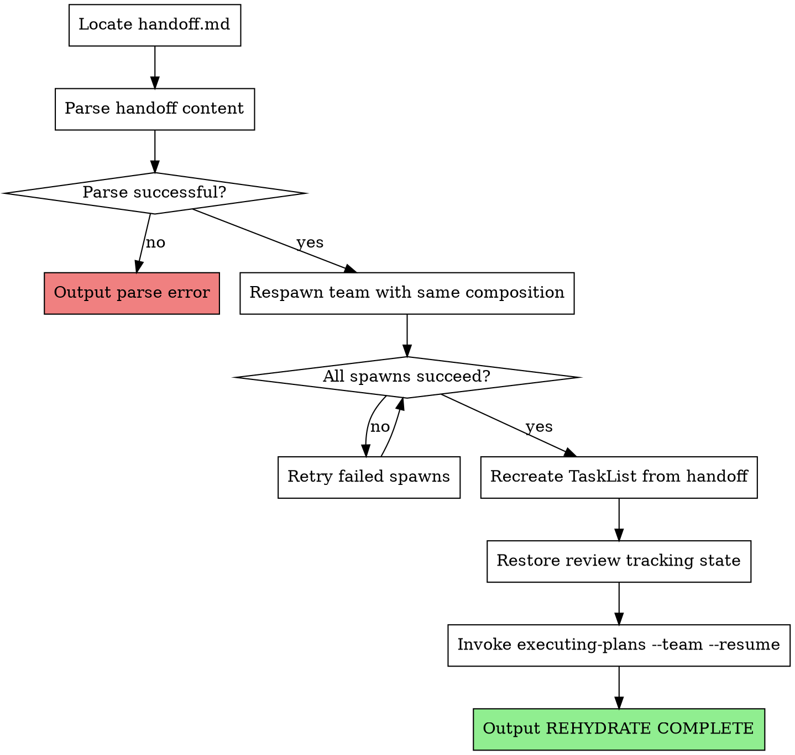

# Rehydrate

## Overview

Restores team execution state from a checkpoint handoff file. Reads captured state, respawns team with same composition, recreates task list, and resumes execution.

**Core principle:** A fresh supervisor should be indistinguishable from the original after rehydration. Same team, same tasks, same review tracking.

## When to Use

- After `/clear` when handoff.md exists
- Starting new session with pending checkpoint
- Manual `/rehydrate` invocation when resuming work

## When NOT to Use

- No handoff.md exists (nothing to restore)
- Starting fresh phase (use team-lead-init instead)
- Phase already completed (check status.json first)

## The Process



## Implementation Details

### Step 1: Locate Handoff File

Find most recent handoff file:

```bash
# Check for handoff in current phase directory
ls .claude/tina/phase-*/handoff.md | sort -V | tail -1
```

If no handoff.md found:

```
Error: No handoff file found. Cannot rehydrate.
Check .claude/tina/ for phase directories with handoff.md
```

### Step 2: Parse Handoff Content

Read `.claude/tina/phase-N/handoff.md` and extract:

**Required sections:**
- Phase number (from path)
- Team Composition (role → agent type mapping)
- Task States (ID, subject, status, owner)
- Review Tracking (per-task review status)

**Example parsed structure:**

```json
{
  "phase": 2,
  "plan_path": "docs/plans/2026-01-26-feature-phase-2.md",
  "team": [
    { "name": "worker-1", "agent": "tina:implementer" },
    { "name": "worker-2", "agent": "tina:implementer" },
    { "name": "spec-reviewer", "agent": "tina:spec-reviewer" },
    { "name": "code-quality-reviewer", "agent": "tina:code-quality-reviewer" }
  ],
  "tasks": [
    { "id": "1", "subject": "Implement feature A", "status": "completed", "owner": "worker-1" },
    { "id": "2", "subject": "Implement feature B", "status": "in_progress", "owner": "worker-2" },
    { "id": "3", "subject": "Add tests for A", "status": "pending", "owner": null }
  ],
  "review_tracking": {
    "1": { "spec_review": "passed", "quality_review": "passed" },
    "2": { "spec_review": "pending", "quality_review": "pending" }
  }
}
```

### Step 3: Respawn Team

Recreate team with exact same composition:

**Create team:**
Use Teammate tool with:
- operation: "spawnTeam"
- team_name: "phase-N-execution" (use actual phase number from handoff)
- agent_type: "team-lead"
- description: "Phase N execution team (resumed from checkpoint)"

**Spawn each team member:**
For each member listed in the handoff's team section:

Use Task tool to spawn:
- subagent_type: (e.g., "tina:implementer", "tina:spec-reviewer", "tina:code-quality-reviewer")
- team_name: "phase-N-execution"
- name: (member name from handoff, e.g., "worker-1", "spec-reviewer")
- prompt: "Resumed from checkpoint. You are {name} in phase {N} execution team. Continue work on assigned tasks."

**Spawn verification:** After spawning all members, verify they've joined by checking the team config file at `~/.claude/teams/phase-N-execution/config.json`. All spawned members should appear in the members list.

### Step 4: Recreate Task List

Restore tasks from handoff state:

```
for task in handoff.tasks:
  TaskCreate({
    subject: task.subject,
    description: task.description,
    activeForm: "Working on " + task.subject
  })

  # Restore status and owner
  TaskUpdate({
    taskId: task.id,
    status: task.status,
    owner: task.owner
  })
```

**Important:** Tasks with `in_progress` status should be reassigned to the same worker name. The worker will pick up where they left off.

### Step 5: Restore Review Tracking

Recreate review tracking state for executing-plans:

```json
// Review tracking restored from handoff
{
  "1": { "spec_review": "passed", "quality_review": "passed" },
  "2": { "spec_review": "pending", "quality_review": "pending" }
}
```

Pass this to executing-plans via `--resume-state` or write to `.claude/tina/phase-N/review-tracking.json`.

### Step 6: Resume Execution

Invoke executing-plans with resume flags:

```
/tina:executing-plans --team --resume <plan-path>
```

The `--resume` flag tells executing-plans to:
- Skip completed tasks
- Resume in-progress tasks from checkpoint
- Use restored review tracking state
- Not re-read the plan (state already loaded)

### Step 7: Signal Completion

Output exactly:

```
REHYDRATE COMPLETE
```

Supervisor watches for this signal to confirm rehydration succeeded.

## State Files

**Read:**
- `.claude/tina/phase-N/handoff.md` - Checkpoint handoff state

**Write:**
- `.claude/tina/phase-N/review-tracking.json` - Restored review tracking (optional, may pass inline)

## Error Handling

**Handoff file not found:**
- Output: `Error: No handoff file found at .claude/tina/phase-N/handoff.md`
- Do NOT attempt to spawn team
- Exit with error

**Parse error:**
- Output: `Error: Failed to parse handoff.md: <specific error>`
- Include which section failed (Team Composition, Task States, etc.)
- Exit with error

**Team spawn fails:**
- Retry spawn once for failed member
- If retry fails: Output error with member name
- Attempt to continue with partial team if possible
- Include warning in execution context

**Task restoration fails:**
- Log which tasks failed
- Continue with successful tasks
- Include failed task info in resumption notes

## Integration

**Invoked by:**
- Supervisor after detecting handoff.md post-/clear
- Manual user invocation via `/rehydrate`

**Uses:**
- Teammate tool with operation "spawnTeam" - Create team container
- Task tool with team_name parameter - Spawn individual team members
- TaskCreate tool - Recreate tasks from handoff
- TaskUpdate tool - Restore task status/owner
- tina:executing-plans skill - Resume execution

**State files:**
- `.claude/tina/phase-N/handoff.md` - Input: checkpoint state
- `.claude/tina/phase-N/review-tracking.json` - Output: restored review state

**Paired with:**
- `tina:checkpoint` - Creates the handoff.md this skill reads

## Red Flags

**Never:**
- Skip team spawning (tasks need workers)
- Ignore parse errors (corrupted state = unpredictable behavior)
- Start execution without restoring review tracking (reviews will repeat)
- Spawn different team composition than handoff (breaks task ownership)
- Mark tasks complete that were in_progress (checkpoint captured mid-work)

**Always:**
- Verify handoff.md exists before proceeding
- Validate parsed content has required sections
- Spawn exact same team composition
- Restore tasks with original IDs for consistency
- Pass `--resume` flag to executing-plans
- Output REHYDRATE COMPLETE on success
