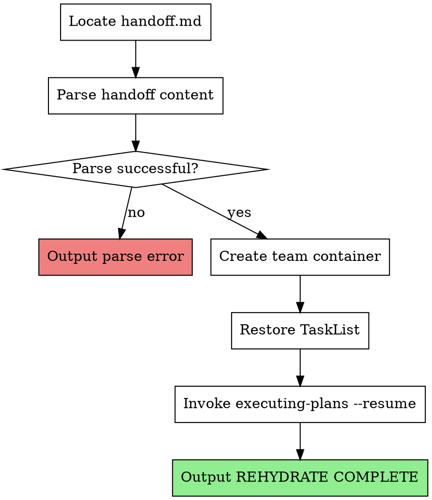

# Rehydrate

## Overview

Restores task execution state from a checkpoint handoff file. Reads captured task states, creates team container, recreates task list, and resumes execution.

**Core principle:** Ephemeral team model - only TaskList state persists. Workers and reviewers are spawned fresh per-task by executing-plans.

## When to Use

- After `/clear` when handoff.md exists
- Starting new session with pending checkpoint
- Manual `/rehydrate` invocation when resuming work

## When NOT to Use

- No handoff.md exists (nothing to restore)
- Starting fresh phase (use team-lead-init instead)
- Phase already completed (check status.json first)

## The Process



## Implementation Details

### Step 1: Locate Handoff File

Find most recent handoff file:

```bash
# Check for handoff in current phase directory
ls .claude/tina/phase-*/handoff.md | sort -V | tail -1
```

If no handoff.md found:

```
Error: No handoff file found. Cannot rehydrate.
Check .claude/tina/ for phase directories with handoff.md
```

### Step 2: Parse Handoff Content

Read `.claude/tina/phase-N/handoff.md` and extract:

**Required sections:**
- Phase number (from path)
- Plan path
- Task States (ID, subject, status, description)

**Example parsed structure:**

```json
{
  "phase": 2,
  "plan_path": "docs/plans/2026-01-26-feature-phase-2.md",
  "tasks": [
    { "id": "1", "subject": "Implement feature A", "status": "completed", "description": "..." },
    { "id": "2", "subject": "Implement feature B", "status": "in_progress", "description": "..." },
    { "id": "3", "subject": "Add tests for A", "status": "pending", "description": "..." }
  ]
}
```

**Note:** Team composition and review tracking are NOT needed. Fresh workers/reviewers get spawned per-task by executing-plans.

### Step 3: Create Team Container

Create team container (no members yet):

Use Teammate tool with:
- operation: "spawnTeam"
- team_name: "phase-N-execution" (use actual phase number from handoff)
- agent_type: "team-lead"
- description: "Phase N execution team (resumed from checkpoint)"

**No members to spawn:** executing-plans will spawn fresh workers/reviewers as tasks are assigned.

### Step 4: Recreate Task List

Restore tasks from handoff state:

```
for task in handoff.tasks:
  TaskCreate({
    subject: task.subject,
    description: task.description,
    activeForm: "Working on " + task.subject
  })

  # Restore status (in_progress becomes pending)
  if task.status == "completed":
    TaskUpdate({
      taskId: task.id,
      status: "completed"
    })
  else:
    # in_progress and pending both become pending
    # Fresh worker will handle the task from scratch
    TaskUpdate({
      taskId: task.id,
      status: "pending"
    })
```

**Important:** Tasks with `in_progress` status become `pending` - fresh workers start clean without previous context.

### Step 5: Resume Execution

Invoke executing-plans with resume flag:

```
/tina:executing-plans --resume <plan-path>
```

The `--resume` flag tells executing-plans to:
- Skip completed tasks
- Process pending tasks (including those reset from in_progress)
- Spawn fresh workers/reviewers per-task
- Review tracking resets (fresh reviewers per task)

### Step 6: Signal Completion

Output exactly:

```
REHYDRATE COMPLETE
```

Supervisor watches for this signal to confirm rehydration succeeded.

## State Files

**Read:**
- `.claude/tina/phase-N/handoff.md` - Checkpoint handoff state

**Write:**
- `.claude/tina/phase-N/review-tracking.json` - Restored review tracking (optional, may pass inline)

## Error Handling

**Handoff file not found:**
- Output: `Error: No handoff file found at .claude/tina/phase-N/handoff.md`
- Do NOT attempt to spawn team
- Exit with error

**Parse error:**
- Output: `Error: Failed to parse handoff.md: <specific error>`
- Include which section failed (Task States, Plan Path, etc.)
- Exit with error

**Team creation fails:**
- Output: `Error: Failed to create team container: <specific error>`
- Do NOT attempt task restoration
- Exit with error

**Task restoration fails:**
- Log which tasks failed
- Continue with successful tasks
- Include failed task info in resumption notes

## Integration

**Invoked by:**
- Supervisor after detecting handoff.md post-/clear
- Manual user invocation via `/rehydrate`

**Uses:**
- Teammate tool with operation "spawnTeam" - Create team container
- TaskCreate tool - Recreate tasks from handoff
- TaskUpdate tool - Restore task status (completed stays completed, in_progress becomes pending)
- tina:executing-plans skill - Resume execution

**State files:**
- `.claude/tina/phase-N/handoff.md` - Input: checkpoint state

**Paired with:**
- `tina:checkpoint` - Creates the handoff.md this skill reads

## Red Flags

**Never:**
- Ignore parse errors (corrupted state = unpredictable behavior)
- Restore team member state (ephemeral model - fresh spawns per task)
- Restore review tracking (resets per task with fresh reviewers)
- Keep tasks as in_progress (reset to pending for fresh worker)
- Skip team container creation (required for TaskList isolation)

**Always:**
- Verify handoff.md exists before proceeding
- Validate parsed content has required sections (phase, plan_path, tasks)
- Create team container (even with no members)
- Reset in_progress tasks to pending
- Keep completed tasks as completed
- Pass `--resume` flag to executing-plans
- Output REHYDRATE COMPLETE on success
