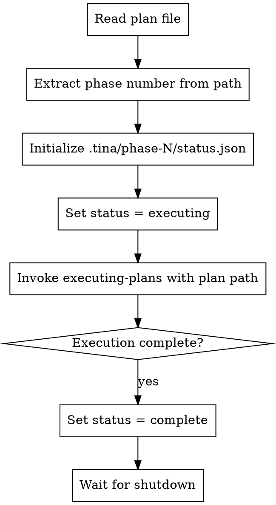

# Team Lead Initialization

## Overview

Initialize a team-lead session for phase execution. Reads the plan, sets up phase status, and delegates to the execution workflow.

**Core principle:** Team-lead manages one phase. Reads plan once, executes all tasks, reports completion.

**Announce at start:** "I'm initializing team-lead for this phase."

## Invocation

Called by supervisor when spawning team-lead in tmux:

```
/team-lead-init docs/plans/2026-01-26-feature-phase-1.md
```

## The Process



## Phase Number Extraction

Extract phase number from plan path:
- `docs/plans/2026-01-26-feature-phase-1.md` → Phase 1
- Pattern: `-phase-(\d+)\.md$`

## Status Updates

**On start:**
```json
{
  "status": "executing",
  "started_at": "2026-01-26T10:00:00Z"
}
```

**On completion:**
```json
{
  "status": "complete",
  "started_at": "2026-01-26T10:00:00Z",
  "completed_at": "2026-01-26T10:30:00Z"
}
```

**On blocked:**
```json
{
  "status": "blocked",
  "started_at": "2026-01-26T10:00:00Z",
  "reason": "Phase reviewer rejected 3 times"
}
```

## Phase 1 Behavior

In this phase, team-lead uses the existing Task-based execution flow:
1. Read plan path
2. Initialize phase status
3. Invoke `supersonic:executing-plans` skill directly
4. Mark phase complete when executing-plans finishes

Phase 2 will add team-based execution via Teammate tool.

## Error Handling

**Plan file not found:**
- Set status = blocked with reason
- Exit (supervisor will escalate)

**executing-plans fails:**
- Set status = blocked with reason
- Exit (supervisor will escalate)

## Integration

**Invoked by:**
- `supersonic:orchestrate` - Spawns team-lead-init in tmux for each phase

**Invokes:**
- `supersonic:executing-plans` - Delegates task execution to this skill

**State files:**
- `.tina/phase-N/status.json` - Phase execution status

**Future integrations (Phase 2+):**
- Will spawn team of workers/reviewers via Teammate tool
- Will handle checkpoint/rehydrate commands

## Red Flags

**Never:**
- Start executing without setting status to "executing"
- Finish without setting status to "complete" or "blocked"
- Swallow errors (always update status with reason)

**Always:**
- Update status.json at each state transition
- Include timestamps for debugging
- Include reasons when blocked
