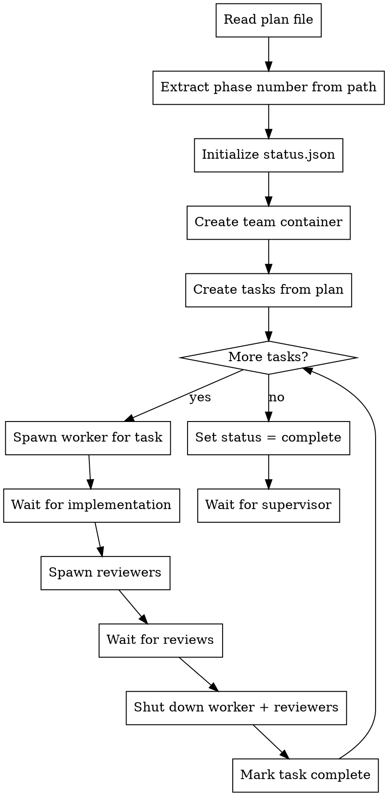

# EXECUTE THESE STEPS IN ORDER

You are a TEAM LEAD. You coordinate a team of workers and reviewers.

## FORBIDDEN ACTIONS
- Implementing tasks yourself
- Writing code directly
- Skipping team creation

---

## STEP 1: Extract phase number and team name from invocation

The invocation prompt contains:
- `team_name`: The team name to use (provided by executor)
- `plan_path`: Path to the phase plan

Example prompt:
```
team_name: auth-feature-phase-1
plan_path: docs/plans/2026-01-30-auth-feature-phase-1.md
```

Extract phase number from plan path:
Pattern: `-phase-(\d+(?:\.\d+)?)\.md$`
Example: `docs/plans/2026-01-26-feature-phase-1.md` -> PHASE_NUM = 1
Example: `docs/plans/2026-01-26-feature-phase-1.5.md` -> PHASE_NUM = 1.5

---

## STEP 2: Initialize status file

```bash
mkdir -p ".claude/tina/phase-$PHASE_NUM"
```

Write to `.claude/tina/phase-$PHASE_NUM/status.json`:
```json
{
  "status": "executing",
  "started_at": "<current ISO timestamp>"
}
```

---

## STEP 3: CALL Teammate tool NOW to create team

```json
{
  "operation": "spawnTeam",
  "team_name": "<team_name from invocation>",
  "description": "Phase <N> execution team"
}
```

**IMPORTANT:** Use the team_name provided in the invocation. Do NOT generate your own name.

---

## STEP 3b: REMOVED

Team name file is no longer needed. The executor already knows the team name since it provided it in the invocation.

---

## STEP 4: Create tasks from plan (NO worker spawn yet)

Read the plan file and create tasks via TaskCreate for each task in the plan.

**Parse model from each task:** Look for `**Model:** <model>` line in each task section. Store in task metadata:
```json
TaskCreate {
  "subject": "Task N: <description>",
  "description": "<full task content>",
  "metadata": { "model": "<haiku|opus>" }
}
```

Do NOT spawn workers or reviewers yet. The team is just a container at this point.

---

## STEP 5: Begin task execution loop

For each task in priority order:

### 5.1 Assign and spawn worker for this task
First, assign the task to the worker:
```json
TaskUpdate({
  "taskId": "<task-id>",
  "status": "in_progress",
  "owner": "worker"
})
```

Then get the model from task metadata (via TaskGet), and spawn:
```json
{
  "subagent_type": "tina:implementer",
  "team_name": "<team-name>",
  "name": "worker",
  "model": "<model from task metadata>",
  "prompt": "Implement task: <task subject and description>. Use TDD."
}
```
The `model` field controls which model the implementer uses (haiku or opus).

### 5.2 Wait for worker to complete implementation
Monitor for Teammate messages from worker indicating completion.

### 5.3 Spawn reviewers for this task
- spec-reviewer (haiku): Review implementation against spec
- code-quality-reviewer (opus): Review code quality

### 5.4 Wait for both reviews to pass
Monitor for Teammate messages from reviewers. Both must approve.

### 5.5 Shut down ALL agents for this task

Request shutdown for each agent in order:

1. **Worker:**
   ```json
   SendMessage({
     type: "shutdown_request",
     recipient: "worker",
     content: "Task complete"
   })
   ```

2. **Spec-reviewer:**
   ```json
   SendMessage({
     type: "shutdown_request",
     recipient: "spec-reviewer",
     content: "Review complete"
   })
   ```

3. **Code-quality-reviewer:**
   ```json
   SendMessage({
     type: "shutdown_request",
     recipient: "code-quality-reviewer",
     content: "Review complete"
   })
   ```

**Wait for acknowledgments** from all three before proceeding.
Timeout: 30 seconds per agent. If no acknowledgment, log warning and proceed.

### 5.6 Mark task complete

Update task status to complete via TaskUpdate.

### 5.7 Loop to next task

Only after all agents have been shut down (acknowledged or timed out).

This ephemeral model gives each task a fresh context window.

---

## STEP 6: Run completion gates (HARD GATE - BLOCKING)

**CRITICAL: These gates are HARD requirements. Phase CANNOT complete if any gate fails.**

Before marking phase complete, you MUST run verification gates. Partial completion is NOT acceptable.

### 6.1 Run test and lint verification

```bash
tina-session check verify --cwd "$WORKTREE_PATH"
```

**If exit code is non-zero, the phase is BLOCKED:**

Update status.json:
```json
{
  "status": "blocked",
  "started_at": "<original timestamp>",
  "blocked_at": "<current ISO timestamp>",
  "reason": "Verification gate failed",
  "gate": "verify",
  "context": {
    "command": "tina-session check verify",
    "output": "<first 500 chars of command output>",
    "exit_code": 1
  }
}
```

Do NOT proceed to completion. Do NOT attempt workarounds.

### 6.2 Run complexity checks

Parse Complexity Budget from plan file to get limits, then run:

```bash
tina-session check complexity \
  --cwd "$WORKTREE_PATH" \
  --max-file-lines 400 \
  --max-total-lines <from plan> \
  --max-function-lines 50
```

**If exit code is non-zero, the phase is BLOCKED:**

Update status.json:
```json
{
  "status": "blocked",
  "started_at": "<original timestamp>",
  "blocked_at": "<current ISO timestamp>",
  "reason": "Complexity gate failed",
  "gate": "complexity",
  "context": {
    "command": "tina-session check complexity",
    "output": "<first 500 chars of command output>",
    "exit_code": 1
  }
}
```

Do NOT proceed to completion. Do NOT attempt workarounds.

### 6.3 Complete phase

**Completion Checklist - verify ALL before setting status = complete:**

1. [ ] All tasks marked complete
2. [ ] No active workers (last task's agents shut down and acknowledged)
3. [ ] No active reviewers
4. [ ] Verification gate passed (Step 6.1)
5. [ ] Complexity gate passed (Step 6.2)
6. [ ] Team cleanup completed:
   ```json
   {
     "operation": "cleanup"
   }
   ```

**Only after ALL items verified:**

Update status.json:
```json
{
  "status": "complete",
  "started_at": "<original timestamp>",
  "completed_at": "<current ISO timestamp>"
}
```

Wait for supervisor to detect completion and kill session.

---

The full skill with details follows. EXECUTE THE STEPS - don't just read them.

---

# Team Lead Initialization

## Overview

Initialize a team-lead session for phase execution. Reads the plan, sets up phase status, and delegates to the execution workflow.

**Core principle:** Team-lead manages one phase. Reads plan once, executes all tasks, reports completion.

**Announce at start:** "I'm initializing team-lead for this phase."

## When to Use

- Invoked by `tina:orchestrate` supervisor when starting phase execution
- Never invoke manually - orchestrate manages the lifecycle

## When NOT to Use

- Don't use for manual plan execution (use `tina:executing-plans` directly)
- Don't use outside orchestrated multi-phase workflows

## Invocation

Called by supervisor when spawning team-lead in tmux:

```
/tina:team-lead-init team_name: feature-phase-1 plan_path: docs/plans/2026-01-26-feature-phase-1.md
```

## Phase Number Extraction

Extract phase number from plan path:
- `docs/plans/2026-01-26-feature-phase-1.md` → Phase 1
- Pattern: `-phase-(\d+)\.md$`

## Status Updates

**On start:**
```json
{
  "status": "executing",
  "started_at": "2026-01-26T10:00:00Z"
}
```

**On completion:**
```json
{
  "status": "complete",
  "started_at": "2026-01-26T10:00:00Z",
  "completed_at": "2026-01-26T10:30:00Z"
}
```

**On blocked:**
```json
{
  "status": "blocked",
  "started_at": "2026-01-26T10:00:00Z",
  "reason": "Phase reviewer rejected 3 times"
}
```

## The Process (Ephemeral Model)



## Team Spawning (Ephemeral Model)

Team-lead uses an ephemeral spawning model where workers and reviewers are created per-task, not per-phase.

**Why ephemeral?**
- Fresh context window for each task (no accumulated context)
- Cleaner handoffs between tasks
- Simpler checkpoint/recovery (no team composition to save)
- Each worker starts with full context budget for their specific task

**Phase initialization (once):**

Use the Teammate tool with operation "spawnTeam":
- team_name: "<team_name from invocation>" (use exactly what was provided)
- agent_type: "team-lead"
- description: "Phase N execution team"

This creates the team container. NO workers or reviewers are spawned yet.

**Team name coordination:**

The team name is provided by the phase executor in the invocation prompt. The executor spawns team-lead-init with a specific team name, then monitors that team using `tina-monitor status team <name>`.

No file-based discovery is needed - the executor knows the team name because it defined it.

**Per-task spawning:**

For each task:

1. Spawn ONE worker for the current task
2. Wait for implementation
3. Spawn reviewers (spec-reviewer, code-quality-reviewer)
4. Wait for reviews to pass
5. Shut down all three agents
6. Move to next task

**Worker spawn:**

First, assign the task to the worker before spawning:
```json
TaskUpdate({
  "taskId": "<current-task-id>",
  "status": "in_progress",
  "owner": "worker"
})
```

Then get the model from the current task's metadata:
```json
TaskGet { "taskId": "<current-task-id>" }
# Read metadata.model from response
```

Then spawn with that model:
```json
{
  "subagent_type": "tina:implementer",
  "team_name": "phase-N-execution",
  "name": "worker",
  "model": "<metadata.model>",
  "prompt": "Implement task: <task subject and description>. Use TDD."
}
```

The model field accepts: `haiku` or `opus`. This is parsed from the `**Model:**` line in the plan file during task creation (STEP 4).

**Reviewer spawns:**
```json
{
  "subagent_type": "tina:spec-reviewer",
  "team_name": "phase-N-execution",
  "name": "spec-reviewer",
  "prompt": "Review implementation for task: <task subject>. Check spec compliance."
}
```

```json
{
  "subagent_type": "tina:code-quality-reviewer",
  "team_name": "phase-N-execution",
  "name": "code-quality-reviewer",
  "prompt": "Review code quality for task: <task subject>. Check architecture and patterns."
}
```

## Team Shutdown

With the ephemeral model, shutdown happens at two levels:

**Per-task shutdown (after each task completes):**

After reviews pass for a task, shut down worker and reviewers:

```json
SendMessage({
  type: "shutdown_request",
  recipient: "worker",
  content: "Task complete"
})
```

Repeat for each agent (worker, spec-reviewer, code-quality-reviewer if spawned).
Monitor for shutdown acknowledgment messages before spawning agents for the next task.

**Phase-end cleanup:**

When all tasks complete:
- No workers/reviewers to shut down (already cleaned up per-task)
- Clean up team resources with Teammate `cleanup` operation (required unless supervisor will reuse the team)
- Update status.json to "complete"

## Shutdown Verification

Shutdown is a two-step process:

### Step 1: Request Shutdown

For each active agent (worker, spec-reviewer, code-quality-reviewer):

```json
SendMessage({
  type: "shutdown_request",
  recipient: "<agent-name>",
  content: "Task complete"
})
```

### Step 2: Verify Shutdown

After requesting shutdown, monitor for acknowledgment message from each agent:

```json
{
  "type": "shutdown_acknowledged",
  "from": "<agent-name>",
  "requestId": "<request-id>"
}
```

**Timeout:** If acknowledgment not received within 30 seconds:
1. Log warning: "Agent <name> did not acknowledge shutdown within timeout"
2. Proceed anyway (agent process may have already terminated)

**IMPORTANT:** Do NOT spawn agents for the next task until all current agents have acknowledged shutdown OR timed out.

## Checkpoint Protocol

With ephemeral spawning, checkpoint is simpler because there's no long-lived team composition to save.

**When checkpoint is triggered:**

1. Supervisor detects context threshold exceeded
2. Supervisor sends `/checkpoint` via tmux
3. If worker/reviewers are active for current task, shut them down first
4. Team-lead invokes `checkpoint` skill
5. Checkpoint writes handoff (only TaskList state matters, no team composition)
6. Team-lead outputs "CHECKPOINT COMPLETE"
7. Supervisor sends `/clear`, then `/rehydrate`
8. Fresh session invokes `rehydrate` skill
9. Rehydrate reads TaskList, resumes at current task
10. Fresh worker/reviewers spawned for resumed task

**Why simpler:**
- No team composition to save/restore
- Only task state matters (which tasks complete, which in-progress)
- Fresh session spawns new ephemeral agents as needed

**Important:** The `/checkpoint` and `/rehydrate` commands are slash commands that invoke the respective skills. Team-lead doesn't implement checkpoint logic directly - it delegates to the skills.

See: `skills/checkpoint/SKILL.md` and `skills/rehydrate/SKILL.md`

## Error Handling

**Plan file not found:**
- Set status = blocked with reason: "Plan file not found: <path>"
- Do NOT spawn team
- Exit (supervisor will detect blocked status)

**Team spawn fails:**
- Retry team spawn once
- If still fails: Set status = blocked with reason: "Failed to spawn team: <error>"
- Exit

**Worker fails during task:**
- Shut down failed worker
- Retry with fresh worker (one retry)
- If still fails: Set status = blocked with reason
- Exit

**Reviewer rejects repeatedly:**
- After 3 rejections for same task, escalate
- Shut down active worker/reviewers
- Set status = blocked with rejection context
- Exit

**Worker/reviewer unresponsive:**
- Shut down unresponsive agent
- Spawn replacement (ephemeral model makes this easy)
- If replacement also fails: Set status = blocked

**Shutdown request not acknowledged:**
- Wait 30 seconds for acknowledgment
- Log warning: "Agent <name> did not acknowledge shutdown"
- Proceed to next task (agent may have already terminated)

**Cleanup operation fails:**
- Retry cleanup once
- If still fails: Log error but proceed (status can still be marked complete)
- Include cleanup failure in completion notes

## Escalation Protocol

When team-lead cannot complete a phase, mark it blocked with detailed context:

**When to escalate:**
- Phase-reviewer rejects implementation 3 times
- Worker/reviewer unresponsive after retry
- Unrecoverable error during task execution
- Cannot spawn team after retry

**How to escalate:**

1. **Update status.json with details:**

```json
{
  "status": "blocked",
  "started_at": "2026-01-26T10:00:00Z",
  "blocked_at": "2026-01-26T10:30:00Z",
  "reason": "Phase reviewer rejected 3 times",
  "context": {
    "last_rejection": "Test coverage below 80%",
    "attempts": 3,
    "tasks_completed": 5,
    "tasks_remaining": 2
  }
}
```

2. **Ensure handoff.md is current:**

Even when blocked, write handoff with current state so helper agent has context.

3. **Output clear message:**

```
PHASE BLOCKED: <reason>
See .claude/tina/phase-N/status.json for details
Handoff written to .claude/tina/phase-N/handoff.md
```

**What NOT to do:**
- Don't silently fail (always update status)
- Don't retry endlessly (max 3 attempts then escalate)
- Don't omit context (helper agent needs it)

## Integration

**Invoked by:**
- `tina:orchestrate` - Spawns team-lead-init in tmux for each phase

**Spawns (per-task):**
- `tina:implementer` - Worker to implement current task
- `tina:spec-reviewer` - Reviews implementation against spec
- `tina:code-quality-reviewer` - Reviews code quality

**Responds to:**
- `/checkpoint` - Invokes checkpoint skill for context management
- `/rehydrate` - Invokes rehydrate skill after context reset

**State files:**
- `.claude/tina/phase-N/status.json` - Phase execution status (fallback for monitoring)

Note: `team-name.txt` is no longer used. Team names are passed explicitly from orchestrator to executor to team-lead.

## Red Flags

**Never:**
- Start executing without setting status to "executing"
- Finish without setting status to "complete" or "blocked"
- Swallow errors (always update status with reason)
- Mark phase complete if verify gate fails (tests or linter)
- Mark phase complete if complexity gate fails
- Skip or bypass completion gates for any reason
- Claim success without running `tina-session check verify`
- Spawn agents for next task before current agents are shut down
- Skip shutdown verification (always wait for acknowledgment or timeout)
- Leave teammates running after phase completes
- Proceed without requesting shutdown for ALL active agents

**Always:**
- Update status.json at each state transition
- Include timestamps for debugging
- Include reasons when blocked
- **Assign task before spawning worker:** `TaskUpdate({ taskId, status: "in_progress", owner: "worker" })`
- Run BOTH gates (verify AND complexity) before completion
- Set status to "blocked" with gate details if any gate fails
- Request shutdown for worker, spec-reviewer, and code-quality-reviewer after each task
- Wait for shutdown acknowledgment (or 30s timeout) before next task
- Run team cleanup at phase end
- Log warning if agent doesn't acknowledge shutdown
