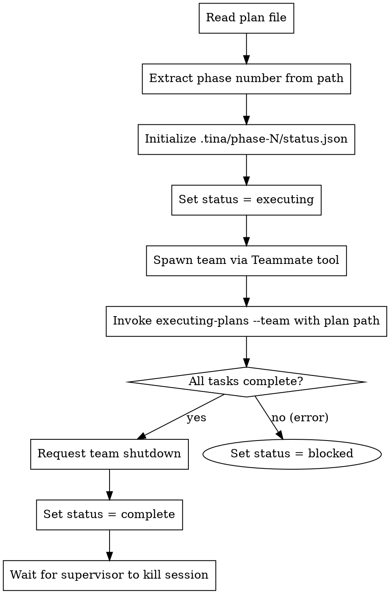

# Team Lead Initialization

## Overview

Initialize a team-lead session for phase execution. Reads the plan, sets up phase status, and delegates to the execution workflow.

**Core principle:** Team-lead manages one phase. Reads plan once, executes all tasks, reports completion.

**Announce at start:** "I'm initializing team-lead for this phase."

## When to Use

- Invoked by `supersonic:orchestrate` supervisor when starting phase execution
- Never invoke manually - orchestrate manages the lifecycle

## When NOT to Use

- Don't use for manual plan execution (use `supersonic:executing-plans` directly)
- Don't use outside orchestrated multi-phase workflows

## Invocation

Called by supervisor when spawning team-lead in tmux:

```
/team-lead-init docs/plans/2026-01-26-feature-phase-1.md
```

## Phase Number Extraction

Extract phase number from plan path:
- `docs/plans/2026-01-26-feature-phase-1.md` → Phase 1
- Pattern: `-phase-(\d+)\.md$`

## Status Updates

**On start:**
```json
{
  "status": "executing",
  "started_at": "2026-01-26T10:00:00Z"
}
```

**On completion:**
```json
{
  "status": "complete",
  "started_at": "2026-01-26T10:00:00Z",
  "completed_at": "2026-01-26T10:30:00Z"
}
```

**On blocked:**
```json
{
  "status": "blocked",
  "started_at": "2026-01-26T10:00:00Z",
  "reason": "Phase reviewer rejected 3 times"
}
```

## The Process (Phase 2)



## Team Spawning

Team-lead spawns the execution team before invoking executing-plans:

**Step 1: Create team**

```
Teammate.spawnTeam({
  name: "phase-N-execution"
})
```

**Step 2: Spawn workers (2 by default)**

```
Teammate.spawn({
  team: "phase-N-execution",
  name: "worker-1",
  agent: "supersonic:implementer",
  context: "You are worker-1 in phase N execution team."
})

Teammate.spawn({
  team: "phase-N-execution",
  name: "worker-2",
  agent: "supersonic:implementer",
  context: "You are worker-2 in phase N execution team."
})
```

**Step 3: Spawn dedicated reviewers**

```
Teammate.spawn({
  team: "phase-N-execution",
  name: "spec-reviewer",
  agent: "supersonic:spec-reviewer",
  context: "You are the spec compliance reviewer for phase N."
})

Teammate.spawn({
  team: "phase-N-execution",
  name: "code-quality-reviewer",
  agent: "supersonic:code-quality-reviewer",
  context: "You are the code quality reviewer for phase N."
})
```

**Step 4: Invoke executing-plans with team flag**

```
/supersonic:executing-plans --team <plan-path>
```

## Team Shutdown

After executing-plans completes (all tasks done, phase-reviewer approved):

```
Teammate.requestShutdown({
  team: "phase-N-execution"
})
```

Wait for all teammates to acknowledge, then update status to complete.

## Checkpoint Protocol

Team-lead responds to `/checkpoint` command from supervisor:

1. Supervisor detects context threshold exceeded
2. Supervisor sends `/checkpoint` via tmux
3. Team-lead invokes `checkpoint` skill
4. Checkpoint skill shuts down team, writes handoff
5. Team-lead outputs "CHECKPOINT COMPLETE"
6. Supervisor sends `/clear`, then `/rehydrate`
7. Fresh session invokes `rehydrate` skill
8. Rehydrate restores team and task state
9. Execution continues

**Important:** The `/checkpoint` and `/rehydrate` commands are slash commands that invoke the respective skills. Team-lead doesn't implement checkpoint logic directly - it delegates to the skills.

See: `skills/checkpoint/SKILL.md` and `skills/rehydrate/SKILL.md`

## Error Handling

**Plan file not found:**
- Set status = blocked with reason: "Plan file not found: <path>"
- Do NOT spawn team
- Exit (supervisor will detect blocked status)

**Team spawn fails:**
- Retry team spawn once
- If still fails: Set status = blocked with reason: "Failed to spawn team: <error>"
- Exit

**executing-plans fails:**
- Team-lead already has team spawned
- Request team shutdown before marking blocked
- Set status = blocked with reason from execution error
- Exit

**Worker/reviewer unresponsive:**
- executing-plans handles this (spawns replacement)
- If team-lead cannot recover: request shutdown, mark blocked

## Integration

**Invoked by:**
- `supersonic:orchestrate` - Spawns team-lead-init in tmux for each phase

**Invokes:**
- `supersonic:executing-plans` - Delegates to executing-plans workflow for task execution

**Responds to:**
- `/checkpoint` - Invokes checkpoint skill for context management
- `/rehydrate` - Invokes rehydrate skill after context reset

**State files:**
- `.tina/phase-N/status.json` - Phase execution status

## Red Flags

**Never:**
- Start executing without setting status to "executing"
- Finish without setting status to "complete" or "blocked"
- Swallow errors (always update status with reason)

**Always:**
- Update status.json at each state transition
- Include timestamps for debugging
- Include reasons when blocked
